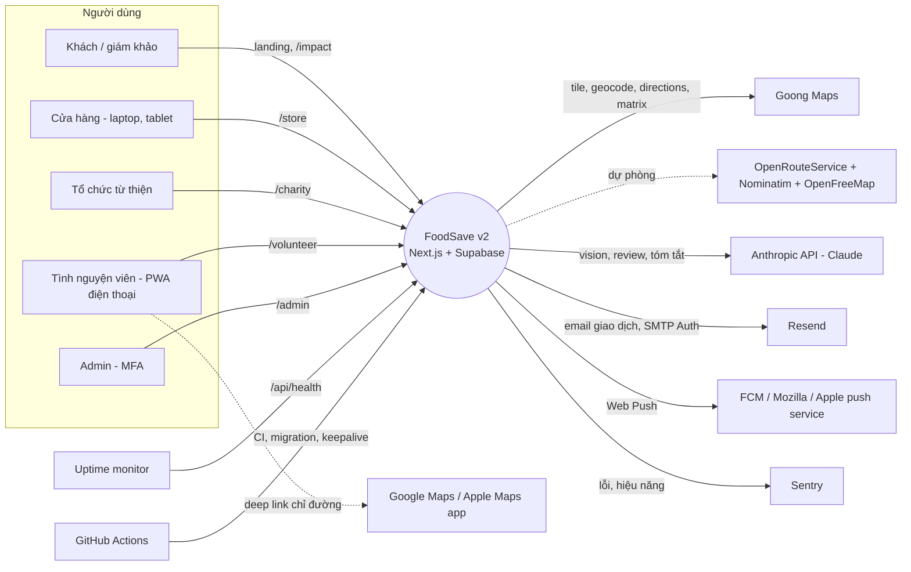
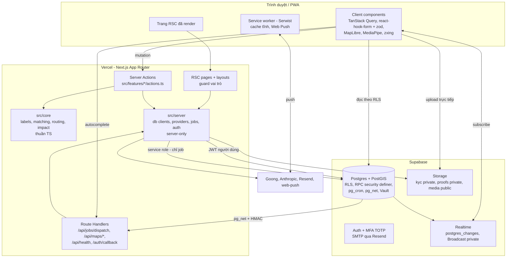
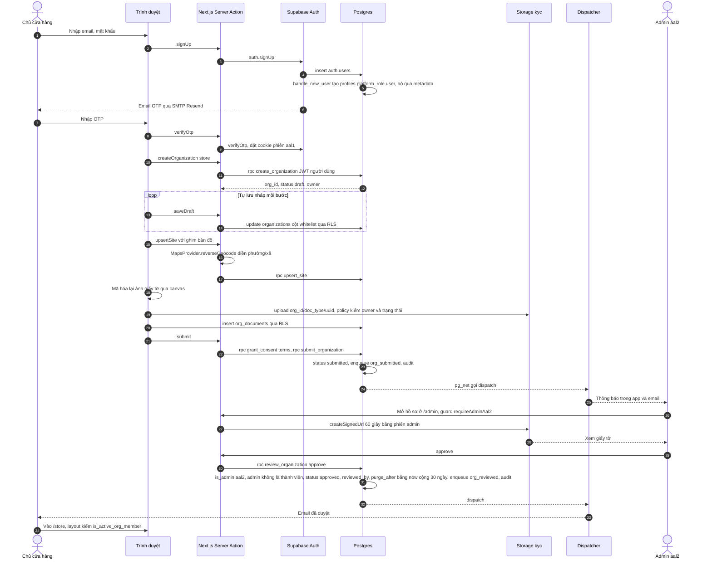
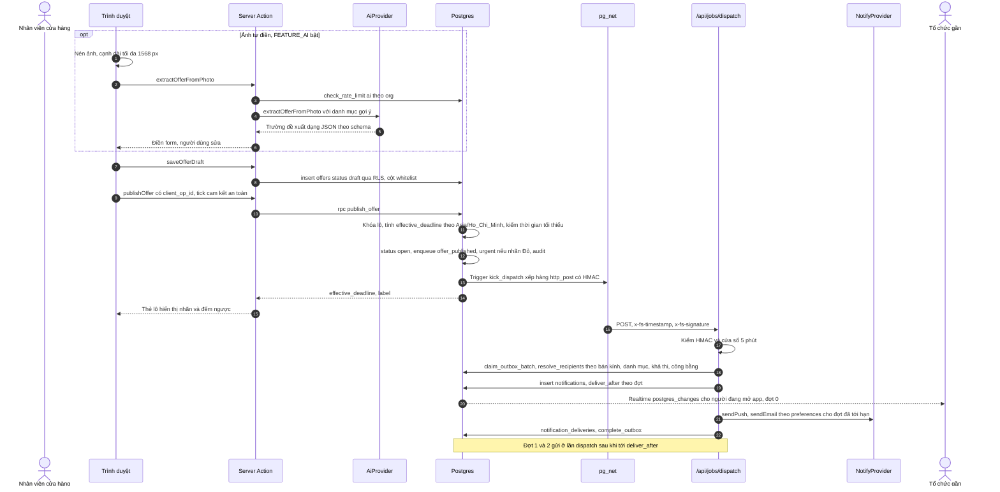
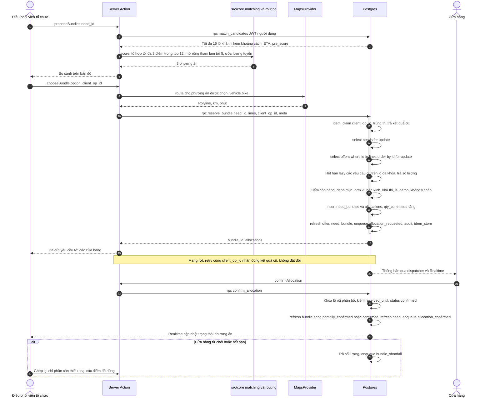
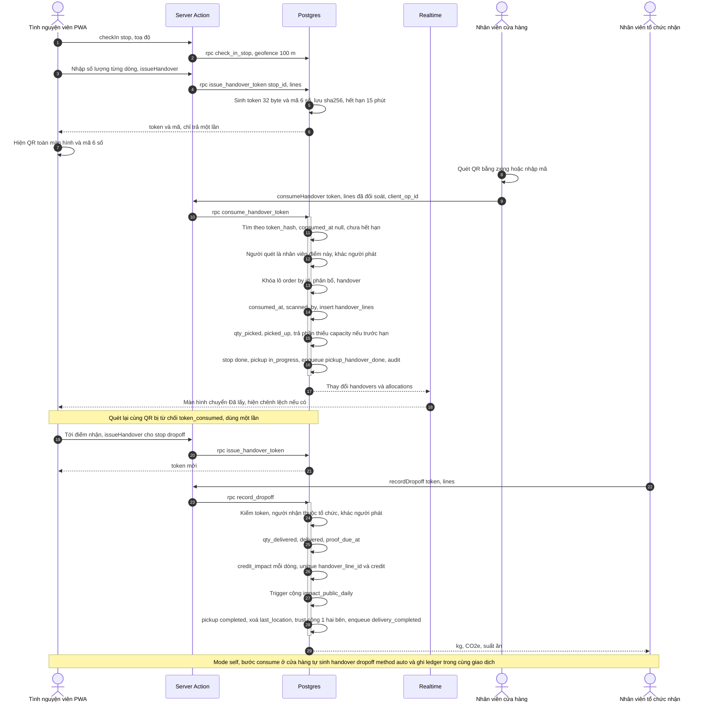
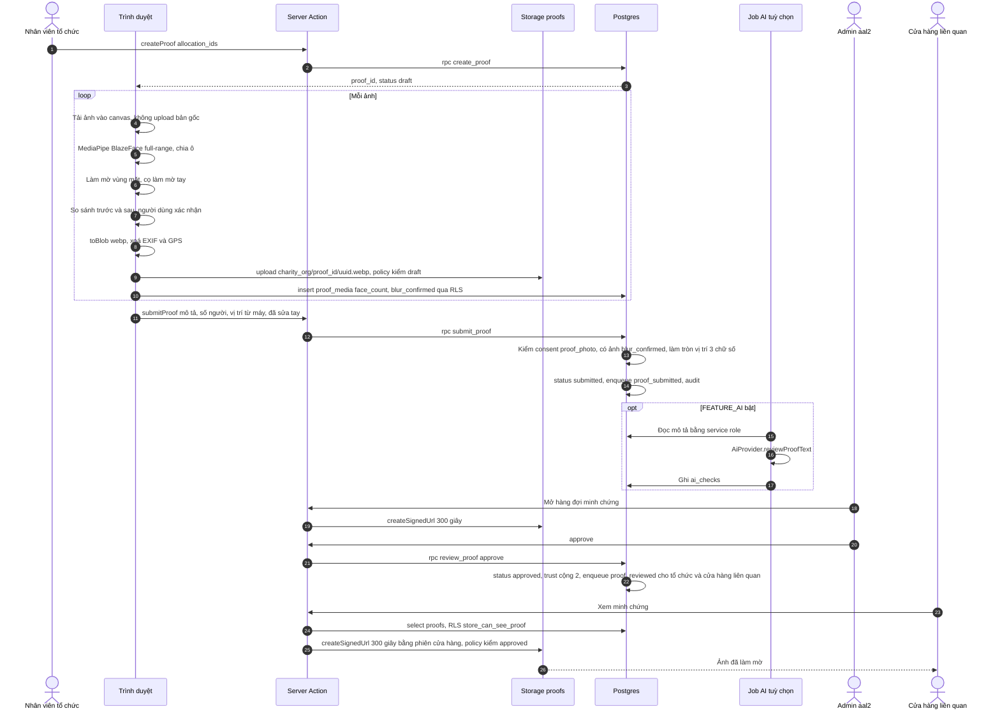
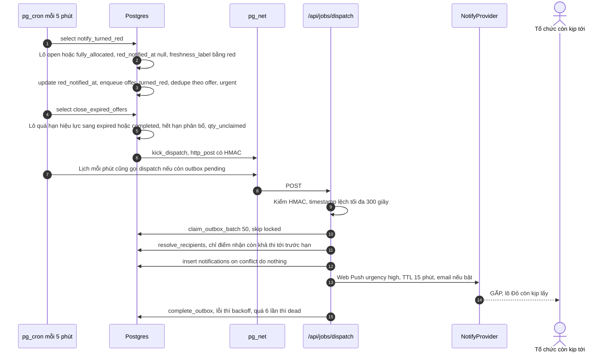

# FoodSave v2 — Kiến trúc hệ thống (ARCHITECTURE)

> **Trạng thái:** nguồn sự thật cho kiến trúc. Quyết định lớn ghi trong [`docs/adr/`](adr/README.md); schema, máy trạng thái, RLS nằm ở [DATA-MODEL.md](DATA-MODEL.md).
> **Đối tượng đọc:** Minh, Khanh, Claude Code, giám khảo kỹ thuật.

## Mục lục

1. [Mục tiêu và ràng buộc](#1-mục-tiêu-và-ràng-buộc)
2. [Sơ đồ ngữ cảnh](#2-sơ-đồ-ngữ-cảnh)
3. [Container](#3-container)
4. [Component và cấu trúc mã](#4-component-và-cấu-trúc-mã)
5. [Ranh giới server/client](#5-ranh-giới-serverclient)
6. [Luồng nghiệp vụ chính](#6-luồng-nghiệp-vụ-chính)
7. [Provider adapter](#7-provider-adapter)
8. [Kiến trúc job](#8-kiến-trúc-job)
9. [Realtime](#9-realtime)
10. [Cache](#10-cache)
11. [Xử lý lỗi và quan sát](#11-xử-lý-lỗi-và-quan-sát)
12. [Môi trường](#12-môi-trường)
13. [Biến cấu hình](#13-biến-cấu-hình)
14. [Ngân sách hiệu năng](#14-ngân-sách-hiệu-năng)
15. [Ánh xạ sang AWS](#15-ánh-xạ-sang-aws)
16. [ADR](#16-adr)

---

## 1. Mục tiêu và ràng buộc

| Mục tiêu | Hệ quả kiến trúc |
|---|---|
| Bảo mật đến từng dòng (bài học B1–B8) | **RLS-first**: Postgres là ranh giới bảo mật; Next.js chỉ là lớp tiện dụng (ADR-002) |
| Không cấp vượt, không mất dữ liệu khi bấm trùng, mạng chập chờn | Mọi chuyển trạng thái là RPC nguyên tử có `client_op_id` (ADR-004) |
| Nhãn Xanh/Vàng/Đỏ luôn đúng theo thời gian | Nhãn tính lúc đọc bằng hàm thuần, không phụ thuộc cron (ADR-005) |
| Deploy được ngay khi chưa có AWS, chuyển AWS sau giải không viết lại | Next.js trên Vercel (ADR-001); bản đồ, AI, thông báo đi qua adapter chọn bằng env (ADR-003) |
| Chi phí hạ tầng gần 0 trong 2 tháng thi | Supabase Free/Pro, Vercel Hobby (thử nghiệm), Goong free tier, không server riêng |
| Một lập trình viên + Claude Code, 6 tuần | Monolith Next.js, ít dịch vụ, engine thuần TypeScript test được, không microservice |
| Quyền riêng tư theo thiết kế | Làm mờ mặt trên máy (ADR-008), vị trí chỉ điểm mới nhất, bucket private |

Ràng buộc cứng: múi giờ nghiệp vụ `Asia/Ho_Chi_Minh`; giao diện tiếng Việt, mã và route tiếng Anh; chỉ đổi DB qua migration mới.

---

## 2. Sơ đồ ngữ cảnh



---

## 3. Container



| Container | Công nghệ | Trách nhiệm | Không được làm |
|---|---|---|---|
| Trình duyệt / PWA | React 19, Tailwind v4, shadcn/ui, MapLibre GL (lazy), TanStack Query, Serwist | Hiển thị, form, bản đồ, quét QR, làm mờ mặt, nén ảnh, subscribe Realtime | Giữ secret; gọi RPC chuyển trạng thái trực tiếp (đi qua Server Action) |
| Next.js trên Vercel | App Router, RSC, Server Actions, Route Handlers, Node runtime | Render, guard route, kiểm tra zod, gọi RPC bằng JWT người dùng, gọi provider ngoài, job dispatch | Tự quyết quyền (quyền nằm ở RLS/RPC); dùng service role trong luồng người dùng |
| Postgres (Supabase) | PostGIS, RLS, plpgsql, pg_cron, pg_net, pgcrypto, Vault | Nguồn sự thật, bất biến, máy trạng thái, phân quyền, outbox, ledger | Gọi API ngoài ngoài pg_net tới `/api/jobs/dispatch` |
| Supabase Auth | Email + mật khẩu, OTP email, MFA TOTP | Danh tính, phiên, `aal` | Mang vai trò ứng dụng (vai trò ở bảng, không ở metadata) |
| Supabase Storage | 3 bucket | File, signed URL | Bucket private không bao giờ có URL công khai |
| Supabase Realtime | postgres_changes, Broadcast private | Đẩy thay đổi theo RLS, vị trí TNV | Lưu lịch sử vị trí |

---

## 4. Component và cấu trúc mã

Theo plan mục 6:

```
src/
├─ app/
│  ├─ (marketing)/            landing, /impact, /terms, /privacy, /labels
│  ├─ (auth)/                 /login, /register, /verify, /reset, /mfa
│  ├─ onboarding/store/  onboarding/charity/
│  ├─ store/  charity/  admin/  volunteer/        # cổng theo vai trò; layout = guard
│  └─ api/  jobs/dispatch/  maps/[op]/  health/   + auth/callback
├─ features/<domain>/{components,actions.ts,queries.ts,schemas.ts}
│     domain ∈ auth, orgs, sites, offers, needs, matching, allocations,
│               pickups, handovers, proofs, impact, notifications, admin, demo
├─ core/                      # thuần TS, không import React, Next, Supabase
│  ├─ labels/    freshnessLabel(), fixtures.json (dùng chung với pgTAP)
│  ├─ matching/  score(), combine(), propose()      (ADR-007)
│  ├─ routing/   bestOrder(), estimate(), haversine()
│  └─ impact/    computeImpact(), esg formulas
├─ server/                    # 'server-only'
│  ├─ db/        server.ts (client theo cookie), admin.ts (service role), errors.ts, rpc.ts
│  ├─ providers/ maps/{goong,ors,aws,fake}.ts  ai/{anthropic,bedrock,fake}.ts
│  │             notify/{resend-webpush,ses,fake}.ts  index.ts (chọn theo env)
│  ├─ jobs/      dispatch.ts, recipients.ts, purge-kyc.ts, demo-reset.ts, hmac.ts
│  └─ auth/      guards.ts (requireUser, requireOrgRole, requireAdminAal2), session.ts
├─ components/ ui/ layout/ map/ labels/ charts/ qr/ forms/
├─ lib/ env.ts (zod), request-id.ts, format.ts (vi-VN, Asia/Ho_Chi_Minh)
└─ types/database.types.ts    # sinh bởi supabase gen types
supabase/ config.toml  migrations/  seed/  tests/ (pgTAP)
```

**Quy tắc phụ thuộc** (ESLint `import/no-restricted-paths`, kiểm trong CI):

| Từ | Được import | Không được import |
|---|---|---|
| `src/core/**` | chính nó, thư viện thuần (`date-fns`, `zod`) | `react`, `next/*`, `@supabase/*`, `src/server`, `src/features` |
| `src/server/**` | `src/core`, `src/lib`, `src/types` | client components |
| `src/features/*/components` (client) | `src/core`, `src/lib`, `schemas.ts`, `actions.ts` (Server Action reference) | `src/server/**` |
| `src/features/*/actions.ts` (`'use server'`) | `src/server`, `src/core`, `schemas.ts` | `src/server/db/admin.ts` |
| `src/server/db/admin.ts` | — | chỉ được import từ `src/server/jobs/**`, `src/app/api/jobs/**`, `scripts/**` |

---

## 5. Ranh giới server/client

1. **Ranh giới bảo mật là Postgres.** RLS trên mọi bảng; mọi chuyển trạng thái là RPC `security definer` tự kiểm quyền bằng `auth.uid()`, `private.is_admin()` (aal2), `private.is_active_org_member()`. Kẻ tấn công gọi thẳng PostgREST bằng anon key + JWT của mình cũng chỉ làm được đúng những gì RLS/RPC cho phép. Server Action là lớp tiện dụng (validate, map lỗi, log), **không** phải lớp phân quyền.
2. **`server-only`:** mọi file trong `src/server/**` bắt đầu bằng `import 'server-only'`. Secret chỉ đọc qua `src/lib/env.ts` (zod, tách `serverEnv` và `publicEnv`); biến không có tiền tố `NEXT_PUBLIC_` không bao giờ vào bundle client.
3. **Service role chỉ trong `src/server`**, và chỉ cho việc không có người dùng: dispatch outbox, gửi push/email, xóa file KYC qua Storage API, ghi `ai_checks`, `demo_reset`, seed. Luồng do người dùng khởi phát luôn dùng client theo cookie (JWT người dùng) để RLS áp dụng và `audit_logs` ghi đúng người.
4. **Chọn cơ chế:**

| Cơ chế | Dùng khi | Ví dụ |
|---|---|---|
| RSC + `queries.ts` (client theo cookie) | Đọc dữ liệu render trang lần đầu | Kho hàng, hàng đợi duyệt |
| TanStack Query + supabase-js trình duyệt | Đọc lại/làm mới theo RLS, kết hợp Realtime | Danh sách phân bổ đang chạy, trung tâm thông báo |
| **Server Action** | **Mọi mutation từ UI**: zod (schema dùng chung) → RPC bằng JWT người dùng → map lỗi → `revalidatePath`/trả `Result` | `publishOffer`, `reserveBundle`, `consumeHandover`, `reviewOrganization` |
| **Route Handler** | Gọi từ ngoài React hoặc cần HTTP thuần: `/api/jobs/dispatch` (HMAC từ pg_net), `/api/maps/autocomplete|geocode|reverse` (GET proxy giữ `GOONG_API_KEY`, rate limit, cache), `/api/health`, `/auth/callback` (đổi code phiên) | |
| **RPC trực tiếp từ trình duyệt** | Không dùng cho chuyển trạng thái. Chỉ RPC đọc an toàn: `marketplace_offers`, `public_activity_grid`, `freshness_label` | |
| **Upload trực tiếp Storage từ trình duyệt** | Mọi file (tránh giới hạn body ~4,5 MB của hàm Vercel và tốn băng thông hàm); policy Storage kiểm quyền | KYC, ảnh minh chứng, ảnh lô |

5. **Hợp đồng Server Action:** trả `Result<T> = { ok: true, data: T } | { ok: false, error: { code: AppErrorCode, message: string, fieldErrors?: Record<string,string> , requestId: string } }`. Không throw lỗi nghiệp vụ ra client; lỗi bất ngờ ⇒ Sentry + thông điệp chung kèm `requestId`.
6. **Idempotency phía client:** mỗi ý định người dùng sinh một `client_op_id` (`crypto.randomUUID()`) giữ trong state của form/nút cho tới khi thành công; retry dùng lại cùng giá trị.
7. **Guard route:** `layout.tsx` của từng cổng gọi `requireOrgRole(kind, roles)`: chưa đăng nhập ⇒ `/login`; tổ chức `draft/needs_changes` ⇒ `/onboarding/*`; `submitted` ⇒ trang chờ duyệt; `rejected/suspended/closed` ⇒ trang thông báo. `/admin` gọi `requireAdminAal2()`: aal1 ⇒ `/mfa`. Guard chỉ là UX; dữ liệu vẫn do RLS chặn.

---

## 6. Luồng nghiệp vụ chính

### 6.1 Đăng ký, onboarding, Admin duyệt



### 6.2 Đăng lô → thông báo qua `notification_outbox`



### 6.3 Tổ chức yêu cầu → `reserve_bundle` → cửa hàng xác nhận



### 6.4 Bàn giao QR ở cửa hàng và giao về tổ chức → ledger



### 6.5 Minh chứng: làm mờ trên máy → Admin duyệt → cửa hàng xem



### 6.6 Cron "chuyển Đỏ" → outbox → dispatch



---

## 7. Provider adapter

Mọi lời gọi dịch vụ ngoài đi qua interface trong `src/server/providers/*` (ADR-003). Chọn implementation bằng env lúc khởi tạo module; `fake` dùng cho E2E/CI (TESTING.md).

### 7.1 Kiểu chung

```ts
// src/server/providers/types.ts
import 'server-only';

export interface LatLng { lat: number; lng: number }

export type TravelMode = 'motorbike' | 'bicycle' | 'car' | 'walk';

export interface ProviderCallOptions {
  signal?: AbortSignal;   // mặc định timeout 4 000 ms
  requestId?: string;
}

export class ProviderError extends Error {
  constructor(
    public readonly provider: string,
    public readonly kind: 'timeout' | 'rate_limited' | 'unauthorized' | 'bad_request' | 'unavailable' | 'invalid_response',
    message: string,
    public readonly retryable: boolean,
  ) { super(message); }
}
```

### 7.2 `MapsProvider`

```ts
// src/server/providers/maps/types.ts
export interface GeocodeResult {
  label: string;                 // địa chỉ hiển thị tiếng Việt
  location: LatLng;
  ward?: string;                 // phường/xã (TP.HCM không còn cấp quận từ 01/7/2025)
  city?: string;                 // tỉnh/thành phố
  precision: 'rooftop' | 'street' | 'ward' | 'city' | 'approximate';
  provider: 'goong' | 'ors' | 'aws' | 'fake';   // = MAPS_PROVIDER đã trả kết quả (ors dùng Nominatim cho geocode)
  providerPlaceId?: string;
}

export interface AutocompleteSuggestion {
  id: string;                    // place_id của provider
  mainText: string;
  secondaryText?: string;
}

export interface RouteRequest {
  points: LatLng[];              // điểm đầu, các điểm dừng theo thứ tự, điểm cuối
  mode: TravelMode;              // 'motorbike' → Goong vehicle=bike
  departAt?: Date;
}

export interface RouteResult {
  distanceM: number;
  durationS: number;
  geometry: { type: 'LineString'; coordinates: [number, number][] };  // [lng, lat]
  legs: { distanceM: number; durationS: number }[];
  provider: string;
}

export interface MatrixResult {
  distancesM: (number | null)[][];   // [origin][destination], null = không có tuyến
  durationsS: (number | null)[][];
  provider: string;
}

export interface MapsCapabilities {
  autocomplete: boolean;         // Nominatim: false
  motorbikeProfile: boolean;     // ORS: false (dùng cycling hoặc car rồi hiệu chỉnh)
  maxMatrixElements: number;
}

export interface MapsProvider {
  readonly id: 'goong' | 'ors' | 'aws' | 'fake';
  readonly capabilities: MapsCapabilities;
  geocode(query: string, opts?: ProviderCallOptions & { bias?: LatLng }): Promise<GeocodeResult[]>;
  reverseGeocode(point: LatLng, opts?: ProviderCallOptions): Promise<GeocodeResult | null>;
  autocomplete(
    input: string,
    opts: ProviderCallOptions & { sessionToken: string; bias?: LatLng; radiusM?: number },
  ): Promise<AutocompleteSuggestion[]>;
  /** Đổi gợi ý thành toạ độ (Goong Place Detail); cùng sessionToken để tính phí theo phiên. */
  resolveSuggestion(id: string, opts: ProviderCallOptions & { sessionToken: string }): Promise<GeocodeResult>;
  route(req: RouteRequest, opts?: ProviderCallOptions): Promise<RouteResult>;
  matrix(origins: LatLng[], destinations: LatLng[], mode: TravelMode, opts?: ProviderCallOptions): Promise<MatrixResult>;
}
```

Implementation: `goong` (Places Autocomplete + Detail, Geocode, Reverse, Direction `vehicle=bike`, DistanceMatrix); `ors` (ORS directions/matrix + Nominatim có cache, không autocomplete — UI chuyển sang ô tìm kiếm thường khi `capabilities.autocomplete=false`, tuân thủ chính sách 1 request/giây và User-Agent của Nominatim); `aws` (Amazon Location, sau giải). Lớp bọc `withCache` (bảng `geocode_cache`) và `withFallback(primary, secondary)` cho geocode/reverse khi lỗi `retryable`. Tile: client dùng style Goong với `NEXT_PUBLIC_GOONG_MAPTILES_KEY` (key tile công khai, giới hạn domain), dự phòng `NEXT_PUBLIC_MAP_STYLE_FALLBACK` (OpenFreeMap). Ước lượng nội bộ (ghép đơn, ETA) **không** gọi API (ADR-007).

### 7.3 `AiProvider`

```ts
// src/server/providers/ai/types.ts
export interface ImageInput { mediaType: 'image/jpeg' | 'image/webp' | 'image/png'; base64: string }

export interface OfferDraftFields {
  title: string;
  categoryCode: string | null;        // phải thuộc danh sách gửi kèm
  quantity: number | null;
  unit: 'piece' | 'loaf' | 'box' | 'portion' | 'bottle' | 'bag' | 'kg' | 'liter' | null;
  unitWeightKg: number | null;
  expiryDate: string | null;          // YYYY-MM-DD, đọc từ nhãn nếu thấy
  notes: string | null;
  confidence: number;                 // 0..1
}

export interface OrgDocumentFields {
  legalName: string | null;
  registrationNo: string | null;
  taxCode: string | null;
  issuedOn: string | null;
  confidence: number;
}

export interface ProofTextReview {
  consistent: boolean;                // mô tả khớp mặt hàng và số người hợp lý
  flags: ('vague' | 'quantity_mismatch' | 'possible_pii' | 'off_topic')[];
  noteVi: string;
}

export type AiResult<T> =
  | { ok: true; data: T; model: string; usage: { inputTokens: number; outputTokens: number }; latencyMs: number }
  | { ok: false; reason: 'disabled' | 'refused' | 'invalid_output' | 'timeout' | 'rate_limited' | 'provider_error'; message?: string };

export interface AiProvider {
  readonly id: 'anthropic' | 'bedrock' | 'fake';
  extractOfferFromPhoto(input: {
    image: ImageInput;
    categories: { code: string; nameVi: string; defaultUnit: string }[];
  }, opts?: ProviderCallOptions): Promise<AiResult<OfferDraftFields>>;
  extractOrgDocument(input: { file: ImageInput | { mediaType: 'application/pdf'; base64: string } },
    opts?: ProviderCallOptions): Promise<AiResult<OrgDocumentFields>>;
  reviewProofText(input: { descriptionVi: string; peopleServed: number; items: { categoryCode: string; kg: number }[] },
    opts?: ProviderCallOptions): Promise<AiResult<ProofTextReview>>;
  summarizeEsg(input: { orgKind: 'store' | 'charity'; month: string; metrics: Record<string, number> },
    opts?: ProviderCallOptions): Promise<AiResult<{ summaryVi: string }>>;
}
```

Quy tắc triển khai:
- Cả `anthropic` (`@anthropic-ai/sdk`) và `bedrock` (`@anthropic-ai/bedrock-sdk`, client Bedrock Mantle) dùng **cùng hình dạng Messages API**, nên chung một hàm dựng request; khác nhau ở client và model ID (`AI_MODEL`; mặc định `claude-opus-5-5`, trên Bedrock có tiền tố `anthropic.`).
- Đầu ra có cấu trúc dùng structured outputs (`output_config.format` với JSON Schema sinh từ zod), rồi **vẫn** `zod.parse` lại; lỗi parse ⇒ `invalid_output`. Kiểm `stop_reason === 'refusal'` ⇒ `refused`.
- Ảnh gửi đi là ảnh đã nén trên máy (cạnh dài ≤ 1568 px). Không gửi ảnh minh chứng có thể còn mặt người tới AI; `reviewProofText` chỉ nhận văn bản.
- Bật/tắt bằng `FEATURE_AI`; rate limit `ai_daily_limit_per_org`; AI chỉ **đề xuất**, người dùng luôn xác nhận. Đọc skill `claude-api` trước khi viết code AI/Bedrock.

### 7.4 `NotifyProvider`

```ts
// src/server/providers/notify/types.ts
export interface EmailMessage {
  to: string;
  subject: string;
  html: string;                 // render từ React Email
  text: string;
  idempotencyKey: string;       // `${notificationId}:email`
  tags?: Record<string, string>;
}

export interface PushTarget { endpoint: string; p256dh: string; auth: string }

export interface PushPayload {
  title: string;
  body: string;
  url: string;                  // đường dẫn nội bộ
  tag?: string;                 // gộp thông báo cùng lô
  urgency: 'normal' | 'urgent';
}

export interface SendResult { ok: boolean; providerMessageId?: string; error?: string; gone?: boolean }

export interface NotifyProvider {
  readonly id: 'resend' | 'ses' | 'fake';
  sendEmail(msg: EmailMessage, opts?: ProviderCallOptions): Promise<SendResult>;
  sendPush(target: PushTarget, payload: PushPayload, opts?: ProviderCallOptions & { ttlS: number }): Promise<SendResult>;
  // sendSms(...) — kế hoạch 6 tháng (SNS / Zalo ZNS), chưa có trong v2
}
```

Web Push dùng thư viện `web-push` với VAPID cho **mọi** provider (kể cả `ses`), vì Web Push là giao thức chuẩn tới push service của trình duyệt; SNS chỉ dùng cho SMS sau này. `gone: true` (HTTP 404/410) ⇒ dispatcher đặt `push_subscriptions.disabled_at`.

### 7.5 Chọn theo env

```ts
// src/server/providers/index.ts
import 'server-only';
import { serverEnv } from '@/lib/env';

let maps: MapsProvider | undefined;
export function getMapsProvider(): MapsProvider {
  if (maps) return maps;
  switch (serverEnv.MAPS_PROVIDER) {          // 'goong' | 'ors' | 'aws' | 'fake'
    case 'goong': maps = withCache(withFallback(createGoong(serverEnv), createOrs(serverEnv))); break;
    case 'ors':   maps = withCache(createOrs(serverEnv)); break;
    case 'aws':   maps = withCache(createAwsLocation(serverEnv)); break;
    case 'fake':  maps = createFakeMaps(); break;
  }
  return maps!;
}
// getAiProvider(): AI_PROVIDER 'anthropic' | 'bedrock' | 'fake'; FEATURE_AI=false ⇒ provider trả { ok:false, reason:'disabled' }
// getNotifyProvider(): NOTIFY_PROVIDER 'resend' | 'ses' | 'fake'
```

`src/lib/env.ts` kiểm bằng zod lúc khởi động: thiếu key bắt buộc cho provider đã chọn ⇒ build/khởi động thất bại rõ ràng (không có giá trị mặc định ghi cứng — bài học B5).

---

## 8. Kiến trúc job

### 8.1 Nguyên tắc

- **Đổi trạng thái theo thời gian bằng SQL thuần trong pg_cron** (không cần mạng): hết hạn yêu cầu, đóng lô, "chuyển Đỏ", nhắc minh chứng, dọn dữ liệu.
- **Việc cần mạng** (push, email, Storage API, AI) đi qua `notification_outbox` → pg_net → `POST /api/jobs/dispatch` → `src/server/jobs/dispatch.ts`.
- Hệ thống đúng ngay cả khi cron trễ: nhãn tính lúc đọc; `reserve_bundle`/`confirm_allocation` tự hết hạn yêu cầu cũ trên lô đang khóa; RPC kiểm `effective_deadline` mỗi lần.

### 8.2 Lịch pg_cron (giờ UTC; Supabase pg_cron chạy theo UTC)

| Job | Lịch | Lệnh | Ghi chú |
|---|---|---|---|
| `fs_dispatch_tick` | `* * * * *` | `select private.kick_dispatch() where exists (select 1 from public.notification_outbox where (status = 'pending' and next_attempt_at <= now()) or (status = 'processing' and locked_until < now())) or exists (select 1 from public.notifications n where n.deliver_after <= now() and n.deliver_after > now() - interval '1 hour' and not exists (select 1 from public.notification_deliveries d where d.notification_id = n.id))` | Bắt sót, thu hồi lease hết hạn, gửi đợt công bằng |
| `fs_turned_red` | `*/5 * * * *` | `select public.notify_turned_red();` | |
| `fs_close_offers` | `*/5 * * * *` | `select public.close_expired_offers();` | |
| `fs_expire_requests` | `*/5 * * * *` | `select public.expire_stale_requests();` | Yêu cầu quá `reserved_until`, nhu cầu quá `needed_by` |
| `fs_proof_reminders` | `0 * * * *` | `select public.proof_reminders();` | |
| `fs_refresh_esg` | `0 18 * * *` (01:00 giờ VN) | `select public.refresh_esg_monthly();` | `refresh materialized view concurrently` |
| `fs_purge` | `30 19 * * *` (02:30 giờ VN) | `select public.purge_retention();` | Enqueue `kyc_purge`, xóa dữ liệu hết hạn |

### 8.3 Gọi dispatch có ký HMAC

```sql
create or replace function private.kick_dispatch() returns void
language plpgsql security definer set search_path = '' as $$
declare
  v_url    text := (select decrypted_secret from vault.decrypted_secrets where name = 'jobs_dispatch_url');
  v_secret text := (select decrypted_secret from vault.decrypted_secrets where name = 'jobs_hmac_secret');
  v_ts     text := extract(epoch from now())::bigint::text;
  v_body   text := '{"job":"dispatch"}';
begin
  perform net.http_post(
    url     := v_url,
    body    := v_body::jsonb,
    headers := jsonb_build_object(
      'content-type', 'application/json',
      'x-fs-timestamp', v_ts,
      'x-fs-signature', encode(extensions.hmac(v_ts || '.' || v_body, v_secret, 'sha256'), 'hex')),
    timeout_milliseconds := 10000);
end $$;
```

Route Handler `src/app/api/jobs/dispatch/route.ts` (Node runtime): tính lại HMAC trên `timestamp + '.' + rawBody`, so sánh bằng `crypto.timingSafeEqual`, từ chối nếu lệch > 300 s; sau đó chạy dispatcher với **ngân sách 8 giây** (claim tối đa 50 bản ghi, gửi song song có giới hạn 10), phần còn lại để lần tick sau. Trả `200 {claimed, sent, failed}`. Dispatcher idempotent nhờ `unique(outbox_id, user_id)` và `notification_deliveries` (gửi lại không trùng). Môi trường local: `jobs_dispatch_url = http://host.docker.internal:3000/api/jobs/dispatch`.

### 8.4 Giới hạn Vercel Hobby

- Vercel Cron trên gói Hobby chỉ chạy **tối đa một lần mỗi ngày** và không đúng giờ chính xác ⇒ **không** dùng Vercel Cron cho nghiệp vụ; mọi lịch nằm ở pg_cron, Vercel chỉ nhận HTTP.
- Hàm serverless bị giới hạn thời gian chạy và body request (~4,5 MB) ⇒ dispatcher chia batch, upload file đi thẳng Storage.
- Gói Hobby dành cho sử dụng phi thương mại ⇒ khi pilot có đối tác doanh nghiệp/nhận tài trợ: nâng Vercel Pro hoặc chuyển Amplify (ADR-001).
- Keepalive Supabase (project Free tạm dừng sau 7 ngày không hoạt động) chạy bằng GitHub Actions `keepalive.yml` hằng ngày, không phụ thuộc Vercel.

---

## 9. Realtime

| Kênh | Loại | Bộ lọc / topic | Người nhận | Phân quyền |
|---|---|---|---|---|
| Thông báo | postgres_changes INSERT `notifications` | `user_id=eq.<uid>` | Mọi người dùng | RLS `notifications` |
| Phân bổ cửa hàng | postgres_changes `allocations` | `store_org_id=eq.<org>` | Cổng cửa hàng | RLS |
| Phân bổ tổ chức | postgres_changes `allocations` | `charity_org_id=eq.<org>` | Cổng tổ chức | RLS |
| Bàn giao | postgres_changes UPDATE `handovers` | `pickup_id=eq.<id>` | Màn QR của TNV (biết khi đã quét) | RLS |
| Điểm dừng / ETA | postgres_changes UPDATE `pickup_stops` | `pickup_id=eq.<id>` (tổ chức, TNV) hoặc `site_id=eq.<site>` (cửa hàng) | Điều phối, cửa hàng (chỉ ETA) | RLS |
| Lô (admin, kho hàng) | postgres_changes `offers` | `org_id=eq.<org>` hoặc không lọc (admin) | | RLS |
| **Vị trí TNV trực tiếp** | **Broadcast private** | topic `pickup:<id>:loc` | Điều phối viên tổ chức của chuyến | Policy trên `realtime.messages`: nhận khi `private.is_pickup_participant(id)` và là owner/manager/staff; gửi khi là `assignee_user_id`, chuyến `in_progress`, consent `location_trip` còn hiệu lực |

Vì sao vị trí đi Broadcast: tần suất cao (5–15 giây/lần khi app mở), không cần lưu, không đi qua WAL; Broadcast private có phân quyền theo topic. Ngoài ra mỗi `location_min_interval_seconds` (30 s) PWA gọi `update_pickup_progress` để lưu **điểm mới nhất đã làm tròn** vào `pickups.last_location` (tải lại trang vẫn thấy) và tính lại `pickup_stops.eta` — cửa hàng chỉ thấy ETA. Vị trí chỉ gửi khi app đang mở (không background tracking); rút consent hoặc kết thúc chuyến ⇒ ngừng gửi và xóa điểm.

Realtime là tín hiệu "có thay đổi"; client luôn `invalidateQueries` và đọc lại qua RLS thay vì tin payload.

---

## 10. Cache

| Lớp | Nội dung | Chiến lược |
|---|---|---|
| Trang công khai (landing, `/impact`, `/labels`) | Bộ đếm, lưới hoạt động | Render tĩnh + revalidate 300 s; dữ liệu từ `public_impact_stats`, `public_activity_grid()` bằng client anon |
| Cổng nghiệp vụ | Dữ liệu theo người dùng/RLS | Dynamic, không cache dùng chung; sau mutation `revalidatePath` của trang liên quan |
| TanStack Query | Danh sách, chi tiết | `staleTime` 30 s (lô, phân bổ), 5 phút (danh mục, cài đặt); làm mới khi Realtime báo; nhãn và đếm ngược tính lại mỗi 30 s trên client bằng `freshnessLabel()` (không gọi server) |
| Geocode / autocomplete | Kết quả provider | `geocode_cache` (30 ngày; autocomplete 1 ngày); Route Handler `/api/maps/*` đặt `Cache-Control: private, max-age=60` |
| Tuyến | Polyline phương án đã chọn, chuyến | Lưu trong `need_bundles.route`, `pickups.route`; chỉ gọi lại khi đổi thứ tự điểm |
| Tile bản đồ | Raster/vector tiles | Cache trình duyệt + service worker (StaleWhileRevalidate, giới hạn 200 mục) |
| Tài nguyên tĩnh | JS/CSS/font | CDN Vercel, hash theo build; Serwist precache cho PWA |
| ESG | Tổng hợp tháng | Materialized view `esg_monthly` (chỉ tổng và số đếm, các tháng đã kết thúc) làm mới hằng đêm; tháng hiện tại = tổng hợp trực tiếp từ `impact_ledger` và bảng nguồn, ghép `UNION ALL` trong `get_esg_monthly`/`get_esg_system` ⇒ dashboard cập nhật ngay sau bàn giao (DATA-MODEL 2.5) |

---

## 11. Xử lý lỗi và quan sát

**Phân lớp lỗi:**

| Lớp | Cách xử lý |
|---|---|
| Postgres RPC | `raise exception using errcode = 'PTxxx', message = '<mã máy>', detail = jsonb` (DATA-MODEL 8.0). Không bao giờ lộ chi tiết nội bộ |
| `src/server/db/errors.ts` | Map mã máy ⇒ `AppError { code, httpStatus, messageVi, retryable }` |
| Server Action | Bắt `AppError` ⇒ `Result` lỗi có `fieldErrors`; lỗi lạ ⇒ `Sentry.captureException` + thông điệp "Có lỗi xảy ra (mã yêu cầu …)" |
| Route Handler | `application/problem+json` (`type`, `title`, `status`, `code`, `requestId`) |
| UI | `error.tsx` cho mỗi segment cổng; `not-found.tsx`; toast (sonner) cho lỗi mutation; mọi danh sách có đủ 3 trạng thái loading/empty/error |
| Provider ngoài | Timeout 4 s, retry 1 lần với lỗi `retryable`, fallback (maps), rồi lỗi thân thiện; AI lỗi ⇒ form vẫn dùng tay được |
| Mạng chập chờn (PWA) | Mutation giữ `client_op_id`, nút "Thử lại" an toàn; (tùy chọn, mục cắt #1) hàng đợi offline |

**Quan sát:**
- **Request ID:** middleware sinh `x-request-id` (hoặc nhận từ Vercel), gắn vào log, Sentry scope và header gửi PostgREST; RPC đọc qua `current_setting('request.headers', true)::json->>'x-request-id'` để ghi `audit_logs.request_id`.
- **Sentry** (client, server, edge): `sendDefaultPii: false`, `beforeSend` xóa email/SĐT/toạ độ/body form; release = commit SHA; tracesSampleRate 0,1 (prod), 1,0 (staging); source map upload trong CI.
- **Log có cấu trúc** JSON (một dòng/sự kiện: `level`, `requestId`, `userId` dạng hash, `action`, `durationMs`) lên Vercel logs.
- **Sức khỏe:** `/api/health` kiểm DB (`select 1` qua RPC `health()`), tuổi bản ghi outbox `pending` cũ nhất, số bản `dead`; uptime monitor (Better Stack/UptimeRobot) mỗi 5 phút; admin có trang "Vận hành" (outbox lag, dead letter, job cron gần nhất từ `cron.job_run_details`).
- **Vercel Analytics** (Web Vitals) cho landing và PWA; Lighthouse CI trong GitHub Actions.
- **Cảnh báo:** outbox `pending` > 5 phút, có bản `dead`, lỗi 5xx > 2%/5 phút, `/api/health` fail 2 lần liên tiếp ⇒ email Minh.

---

## 12. Môi trường

| Môi trường | Next.js | Supabase | Email | Provider | Dữ liệu |
|---|---|---|---|---|---|
| **local** | `pnpm dev` (Node 24, Turbopack) | `supabase start` (Docker), migration + seed tham chiếu + `seed-demo` | Inbucket/Mailpit của Supabase local | `fake` mặc định; `goong` khi cần kiểm bản đồ (key dev) | Seed demo |
| **CI** | `next build && next start` | Supabase local trong GitHub Actions | fake | `fake` | Seed demo |
| **preview** | Vercel Preview (mỗi PR một URL) | Project cloud 1 (dùng chung DB staging) | Resend (domain staging/subdomain) | `goong`, `anthropic` (giới hạn) | Seed demo |
| **staging** | Vercel, nhánh `main`, domain `staging.<DOMAIN>` | Project cloud 1 | Resend (domain staging/subdomain) | `goong`, `anthropic` (giới hạn) | Seed demo + tài khoản UAT; được `demo_reset` |
| **production** | Vercel Production, nhánh **`release`** | Project cloud 2 | Resend domain chính | `goong`, `anthropic` | Dữ liệu thật + tổ chức `is_demo` + tài khoản giám khảo theo vai trò |

Luồng phát hành (một luồng duy nhất, khớp DEPLOYMENT §1 và ROADMAP): PR ⇒ CI (Supabase local) + Vercel Preview (DB staging); merge `main` ⇒ CI áp migration lên staging rồi Vercel deploy `staging.<DOMAIN>`; tag `vX` ⇒ `release.yml` áp migration lên prod (GitHub Environment `production` cần Minh duyệt) **rồi** fast-forward nhánh `release` ⇒ Vercel Production deploy từ `release`. Secret của Vault (`jobs_dispatch_url`, `jobs_hmac_secret`) tạo một lần mỗi project bằng `vault.create_secret`. Chi tiết: `DEPLOYMENT.md`.

---

## 13. Biến cấu hình

Tên khớp `.env.example` (nguồn giá trị mẫu); chỉ biến `NEXT_PUBLIC_*` lộ ra trình duyệt.

| Nhóm | Biến | Phạm vi |
|---|---|---|
| App | `NEXT_PUBLIC_APP_URL`, `NEXT_PUBLIC_APP_ENV` (`local`/`staging`/`production`), `FEATURE_AI`, `FEATURE_WEB_PUSH` | public / server |
| Supabase | `NEXT_PUBLIC_SUPABASE_URL`, `NEXT_PUBLIC_SUPABASE_ANON_KEY` | public |
| Supabase | `SUPABASE_SERVICE_ROLE_KEY` (chỉ `src/server`), `SUPABASE_DB_URL` (chỉ script seed/CI, **không** đặt trên Vercel) | server |
| Job | `JOBS_HMAC_SECRET` (khớp Vault `jobs_hmac_secret`), `IP_HASH_SECRET` (băm IP cho rate limit) | server |
| Bản đồ | `MAPS_PROVIDER` (`goong`/`ors`/`aws`/`fake`), `GOONG_API_KEY`, `ORS_API_KEY`, `NOMINATIM_BASE_URL`, `NOMINATIM_USER_AGENT` | server |
| Bản đồ | `NEXT_PUBLIC_GOONG_MAPTILES_KEY`, `NEXT_PUBLIC_MAP_STYLE_FALLBACK` | public |
| AI | `AI_PROVIDER` (`anthropic`/`bedrock`/`fake`), `AI_MODEL`, `ANTHROPIC_API_KEY`, `AWS_REGION`, `AWS_ACCESS_KEY_ID`, `AWS_SECRET_ACCESS_KEY` (khi `bedrock`; trên Amplify dùng IAM role) | server |
| Thông báo | `NOTIFY_PROVIDER` (`resend`/`ses`/`fake`), `RESEND_API_KEY`, `EMAIL_FROM`, `VAPID_PRIVATE_KEY`, `VAPID_SUBJECT` | server |
| Thông báo | `NEXT_PUBLIC_VAPID_PUBLIC_KEY` | public |
| Quan sát | `NEXT_PUBLIC_SENTRY_DSN`, `SENTRY_AUTH_TOKEN`, `SENTRY_ORG`, `SENTRY_PROJECT` | public / CI |
| CI | `SUPABASE_ACCESS_TOKEN`, `SUPABASE_DB_PASSWORD`, `SUPABASE_STAGING_PROJECT_REF`, `SUPABASE_PROD_PROJECT_REF` | GitHub Environments |

Cấu hình nghiệp vụ (TTL, ngưỡng, hệ số ghép đơn) nằm ở bảng `app_settings`, không ở env.

---

## 14. Ngân sách hiệu năng

| Hạng mục | Ngân sách | Cách đo |
|---|---|---|
| Landing, `/impact` (mobile, 4G chậm mô phỏng) | Lighthouse Performance ≥ 90; LCP ≤ 2,5 s; CLS ≤ 0,1; INP ≤ 200 ms | Lighthouse CI mỗi PR |
| PWA `/volunteer` | Lighthouse Performance/Accessibility/Best Practices/SEO ≥ 90 (Lighthouse 12 đã bỏ nhóm PWA); installability kiểm bằng E2E (manifest, service worker, `beforeinstallprompt`); TTI ≤ 3,5 s | Lighthouse CI + Playwright |
| JS ban đầu landing | ≤ 170 KB gzip; MapLibre (≈ 200 KB gzip) **chỉ** lazy-load khi bản đồ vào viewport | `next build` analyze |
| Trang trong app | LCP ≤ 3 s trên laptop + 4G; skeleton ngay | Vercel Analytics |
| `marketplace_offers` | p95 ≤ 150 ms với 2 000 lô mở | pgTAP/bench script `EXPLAIN ANALYZE` |
| `match_candidates` | p95 ≤ 150 ms | như trên |
| `reserve_bundle`, `consume_handover_*`, `record_dropoff` | p95 ≤ 300 ms | log `durationMs` |
| Engine ghép đơn TS (≤ 15 ứng viên, 298 tổ hợp + hoán vị) | ≤ 50 ms trên Vercel function | Vitest bench |
| Server Action end-to-end | p95 ≤ 800 ms (không tính provider ngoài) | Sentry tracing |
| Dispatch | ≤ 8 s mỗi lần gọi; độ trễ outbox → push p95 ≤ 30 s | `processed_at − created_at` |
| Ảnh | Upload ≤ 5 MB sau nén (webp ≈ 1600 px); làm mờ mặt ≤ 2 s/ảnh trên điện thoại tầm trung | thủ công P4 |

---

## 15. Ánh xạ sang AWS

Chuyển sau giải (chi tiết: `AWS-MIGRATION.md`). Postgres có thể ở lại Supabase; cột cuối là việc phải làm.

| Thành phần hiện tại | AWS sau này | Thay đổi trong mã |
|---|---|---|
| Vercel (Next.js hosting, CDN, Preview) | **AWS Amplify Hosting** (SSR Next.js) + CloudFront | Không đổi mã; cấu hình build `amplify.yml`, env |
| Vercel Analytics | CloudWatch RUM | Đổi script đo |
| Supabase Postgres + PostGIS | Giữ Supabase, hoặc **Amazon RDS for PostgreSQL** (PostGIS, pg_cron có hỗ trợ) | Nếu rời Supabase: thay Auth/Storage/Realtime (dưới) — không làm trong 6 tháng đầu |
| Supabase Auth | Giữ (hoặc Amazon Cognito) | — |
| Supabase Storage | Giữ (hoặc S3 + presigned URL) | — |
| pg_cron → pg_net → `/api/jobs/dispatch` | **Amazon EventBridge Scheduler** + **AWS Lambda** (hoặc giữ pg_net gọi Amplify) | Dispatcher là hàm thuần trong `src/server/jobs`, đóng gói lại cho Lambda |
| Goong / ORS (`MapsProvider`) | **Amazon Location Service** (Maps, Places, Routes) | `MAPS_PROVIDER=aws`; style MapLibre đổi URL |
| Anthropic API (`AiProvider`) | **Amazon Bedrock** (Claude) | `AI_PROVIDER=bedrock`, `AI_MODEL` |
| Claude vision OCR giấy tờ | Bedrock (Textract không hỗ trợ tiếng Việt) | — |
| Làm mờ mặt trên máy (MediaPipe) | Giữ trên máy + **Amazon Rekognition** DetectFaces làm lớp kiểm thứ hai phía server | Thêm job kiểm |
| (chưa có) Face Liveness | **Rekognition Face Liveness** cho eKYC người đại diện | Tính năng mới |
| Resend (email) | **Amazon SES** | `NOTIFY_PROVIDER=ses` |
| web-push | Giữ `web-push` (chạy trong Lambda/Amplify) | — |
| (chưa có) SMS | **Amazon SNS** (SMS) / Zalo ZNS | Thêm `sendSms` |
| Secret: Vercel env + Supabase Vault | **AWS Secrets Manager** / SSM Parameter Store | `env.ts` đọc qua IAM role |
| Sentry | Giữ Sentry hoặc CloudWatch + X-Ray | — |
| GitHub Actions | Giữ; deploy bằng Amplify CI hoặc OIDC → AWS | — |

---

## 16. ADR

| ID | Quyết định |
|---|---|
| [ADR-001](adr/ADR-001-nextjs-vercel.md) | Next.js + Vercel (Amplify sau) |
| [ADR-002](adr/ADR-002-supabase-rls-first.md) | Supabase RLS-first |
| [ADR-003](adr/ADR-003-provider-adapters.md) | Provider adapters |
| [ADR-004](adr/ADR-004-chuyen-trang-thai-qua-rpc.md) | Chuyển trạng thái qua RPC |
| [ADR-005](adr/ADR-005-nhan-tinh-luc-doc.md) | Nhãn tính lúc đọc |
| [ADR-006](adr/ADR-006-goong-ban-do.md) | Goong làm nhà cung cấp bản đồ |
| [ADR-007](adr/ADR-007-thuat-toan-ghep-don.md) | Thuật toán ghép đơn tổ hợp nhỏ |
| [ADR-008](adr/ADR-008-lam-mo-mat-phia-client.md) | Làm mờ mặt phía client |
| [ADR-009](adr/ADR-009-esg-factors.md) | Hệ số quy đổi ESG v1: CO₂e 2,0 kg/kg, nước 150 L/kg, suất ăn 0,42 kg (Accepted 08/10/2026) |
