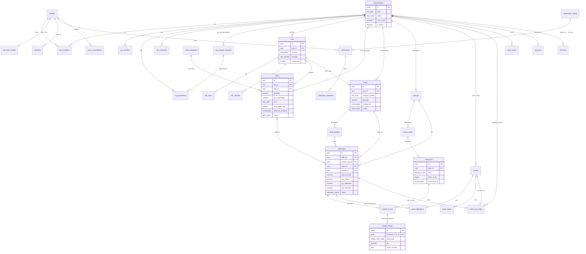
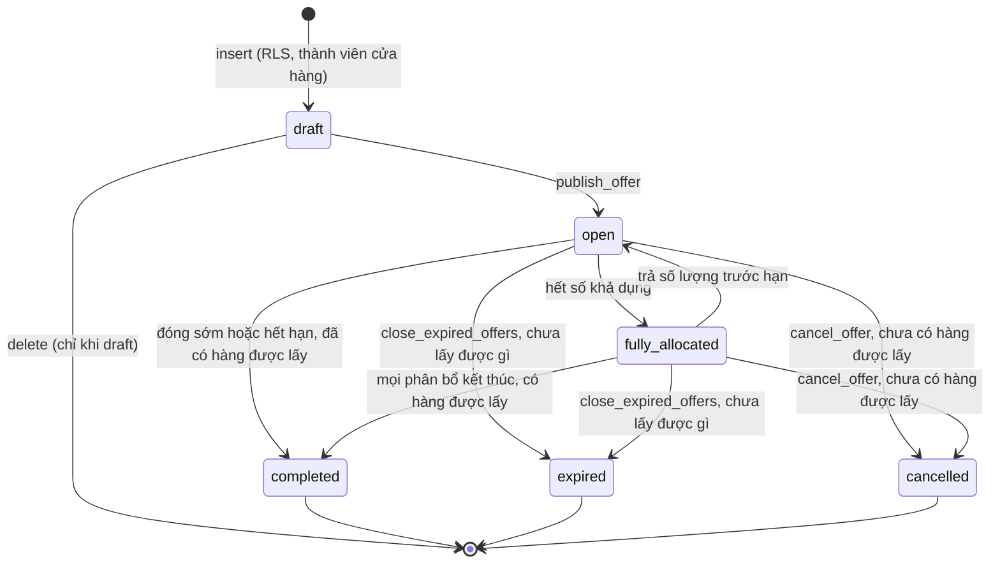
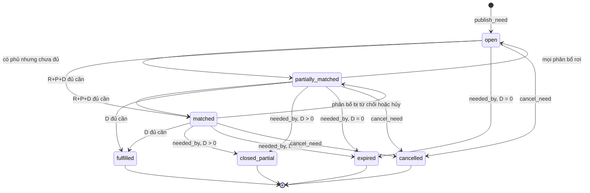
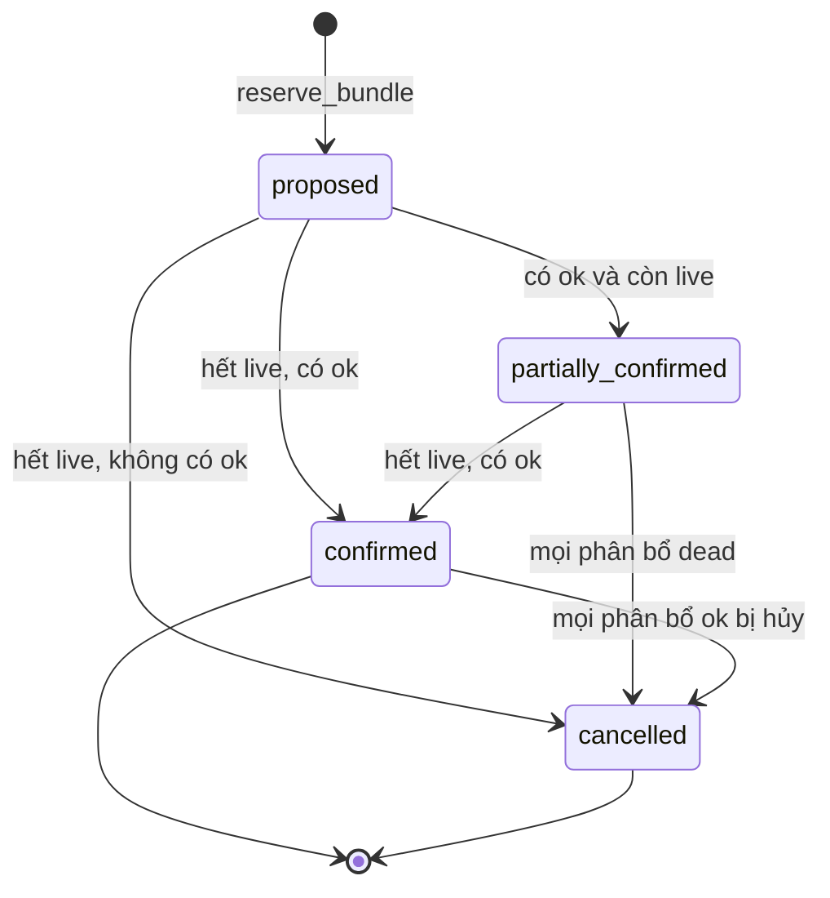
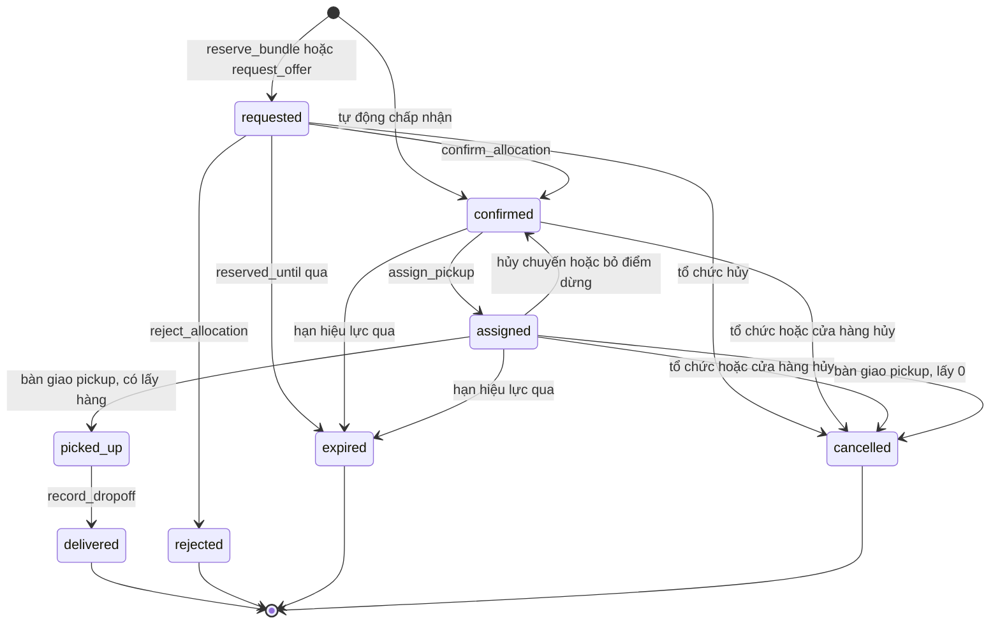
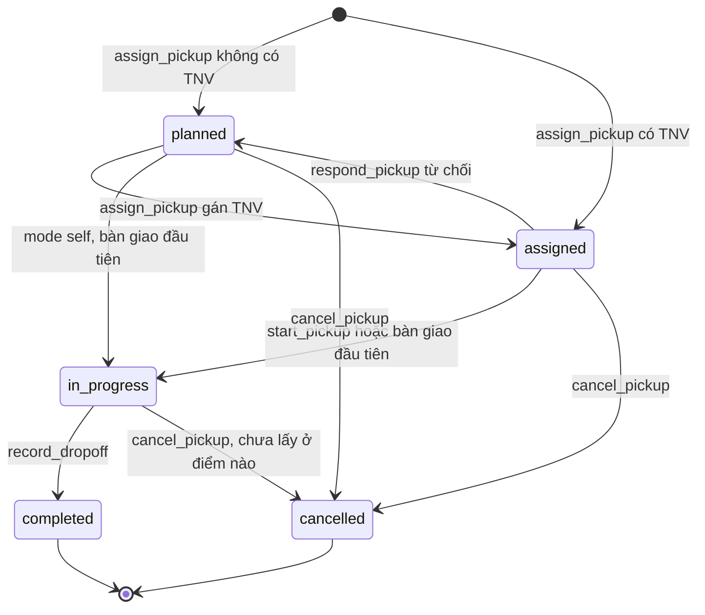
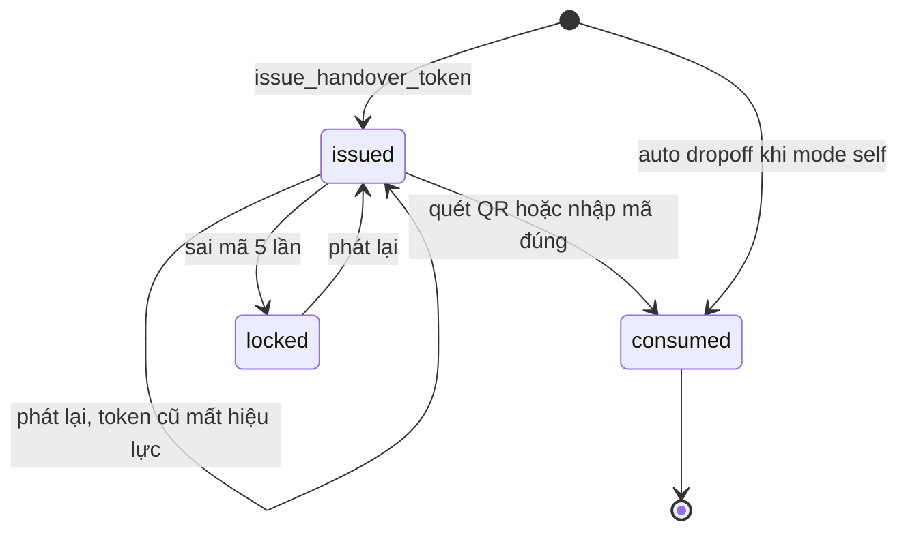
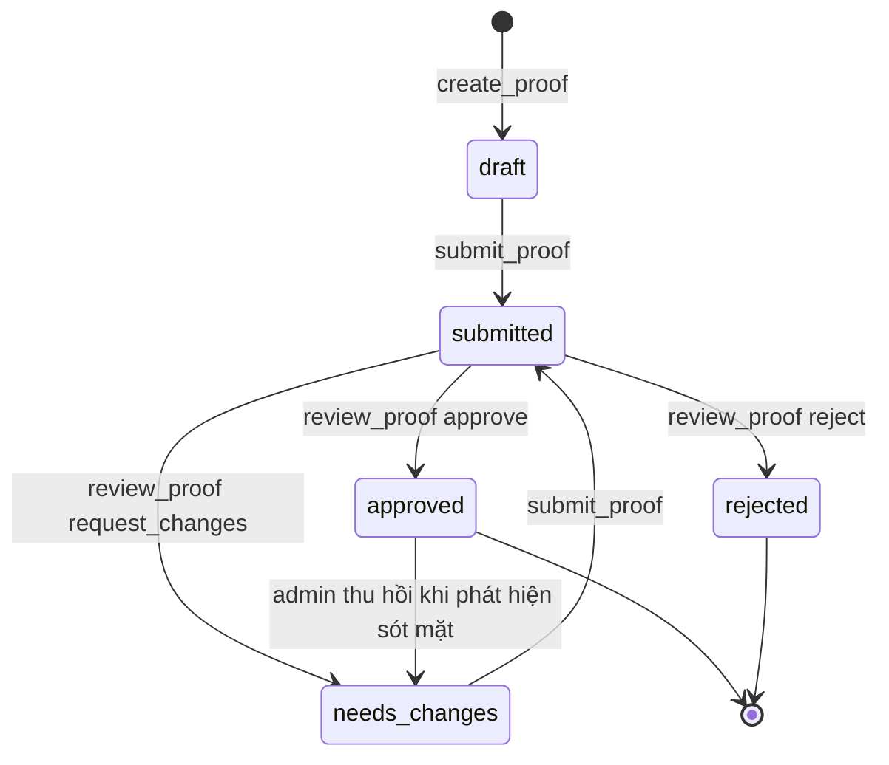
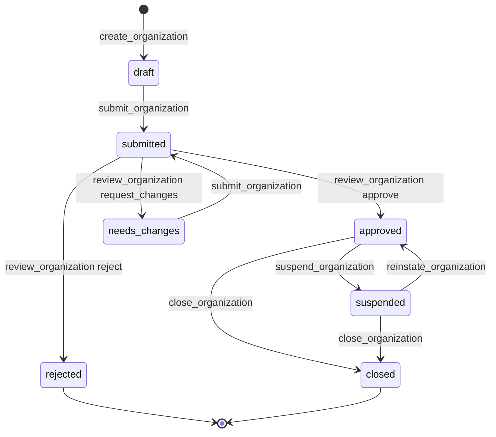

# FoodSave v2 — Mô hình dữ liệu (DATA-MODEL)

> **Trạng thái:** nguồn sự thật cho schema. Mọi migration phải khớp tài liệu này; đổi schema thì sửa tài liệu này **trong cùng PR** (skill `new-migration`).
> **Phạm vi:** Postgres 15+ trên Supabase (PostGIS, pg_cron, pg_net, pgcrypto, Vault), RLS 100%, Storage, Realtime.
> **Liên quan:** [ARCHITECTURE.md](ARCHITECTURE.md) · [ADR-002 RLS-first](adr/ADR-002-supabase-rls-first.md) · [ADR-004 RPC chuyển trạng thái](adr/ADR-004-chuyen-trang-thai-qua-rpc.md) · [ADR-005 Nhãn tính lúc đọc](adr/ADR-005-nhan-tinh-luc-doc.md) · [ADR-007 Ghép đơn](adr/ADR-007-thuat-toan-ghep-don.md) · `SECURITY-PRIVACY.md` · `ESG-METHODOLOGY.md`.

## Mục lục

0. [Quy ước chung](#0-quy-ước-chung)
1. [Enum](#1-enum)
2. [Bảng](#2-bảng)
3. [Index](#3-index)
4. [Bất biến và giá trị tính toán](#4-bất-biến-và-giá-trị-tính-toán)
5. [ERD](#5-erd)
6. [Máy trạng thái](#6-máy-trạng-thái)
7. [Ma trận hủy](#7-ma-trận-hủy)
8. [Danh mục RPC](#8-danh-mục-rpc)
9. [RLS, quyền cột, view](#9-rls-quyền-cột-view)
10. [Storage](#10-storage)
11. [Đồng ý (consents)](#11-đồng-ý-consents)
12. [Mô hình thông báo](#12-mô-hình-thông-báo)
13. [Ledger tác động](#13-ledger-tác-động)
14. [Nhật ký kiểm toán](#14-nhật-ký-kiểm-toán)
15. [Rate limit và idempotency](#15-rate-limit-và-idempotency)
16. [Lưu giữ dữ liệu](#16-lưu-giữ-dữ-liệu)
17. [Chiến lược seed](#17-chiến-lược-seed)
18. [Quy ước migration và pgTAP](#18-quy-ước-migration-và-pgtap)
19. [Bài học từ schema cũ](#19-bài-học-từ-schema-cũ)

---

## 0. Quy ước chung

| Chủ đề | Quy ước |
|---|---|
| Đặt tên | `snake_case`, tên bảng số nhiều tiếng Anh (`offers`, `needs`); cột FK `<entity>_id`; enum số ít (`offer_status`). Hàm RPC công khai dạng động từ (`reserve_bundle`) |
| Schema | `public`: bảng, view, **RPC được phép gọi qua PostgREST**. `private`: helper RLS và hàm nội bộ (không expose qua PostgREST). `extensions`: PostGIS, pgcrypto. Mọi hàm `set search_path = ''` và tham chiếu tên đầy đủ (`public.offers`) |
| Khóa chính | `uuid primary key default gen_random_uuid()`; riêng bảng append-only khối lượng lớn (`impact_ledger`, `audit_logs`) dùng `bigint generated always as identity` |
| Thời gian | Luôn `timestamptz`, lưu UTC. Mọi phép tính lịch (giờ mở cửa, ngày, tháng ESG, 23:59) dùng `'Asia/Ho_Chi_Minh'`. Không có `timestamp without time zone` trong bảng |
| Đồng hồ | RPC và hàm dùng `private.now()` thay vì `now()` (xem 17 — cho phép seed lịch sử và test du hành thời gian; trên PostgREST luôn bằng `now()`) |
| Số lượng | `numeric(12,3)`. Đơn vị **liên tục** (`kg`, `liter`) cho phép thập phân; mọi đơn vị khác bắt buộc số nguyên (CHECK `qty = trunc(qty)`) |
| Khối lượng | `unit_weight_kg numeric(10,3) not null > 0` trên mỗi lô, kèm `weight_source` |
| Tọa độ | `geography(Point,4326)`; index GIST. Tuyến: `geometry(LineString,4326)` |
| Cột chuẩn | `created_at timestamptz not null default now()`, `updated_at timestamptz not null default now()` + trigger `private.set_updated_at()` trên mọi bảng có cập nhật |
| Văn bản | Giới hạn độ dài bằng CHECK `char_length(...) <= n`. Email luôn lưu chữ thường |
| Xóa | Bảng nghiệp vụ không DELETE sau khi rời `draft`; dùng trạng thái. FK mặc định `on delete restrict`, chỉ `cascade` cho bảng con thuần (giờ mở cửa, dòng bàn giao nháp…) và đã ghi rõ |
| Quyền mặc định | Mỗi migration tạo bảng phải: `alter table … enable row level security;` `revoke all on table … from anon, authenticated;` rồi `grant` tường minh theo mục 9. **Không dựa vào grant mặc định của Supabase**. Hàm: migration #1 đã `alter default privileges for role postgres revoke execute on functions from public` (và từ `anon`, `authenticated` trong schema `public`), nên mọi hàm mới do `postgres` tạo **không ai gọi được** cho tới khi `grant execute` tường minh (kể cả helper RLS dùng trong policy) |
| Lỗi | RPC `raise exception` với `errcode` kiểu PostgREST `PTxxx` (đặt mã HTTP) và `message` là mã máy (bảng 8.0) |

---

## 1. Enum

| Enum | Giá trị (thứ tự khai báo) | Ghi chú |
|---|---|---|
| `platform_role` | `user`, `admin` | Chỉ service role/migration đổi được (C2, C5) |
| `org_kind` | `store`, `charity` | |
| `org_status` | `draft`, `submitted`, `needs_changes`, `approved`, `rejected`, `suspended`, `closed` | 6.8. `needs_changes` chỉ dùng trong lần duyệt onboarding; sửa trường pháp lý sau khi duyệt đi qua `org_change_requests`, tổ chức vẫn `approved` |
| `org_change_status` | `pending`, `approved`, `rejected` | Yêu cầu sửa trường pháp lý của tổ chức đã duyệt (2.1 `org_change_requests`, 6.8) |
| `org_role` | `owner`, `manager`, `staff`, `volunteer` | `volunteer` chỉ hợp lệ khi `org_kind='charity'` |
| `member_status` | `invited`, `active`, `removed` | |
| `site_visibility` | `public`, `approximate`, `hidden` | `hidden` cho nơi tạm lánh |
| `location_source` | `pin`, `geocode`, `gps` | Ghim là nguồn sự thật |
| `auto_accept_mode` | `off`, `all`, `trusted` | `trusted` = tổ chức có `trust_score ≥ sites.auto_accept_min_trust` |
| `vehicle_type` | `motorbike`, `bicycle`, `car`, `on_foot` | |
| `consent_purpose` | `terms`, `location_trip`, `proof_photo`, `marketing` | |
| `org_doc_type` | `business_license`, `food_safety_cert`, `establishment_decision`, `operating_license`, `other` | Không thu ảnh CCCD ở v2 |
| `perishability` | `cooked`, `fresh`, `packaged` | |
| `unit_code` | `piece`, `loaf`, `box`, `portion`, `bottle`, `bag`, `kg`, `liter` | cái, ổ, hộp, suất, chai, túi, kg, lít. Liên tục: `kg`, `liter` |
| `weight_source` | `declared`, `category_default` | |
| `freshness_label` | `green`, `yellow`, `red`, `expired` | Không lưu, tính lúc đọc (ADR-005) |
| `offer_status` | `draft`, `open`, `fully_allocated`, `completed`, `expired`, `cancelled` | 6.1 |
| `need_status` | `open`, `partially_matched`, `matched`, `fulfilled`, `closed_partial`, `expired`, `cancelled` | 6.2 |
| `bundle_status` | `proposed`, `partially_confirmed`, `confirmed`, `cancelled` | 6.3 |
| `allocation_status` | `requested`, `confirmed`, `assigned`, `picked_up`, `delivered`, `cancelled`, `rejected`, `expired` | 6.4 |
| `shortfall_reason` | `store_short`, `quality_reject`, `capacity`, `no_show` | Chỉ `capacity`, `no_show` trả số lượng (4.5) |
| `pickup_mode` | `volunteer`, `self` | `self` = nhân viên tổ chức tự đến lấy |
| `pickup_status` | `planned`, `assigned`, `in_progress`, `completed`, `cancelled` | 6.5 |
| `handover_kind` | `pickup`, `dropoff` | Dùng cho cả `pickup_stops.kind` |
| `stop_status` | `pending`, `arrived`, `done`, `skipped` | |
| `handover_method` | `qr`, `code`, `auto` | `auto` = dropoff sinh tự động khi `pickup_mode='self'` |
| `proof_status` | `draft`, `submitted`, `approved`, `needs_changes`, `rejected` | 6.7 |
| `incident_kind` | `quantity_dispute`, `quality`, `food_safety`, `no_show`, `conduct`, `privacy`, `other` | |
| `incident_status` | `open`, `in_review`, `resolved`, `dismissed` | |
| `ledger_entry_type` | `credit`, `reversal` | |
| `factor_status` | `draft`, `active`, `retired` | |
| `outbox_status` | `pending`, `processing`, `done`, `dead` | |
| `notify_channel` | `in_app`, `push`, `email` | |
| `delivery_status` | `sent`, `failed`, `skipped` | |
| `notification_event` | `offer_published`, `offer_turned_red`, `need_published`, `allocation_requested`, `allocation_confirmed`, `allocation_rejected`, `allocation_cancelled`, `allocation_expired`, `bundle_options_ready`, `bundle_confirmed`, `bundle_shortfall`, `need_responded`, `need_closed`, `offer_expired`, `member_invited`, `pickup_assigned`, `pickup_cancelled`, `pickup_started`, `pickup_handover_done`, `delivery_completed`, `proof_due_soon`, `proof_overdue`, `proof_submitted`, `proof_reviewed`, `org_submitted`, `org_reviewed`, `org_suspended`, `org_reinstated`, `org_change_submitted`, `org_change_reviewed`, `allocation_packed`, `volunteer_accepted`, `volunteer_declined`, `volunteer_checked_in`, `thank_you_received`, `incident_opened`, `monthly_report_ready`, `kyc_purge` | `kyc_purge` là việc nội bộ, không có người nhận. Ánh xạ đầy đủ N-01 → N-32 nằm ở cột "Mã sự kiện" của ma trận PRD mục 10; N-33 (đăng nhập thiết bị mới, đổi mật khẩu/MFA) và email xác minh/OTP/đặt lại mật khẩu là **email của Supabase Auth, không qua outbox**, nên không có mã |

---

## 2. Bảng

Ký hiệu cột "Null/Mặc định": **NN** = `not null`; **N** = cho phép null; `= x` = `default x`.

### 2.1 Danh tính và tổ chức

#### `profiles` — 1–1 với `auth.users`

| Cột | Kiểu | Null/Mặc định | Ràng buộc / FK | Ghi chú |
|---|---|---|---|---|
| id | uuid | NN | PK, FK `auth.users(id)` on delete cascade | |
| platform_role | platform_role | NN = `'user'` | | **Không bao giờ** lấy từ metadata |
| email | text | N | CHECK `email = lower(email)` | Đồng bộ từ `auth.users` bằng trigger; `null` sau khi ẩn danh hóa |
| full_name | text | NN = `''` | CHECK len ≤ 120 | |
| phone | text | N | CHECK `phone ~ '^\+?[0-9]{9,15}$'` | |
| avatar_path | text | N | | Đường dẫn trong bucket `media` |
| locale | text | NN = `'vi'` | CHECK in (`vi`,`en`) | |
| active_org_id | uuid | N | FK `organizations(id)` on delete set null | Tổ chức đang làm việc (người thuộc nhiều tổ chức) |
| is_demo | boolean | NN = false | | |
| deleted_at | timestamptz | N | | Ẩn danh hóa (SECURITY-PRIVACY 7.3) |
| created_at, updated_at | timestamptz | NN = now() | | |

Trigger `private.handle_new_user()` (AFTER INSERT on `auth.users`): chỉ `insert into public.profiles(id, email, full_name) values (new.id, lower(new.email), left(coalesce(new.raw_user_meta_data->>'full_name',''),120))`. **Không đọc bất kỳ khóa quyền nào trong metadata.** Trigger `private.handle_user_email_change()` (AFTER UPDATE OF email on `auth.users`) đồng bộ `profiles.email` (chữ thường, bỏ qua profile đã ẩn danh hóa).

#### `organizations`

| Cột | Kiểu | Null/Mặc định | Ràng buộc / FK | Ghi chú |
|---|---|---|---|---|
| id | uuid | NN = gen_random_uuid() | PK | |
| kind | org_kind | NN | | Không đổi sau khi tạo (trigger chặn) |
| name | text | NN | CHECK len 2–160 | |
| slug | text | NN | UNIQUE, CHECK `slug ~ '^[a-z0-9-]{3,80}$'` | |
| subtype | text | NN | CHECK theo kind (dưới bảng) | |
| description | text | N | CHECK len ≤ 2000 | |
| logo_path, cover_path | text | N | | Bucket `media` |
| website | text | N | CHECK `website ~ '^https://'` | |
| founded_on | date | N | | |
| declared_beneficiaries | integer | N | CHECK > 0; CHECK `kind='charity' or declared_beneficiaries is null` | Số người phục vụ tự khai (dùng cho công bằng khi chưa có minh chứng) |
| status | org_status | NN = `'draft'` | | Chỉ RPC đổi |
| submitted_at | timestamptz | N | | |
| reviewed_by | uuid | N | FK `profiles(id)` | |
| reviewed_at | timestamptz | N | | |
| rejection_reason | text | N | CHECK len ≤ 1000 | Dùng cho cả `rejected` và `needs_changes` (chỉ trong lần duyệt onboarding) |
| trust_score | numeric(5,2) | NN = 50 | CHECK 0–100 | Chỉ RPC đổi (qua `trust_events`) |
| is_paused | boolean | NN = false | | "Tạm ngưng nhận/đăng" |
| paused_reason | text | N | | |
| leaderboard_opt_in | boolean | NN = false | | Bảng xếp hạng Xanh |
| is_demo | boolean | NN = false | | Chỉ seed/service role đặt |
| created_by | uuid | NN | FK `profiles(id)` | |
| closed_at | timestamptz | N | | |
| created_at, updated_at | timestamptz | NN = now() | | |

CHECK bổ sung:
- `subtype`: nếu `kind='store'` thì in (`bakery`,`restaurant`,`convenience`,`supermarket`,`other`); nếu `kind='charity'` thì in (`children_home`,`soup_kitchen`,`shelter`,`elderly_home`,`disability_center`,`religious_community`,`other`).
- `status in ('rejected','needs_changes')` ⇒ `rejection_reason is not null`.
- `status in ('approved','rejected','needs_changes','suspended')` ⇒ `reviewed_by is not null and reviewed_at is not null`.
- `status <> 'draft'` ⇒ `submitted_at is not null`.

#### `org_sensitive` — 1–1, chỉ owner/manager và admin

| Cột | Kiểu | Null/Mặc định | Ràng buộc / FK | Ghi chú |
|---|---|---|---|---|
| org_id | uuid | NN | PK, FK `organizations(id)` on delete cascade | |
| legal_name | text | N | len ≤ 200 | |
| tax_code | text | N | CHECK `~ '^[0-9]{10}(-[0-9]{3})?$'` | MST |
| registration_no | text | N | len ≤ 60 | Số giấy phép/quyết định thành lập |
| representative_name | text | N | len ≤ 120 | |
| representative_title | text | N | len ≤ 80 | |
| representative_id_last4 | char(4) | N | CHECK `~ '^[0-9]{4}$'` | **Không lưu số CCCD đầy đủ** |
| id_verified_at | timestamptz | N | | |
| id_verified_by | uuid | N | FK `profiles(id)` | Admin xác nhận |
| id_verification_method | text | N | CHECK in (`cccd_qr`,`manual_document`) | |
| contact_email | text | N | CHECK lower | |
| contact_phone | text | N | | |
| updated_at | timestamptz | NN = now() | | |

Trigger `private.org_sensitive_lock()` (cố ý **không** `security definer`, để `current_user` là vai trò của câu lệnh; cờ `fs.org_change_apply` bị bỏ qua khi `current_user` là `anon`/`authenticated`): khi tổ chức ở `approved`/`suspended`, chặn UPDATE trực tiếp các **cột pháp lý/đã xác minh** (`legal_name`, `tax_code`, `registration_no`, `representative_name`, `representative_title`, `representative_id_last4`, `id_verified_*`). Đổi các cột này phải gửi `submit_org_change_request` (bảng `org_change_requests`); giá trị mới chỉ được ghi bởi `review_org_change_request` khi Admin duyệt, tổ chức **vẫn `approved`** trong lúc chờ. Cột liên hệ (`contact_email`, `contact_phone`) không pháp lý: owner/manager sửa trực tiếp bất kỳ lúc nào, không kích hoạt duyệt lại.

#### `org_documents`

| Cột | Kiểu | Null/Mặc định | Ràng buộc / FK | Ghi chú |
|---|---|---|---|---|
| id | uuid | NN | PK | |
| org_id | uuid | NN | FK `organizations(id)` | |
| doc_type | org_doc_type | NN | | |
| storage_path | text | NN | UNIQUE; CHECK `storage_path like org_id::text || '/%'` | Bucket `kyc` |
| mime_type | text | NN | CHECK in (`application/pdf`,`image/jpeg`,`image/png`,`image/webp`) | |
| size_bytes | integer | NN | CHECK 1–10 485 760 | |
| sha256 | text | NN | CHECK `~ '^[0-9a-f]{64}$'` | |
| uploaded_by | uuid | NN | FK `profiles(id)` | |
| uploaded_at | timestamptz | NN = now() | | |
| ai_extract | jsonb | N | | Kết quả AI trích xuất (tùy chọn) |
| change_request_id | uuid | N | FK `org_change_requests(id)` | Giấy tờ nộp kèm yêu cầu sửa trường pháp lý (đường dẫn `{org_id}/change/{request_id}/…`) |
| purge_after | timestamptz | N | | = quyết định (hồ sơ hoặc yêu cầu thay đổi) + 30 ngày |
| file_deleted_at | timestamptz | N | | Job xóa qua Storage API |

#### `org_change_requests` — yêu cầu sửa trường pháp lý của tổ chức đã duyệt

| Cột | Kiểu | Null/Mặc định | Ràng buộc / FK | Ghi chú |
|---|---|---|---|---|
| id | uuid | NN | PK | |
| org_id | uuid | NN | FK `organizations(id)` | Tổ chức `approved` hoặc `suspended` |
| status | org_change_status | NN = `'pending'` | partial UNIQUE (org_id) where `status='pending'` | Tối đa một yêu cầu đang chờ mỗi tổ chức |
| changes | jsonb | NN | CHECK `jsonb_typeof(changes) = 'object'`; khóa ∈ cột pháp lý của `org_sensitive` (kiểm trong RPC) | Giá trị mới, VD `{"legal_name": "…", "tax_code": "…"}` |
| previous | jsonb | NN | | Ảnh chụp giá trị cũ lúc gửi (Admin so sánh cũ/mới) |
| reason | text | N | len ≤ 1000 | Người gửi giải thích |
| submitted_by | uuid | NN | FK `profiles(id)` | owner |
| submitted_at | timestamptz | NN = now() | | |
| reviewed_by | uuid | N | FK `profiles(id)` | Admin aal2, không là thành viên tổ chức |
| reviewed_at | timestamptz | N | | |
| review_note | text | N | CHECK `status <> 'rejected' or review_note is not null` | |
| applied_at | timestamptz | N | CHECK `status <> 'approved' or applied_at is not null` | Lúc giá trị mới được ghi vào `org_sensitive` |
| client_op_id | uuid | NN | UNIQUE | |
| created_at, updated_at | timestamptz | NN = now() | | |

Quy tắc (sản phẩm): sửa trường **không** pháp lý của tổ chức đã duyệt (mô tả, logo, giờ mở cửa, liên hệ, cài đặt) không bao giờ kích hoạt duyệt lại. Sửa trường pháp lý (tên pháp lý, mã số thuế/số đăng ký, người đại diện, giấy tờ pháp lý) tạo một dòng ở đây; tổ chức **giữ `approved` và hoạt động bình thường** khi yêu cầu `pending`; giá trị cũ còn hiệu lực tới khi Admin duyệt. Không có yêu cầu nào làm tổ chức rời `approved`.

#### `org_members`

| Cột | Kiểu | Null/Mặc định | Ràng buộc / FK | Ghi chú |
|---|---|---|---|---|
| org_id | uuid | NN | PK(org_id,user_id); FK `organizations(id)` | |
| user_id | uuid | NN | FK `profiles(id)` | |
| role | org_role | NN | | |
| site_ids | uuid[] | N | | `null` = mọi điểm |
| status | member_status | NN = `'active'` | | |
| invited_by | uuid | N | FK `profiles(id)` | |
| joined_at | timestamptz | N | | |
| created_at, updated_at | timestamptz | NN = now() | | |

Bất biến (RPC + trigger): `private.org_members_guard` (BEFORE INSERT/UPDATE) kiểm `role='volunteer'` chỉ cho `kind='charity'` và mọi phần tử `site_ids` thuộc cùng `org_id`; constraint trigger `private.org_members_owner_guard` (AFTER UPDATE/DELETE, `deferrable initially deferred` để chuyển quyền owner trong một giao dịch) giữ mỗi tổ chức chưa `closed` có ≥ 1 `owner` `active`.

#### `org_invitations`

| Cột | Kiểu | Null/Mặc định | Ràng buộc / FK | Ghi chú |
|---|---|---|---|---|
| id | uuid | NN | PK | |
| org_id | uuid | NN | FK `organizations(id)` | |
| email | text | NN | CHECK lower | |
| role | org_role | NN | | |
| site_ids | uuid[] | N | | |
| token_hash | bytea | NN | UNIQUE, CHECK 32 byte | `sha256(convert_to(token, 'UTF8'))`: băm **chuỗi token đúng như trong link** (token = 32 byte ngẫu nhiên, mã hóa base64url). Server action băm khi gọi `invite_member`; `accept_invite(p_token)` băm lại chuỗi nhận được. Không grant SELECT |
| expires_at | timestamptz | NN = now() + 7 days | | |
| invited_by | uuid | NN | FK `profiles(id)` | |
| accepted_at, revoked_at | timestamptz | N | | |
| accepted_by | uuid | N | FK `profiles(id)` | |
| created_at | timestamptz | NN = now() | | |

#### `sites` — điểm (chi nhánh cửa hàng / điểm nhận của tổ chức)

| Cột | Kiểu | Null/Mặc định | Ràng buộc / FK | Ghi chú |
|---|---|---|---|---|
| id | uuid | NN | PK | |
| org_id | uuid | NN | FK `organizations(id)` | |
| name | text | NN | len 1–120 | |
| is_primary | boolean | NN = false | partial UNIQUE (org_id) where is_primary | |
| address_line | text | NN | len ≤ 300 | **Cột nhạy cảm**: không grant SELECT (9.4) |
| ward | text | N | len ≤ 120 | Phường/xã/đặc khu theo đơn vị hành chính từ 01/7/2025 (chính quyền 2 cấp; **không có cột quận/huyện**) |
| city | text | NN = `'Thành phố Hồ Chí Minh'` | len ≤ 120 | Tỉnh/thành phố trực thuộc trung ương |
| location | geography(Point,4326) | NN | | **Cột nhạy cảm**: không grant SELECT |
| location_source | location_source | NN = `'pin'` | | |
| location_accuracy_m | integer | N | CHECK ≥ 0 | |
| visibility | site_visibility | NN = `'public'` | | Tổ chức mặc định `approximate` (UI) |
| public_location | geography(Point,4326) | generated stored | `case visibility when 'public' then location when 'approximate' then ST_SnapToGrid(location::geometry, 0.005)::geography else null end` | Lưới ~550 m |
| public_address | text | generated stored | `case when visibility='public' then address_line else coalesce(ward \|\| ', ', '') \|\| city end` | Không dùng `concat_ws` vì hàm đó chỉ `stable`, cột sinh cần biểu thức `immutable` |
| radius_km | numeric(4,1) | NN = 5 | CHECK 0.5–30 | Tổ chức: bán kính phục vụ. Cửa hàng: bán kính "Nhu cầu gần bạn" |
| accepted_categories | text[] | N | | Tổ chức: loại nhận (`null` = tất cả). Cửa hàng: loại thường có (lọc thông báo nhu cầu) |
| capacity_kg | numeric(8,1) | N | CHECK > 0 | Tổ chức: sức nhận/ngày |
| auto_accept_mode | auto_accept_mode | NN = `'off'` | | Chỉ có nghĩa với cửa hàng |
| auto_accept_min_trust | numeric(5,2) | NN = 60 | CHECK 0–100 | Dùng khi `trusted` |
| is_active | boolean | NN = true | | |
| created_at, updated_at | timestamptz | NN = now() | | |

#### `site_hours` — giờ mở cửa (cửa hàng) / giờ nhận (tổ chức), giờ địa phương

| Cột | Kiểu | Null/Mặc định | Ràng buộc / FK | Ghi chú |
|---|---|---|---|---|
| id | uuid | NN | PK | |
| site_id | uuid | NN | FK `sites(id)` on delete cascade | |
| dow | smallint | NN | CHECK 0–6 | 0 = Chủ nhật (khớp `extract(dow)`) |
| opens | time | NN | | |
| closes | time | NN | | |
| closes_next_day | boolean | NN = false | CHECK `closes_next_day or closes > opens` | Đóng sau nửa đêm |
| | | | UNIQUE (site_id, dow, opens) | Không chồng lấn: kiểm trong RPC `set_site_hours` |

Không có dòng nào cho một điểm ⇒ coi như **mở 24/7** (hàm trả `null`, `least()` bỏ qua `null`).

#### `site_closures`

| Cột | Kiểu | Null/Mặc định | Ràng buộc / FK |
|---|---|---|---|
| site_id | uuid | NN | PK(site_id, closed_on); FK `sites(id)` on delete cascade |
| closed_on | date | NN | Ngày địa phương |
| reason | text | N | len ≤ 200 |

#### `volunteer_profiles`

| Cột | Kiểu | Null/Mặc định | Ràng buộc / FK | Ghi chú |
|---|---|---|---|---|
| user_id | uuid | NN | PK, FK `profiles(id)` on delete cascade | |
| vehicle | vehicle_type | NN = `'motorbike'` | | |
| capacity_kg | numeric(5,1) | NN = 20 | CHECK 1–500 | |
| base_area | geography(Point,4326) | N | | Lưu đã làm tròn 0,01° (~1,1 km) trong RPC |
| base_area_label | text | N | len ≤ 120 | VD "Phường Bàn Cờ" |
| availability_note | text | N | len ≤ 300 | |
| created_at, updated_at | timestamptz | NN = now() | | |

#### `consents` — xem mục 11 (định nghĩa khớp SECURITY-PRIVACY §6).

### 2.2 Danh mục

#### `food_categories`

| Cột | Kiểu | Null/Mặc định | Ràng buộc | Ghi chú |
|---|---|---|---|---|
| code | text | NN | PK, CHECK `~ '^[a-z_]{2,32}$'` | |
| name_vi | text | NN | | |
| perishability | perishability | NN | | |
| default_unit | unit_code | NN | | |
| default_unit_weight_kg | numeric(8,3) | NN | CHECK > 0 | |
| icon | text | NN | | Tên icon lucide |
| sort_order | smallint | NN = 0 | | |
| is_active | boolean | NN = true | | |

Seed (giá trị khối lượng mặc định là ước lượng; số chốt nằm ở `ESG-METHODOLOGY.md`):

| code | name_vi | perishability | default_unit | default_unit_weight_kg |
|---|---|---|---|---|
| bread | Bánh mì & bakery | cooked | loaf | 0.120 |
| cooked_meal | Cơm hộp & món chế biến | cooked | portion | 0.450 |
| pastry | Bánh ngọt & dessert | cooked | piece | 0.100 |
| vegetables | Rau củ tươi | fresh | kg | 1.000 |
| fruit | Trái cây | fresh | kg | 1.000 |
| dairy | Sữa & sản phẩm sữa | fresh | bottle | 0.250 |
| meat_seafood | Thịt & hải sản | fresh | kg | 1.000 |
| beverage | Đồ uống | packaged | bottle | 0.500 |
| dry_goods | Đồ khô | packaged | bag | 0.500 |

#### `label_rules` — ngưỡng nhãn có version (tài liệu hóa + nguồn fixture)

| Cột | Kiểu | Null/Mặc định | Ràng buộc |
|---|---|---|---|
| version | integer | NN | PK(version, perishability) |
| perishability | perishability | NN | |
| green_above | interval | NN | |
| red_below | interval | NN | CHECK `red_below < green_above` |
| effective_from | timestamptz | NN | |
| note | text | N | |

Seed version 1: `cooked` 12 h / 4 h · `fresh` 72 h / 24 h · `packaged` 7 days / 3 days. Hàm `freshness_label` mã hóa cứng version đang hiệu lực (ADR-005); đổi ngưỡng = migration mới (thêm dòng version + định nghĩa lại hàm + sửa fixture `src/core/labels/fixtures.json`).

### 2.3 Luồng chính

#### `offers` — lô tặng (mỗi lô một mặt hàng, một danh mục)

| Cột | Kiểu | Null/Mặc định | Ràng buộc / FK | Ghi chú |
|---|---|---|---|---|
| id | uuid | NN | PK | |
| org_id | uuid | NN | FK `organizations(id)` | Cửa hàng |
| site_id | uuid | NN | FK `sites(id)` | Cùng org (trigger) |
| category_code | text | NN | FK `food_categories(code)` | |
| title | text | NN | len 2–120 | |
| description | text | N | len ≤ 1000 | Kèm ghi chú bảo quản |
| quantity | numeric(12,3) | NN | CHECK > 0 | |
| unit | unit_code | NN | | |
| unit_weight_kg | numeric(10,3) | NN | CHECK > 0 and ≤ 1000 | Trigger điền từ danh mục nếu client bỏ trống |
| weight_source | weight_source | NN | | `category_default` nếu điền tự động |
| expires_at | timestamptz | NN | | Chỉ có ngày ⇒ 23:59 giờ VN (4.3) |
| expiry_is_date_only | boolean | NN = false | | |
| pickup_window | tstzrange | NN | CHECK `not isempty(pickup_window) and lower_inc(pickup_window) and not upper_inf(pickup_window)` | |
| effective_deadline | timestamptz | N | CHECK `effective_deadline <= expires_at` | RPC tính và lưu (4.2) |
| safety_attested_at | timestamptz | N | | Tick cam kết an toàn |
| safety_attested_by | uuid | N | FK `profiles(id)` | |
| status | offer_status | NN = `'draft'` | | Chỉ RPC đổi |
| qty_committed | numeric(12,3) | NN = 0 | CHECK `0 <= qty_committed and qty_committed <= quantity` | Σ(qty_reserved − qty_released) của mọi phân bổ (4.4) |
| qty_available | numeric(12,3) | generated stored | `quantity - qty_committed` | |
| qty_unclaimed | numeric(12,3) | N | CHECK ≥ 0 | Ghi khi đóng lô |
| photo_paths | text[] | NN = `'{}'` | CHECK `cardinality(photo_paths) <= 4` | Bucket `media` |
| ai_assisted | boolean | NN = false | | Đã dùng AI tự điền |
| published_at | timestamptz | N | | |
| red_notified_at | timestamptz | N | | Cron "chuyển Đỏ" đã phát |
| closed_at | timestamptz | N | | |
| cancel_reason | text | N | len ≤ 500 | |
| created_by | uuid | NN | FK `profiles(id)` | |
| created_at, updated_at | timestamptz | NN = now() | | |

CHECK bổ sung:
- `offers_integer_qty`: `unit in ('kg','liter') or (quantity = trunc(quantity) and qty_committed = trunc(qty_committed) and coalesce(qty_unclaimed,0) = trunc(coalesce(qty_unclaimed,0)))`.
- `offers_published_fields`: `status = 'draft' or (effective_deadline is not null and safety_attested_at is not null and published_at is not null)`.
- `offers_closed_fields`: `status not in ('completed','expired','cancelled') or closed_at is not null`.
- `offers_window_before_deadline`: `effective_deadline is null or lower(pickup_window) < effective_deadline`.

#### `needs` — nhu cầu của tổ chức

| Cột | Kiểu | Null/Mặc định | Ràng buộc / FK | Ghi chú |
|---|---|---|---|---|
| id | uuid | NN | PK | |
| org_id | uuid | NN | FK `organizations(id)` | Tổ chức |
| site_id | uuid | NN | FK `sites(id)` | Điểm nhận |
| category_codes | text[] | NN | CHECK `cardinality between 1 and 3` | Danh mục thay thế được cho nhau; phần tử phải tồn tại (trigger) |
| unit | unit_code | NN | | Mọi lô ghép phải cùng đơn vị, trừ khi `unit` là `kg` (quy đổi qua `unit_weight_kg`) |
| quantity | numeric(12,3) | NN | CHECK > 0; số nguyên nếu đơn vị không liên tục | |
| needed_by | timestamptz | NN | | |
| people_to_serve | integer | N | CHECK > 0 | |
| note | text | N | len ≤ 500 | |
| status | need_status | NN = `'open'` | | Tính lại bởi `private.refresh_need` |
| qty_in_flight | numeric(12,3) | NN = 0 | CHECK ≥ 0 | Cache R + P (4.6), đơn vị nhu cầu |
| qty_delivered | numeric(12,3) | NN = 0 | CHECK ≥ 0 | Cache D |
| closed_at | timestamptz | N | | |
| cancel_reason | text | N | | |
| created_by | uuid | NN | FK `profiles(id)` | |
| created_at, updated_at | timestamptz | NN = now() | | |

#### `need_bundles` — phương án ghép **đã được chọn** (3 phương án gợi ý không lưu cho tới khi tổ chức chọn)

| Cột | Kiểu | Null/Mặc định | Ràng buộc / FK | Ghi chú |
|---|---|---|---|---|
| id | uuid | NN | PK | |
| need_id | uuid | NN | FK `needs(id)` | |
| status | bundle_status | NN = `'proposed'` | | Tính lại bởi `private.refresh_bundle` |
| option_rank | smallint | NN | CHECK 1–3 | Hạng của phương án khi được chọn |
| qty_target | numeric(12,3) | NN | CHECK > 0 | Phần còn thiếu tại thời điểm chọn (đơn vị nhu cầu) |
| score | numeric(6,4) | NN | CHECK 0–1 | Điểm trung bình |
| stop_count | smallint | NN | CHECK 1–5 | |
| est_distance_m | integer | NN | | Ước lượng (đường chim bay × 1,4) hoặc tuyến thật |
| est_duration_s | integer | NN | | |
| route | geometry(LineString,4326) | N | | Tuyến thật của phương án đã chọn |
| route_provider | text | N | CHECK in (`goong`,`ors`,`aws`,`fake`) | Khớp giá trị `MAPS_PROVIDER` |
| algorithm_version | text | NN | CHECK `~ '^match-v[0-9]+$'` | |
| inputs_snapshot | jsonb | NN | | Ứng viên, điểm thành phần (giải thích được) |
| rematch_of | uuid | N | FK `need_bundles(id)` | Ghép lại phần thiếu |
| client_op_id | uuid | NN | UNIQUE | |
| created_by | uuid | NN | FK `profiles(id)` | |
| created_at, updated_at | timestamptz | NN = now() | | |

#### `allocations` — phân bổ (một lô → một tổ chức)

| Cột | Kiểu | Null/Mặc định | Ràng buộc / FK | Ghi chú |
|---|---|---|---|---|
| id | uuid | NN | PK | |
| offer_id | uuid | NN | FK `offers(id)` | |
| store_org_id | uuid | NN | FK `organizations(id)` | Sao chép từ lô (lọc Realtime, RLS nhanh) |
| store_site_id | uuid | NN | FK `sites(id)` | Sao chép từ lô |
| charity_org_id | uuid | NN | FK `organizations(id)` | CHECK `charity_org_id <> store_org_id` |
| charity_site_id | uuid | NN | FK `sites(id)` | Điểm nhận |
| need_id | uuid | N | FK `needs(id)` | Có khi đến từ nhu cầu |
| bundle_id | uuid | N | FK `need_bundles(id)` | CHECK `bundle_id is null or need_id is not null` |
| unit | unit_code | NN | | Bằng `offers.unit` |
| unit_weight_kg_snapshot | numeric(10,3) | NN | CHECK > 0 | Hiện thực hóa `kg_snapshot` trong plan: khối lượng/đơn vị chốt lúc đặt |
| qty_reserved | numeric(12,3) | NN | CHECK > 0 | |
| qty_picked | numeric(12,3) | NN = 0 | | |
| qty_delivered | numeric(12,3) | NN = 0 | | |
| qty_released | numeric(12,3) | NN = 0 | CHECK ≥ 0 | Phần đã trả về lô |
| kg_delivered | numeric(12,3) | generated stored | `round(qty_delivered * unit_weight_kg_snapshot, 3)` | |
| status | allocation_status | NN = `'requested'` | | |
| shortfall_reason | shortfall_reason | N | | |
| shortfall_note | text | N | len ≤ 500 | |
| reserved_until | timestamptz | N | | Hạn cửa hàng phản hồi |
| pickup_id | uuid | N | FK `pickups(id)` | |
| stop_id | uuid | N | FK `pickup_stops(id)` | |
| requested_by | uuid | NN | FK `profiles(id)` | |
| requested_at | timestamptz | NN = now() | | |
| confirmed_at | timestamptz | N | | |
| confirmed_by | uuid | N | FK `profiles(id)` | `null` khi tự động chấp nhận |
| auto_confirmed | boolean | NN = false | | |
| assigned_at, picked_at, delivered_at | timestamptz | N | | |
| packed_at | timestamptz | N | | Cửa hàng bấm "Đã đóng gói" (`mark_allocation_packed`); chỉ đặt khi `confirmed/assigned`; hoàn tác trong 2 phút đặt lại `null` |
| packed_by | uuid | N | FK `profiles(id)` | |
| proof_due_at | timestamptz | N | | = `delivered_at + app_settings.proof_due_hours` |
| closed_at | timestamptz | N | | Thời điểm vào trạng thái kết thúc |
| cancelled_by | uuid | N | FK `profiles(id)` | |
| cancel_actor | text | N | CHECK in (`charity`,`store`,`admin`,`system`) | |
| cancel_reason | text | N | len ≤ 500 | |
| created_at, updated_at | timestamptz | NN = now() | | |

CHECK bổ sung (đây là **bất biến số lượng**, mục 4.1):
- `alloc_qty_order`: `qty_reserved >= qty_picked and qty_picked >= qty_delivered and qty_delivered >= 0`.
- `alloc_release_bound`: `qty_picked + qty_released <= qty_reserved`.
- `alloc_integer_qty`: `unit in ('kg','liter') or (qty_reserved = trunc(qty_reserved) and qty_picked = trunc(qty_picked) and qty_delivered = trunc(qty_delivered) and qty_released = trunc(qty_released))`.
- `alloc_requested_ttl`: `status <> 'requested' or reserved_until is not null`.
- `alloc_assigned_pickup`: `status not in ('assigned') or (pickup_id is not null and stop_id is not null)`.
- `alloc_delivered_fields`: `status <> 'delivered' or (delivered_at is not null and proof_due_at is not null)`.
- `alloc_shortfall_reason`: `status not in ('picked_up','delivered') or qty_picked + qty_released = qty_reserved or shortfall_reason is not null`.
- `alloc_cancel_fields`: `status <> 'cancelled' or (cancel_actor is not null)`.
- `alloc_packed_by`: `packed_at is null or packed_by is not null`.

#### `pickups` — chuyến lấy hàng

| Cột | Kiểu | Null/Mặc định | Ràng buộc / FK | Ghi chú |
|---|---|---|---|---|
| id | uuid | NN | PK | |
| charity_org_id | uuid | NN | FK `organizations(id)` | |
| charity_site_id | uuid | NN | FK `sites(id)` | Điểm giao (dropoff) |
| mode | pickup_mode | NN | | |
| assignee_user_id | uuid | N | FK `profiles(id)` | Tình nguyện viên (mode `volunteer`) hoặc nhân viên (mode `self`, tùy chọn) |
| status | pickup_status | NN = `'planned'` | | |
| planned_start_at | timestamptz | N | | |
| accepted_at, started_at, completed_at, cancelled_at | timestamptz | N | | |
| cancel_reason | text | N | | |
| route | geometry(LineString,4326) | N | | |
| route_distance_m, route_duration_s | integer | N | | |
| route_provider | text | N | | |
| route_computed_at | timestamptz | N | | |
| last_location | geography(Point,4326) | N | | **Chỉ điểm mới nhất**, làm tròn 4 chữ số thập phân (~11 m); xóa khi chuyến kết thúc/hủy |
| last_location_at | timestamptz | N | | |
| last_location_accuracy_m | integer | N | | |
| created_by | uuid | NN | FK `profiles(id)` | |
| created_at, updated_at | timestamptz | NN = now() | | |

CHECK: `status <> 'assigned' or mode = 'self' or assignee_user_id is not null`; `status in ('planned','assigned','in_progress') or last_location is null` (đã kết thúc thì không còn vị trí).

#### `pickup_stops`

| Cột | Kiểu | Null/Mặc định | Ràng buộc / FK | Ghi chú |
|---|---|---|---|---|
| id | uuid | NN | PK | |
| pickup_id | uuid | NN | FK `pickups(id)` on delete cascade | |
| seq | smallint | NN | CHECK 1–6; UNIQUE (pickup_id, seq) DEFERRABLE INITIALLY DEFERRED | Tối đa 5 điểm lấy + 1 điểm giao |
| kind | handover_kind | NN | partial UNIQUE (pickup_id) where kind='dropoff' | |
| site_id | uuid | NN | FK `sites(id)`; UNIQUE (pickup_id, site_id, kind) | |
| status | stop_status | NN = `'pending'` | | |
| eta | timestamptz | N | | Cửa hàng chỉ thấy cột này về vị trí TNV |
| arrived_at, completed_at | timestamptz | N | | |
| skip_reason | text | N | | |

#### `handovers` — sự kiện bàn giao (một dòng cho mỗi điểm dừng)

| Cột | Kiểu | Null/Mặc định | Ràng buộc / FK | Ghi chú |
|---|---|---|---|---|
| id | uuid | NN | PK | |
| pickup_id | uuid | NN | FK `pickups(id)` | |
| stop_id | uuid | NN | UNIQUE, FK `pickup_stops(id)` | |
| kind | handover_kind | NN | | Bằng `pickup_stops.kind` |
| token_hash | bytea | N | | `sha256(token)`; token 32 byte base64url **không bao giờ lưu** |
| code_hash | bytea | N | | `sha256(id::text || ':' || code)` cho mã 6 số |
| token_expires_at | timestamptz | N | | `issued_at + handover_token_ttl_minutes` (15 phút); xem "Hiệu lực token" dưới bảng |
| issued_by | uuid | N | FK `profiles(id)` | |
| issued_at | timestamptz | N | | |
| proposed_lines | jsonb | NN = `'[]'` | | Số lượng phía người mang hàng khai |
| failed_attempts | smallint | NN = 0 | CHECK 0–10 | ≥ 5 ⇒ khóa, phải phát lại |
| consumed_at | timestamptz | N | | **Dùng một lần** |
| scanned_by | uuid | N | FK `profiles(id)` | |
| method | handover_method | N | | |
| client_op_id | uuid | N | UNIQUE | Của lần tiêu thụ |
| created_at, updated_at | timestamptz | NN = now() | | |

CHECK: `consumed_at is null or (scanned_by is not null and method is not null)`; `method is distinct from 'auto' or token_hash is null`; `consumed_at is not null or token_hash is not null`; `scanned_by is null or method = 'auto' or scanned_by <> issued_by` (kiểm soát kép).

**Hiệu lực token** (một quy tắc, dùng chung cho QR và mã 6 số; khớp SECURITY-PRIVACY và TESTING): token/mã chỉ được tiêu thụ khi **đồng thời**
1. `consumed_at is null` (dùng một lần; tiêu thụ bằng `UPDATE … SET consumed_at = now() WHERE id = … AND consumed_at IS NULL RETURNING`);
2. `now() <= token_expires_at` (TTL `handover_token_ttl_minutes` = 15 phút kể từ khi phát; phát lại thì token cũ mất hiệu lực);
3. với handover `pickup`: `now()` nằm trong `[lower(pickup_window) − g, least(upper(pickup_window) + g, offers.expires_at)]` của **mọi** phân bổ ở điểm dừng, với `g = handover_window_grace_minutes` (30 phút). `issue_handover_token` cũng chỉ phát token trong khoảng này. Handover `dropoff` chỉ áp điều kiện 1–2 (và mọi điểm lấy đã `done/skipped`);
4. `failed_attempts < handover_max_failed_attempts`.

Để ân hạn sau khung lấy có tác dụng, `close_expired_offers` chưa chuyển `expired` các phân bổ `assigned` thuộc chuyến `in_progress` cho tới `least(effective_deadline + g, offers.expires_at)`; lô vẫn ngừng nhận yêu cầu mới từ `effective_deadline`.

#### `handover_lines`

| Cột | Kiểu | Null/Mặc định | Ràng buộc / FK | Ghi chú |
|---|---|---|---|---|
| id | uuid | NN | PK | |
| handover_id | uuid | NN | FK `handovers(id)` | |
| allocation_id | uuid | NN | FK `allocations(id)`; UNIQUE (handover_id, allocation_id) | |
| expected_qty | numeric(12,3) | NN | CHECK ≥ 0 | Pickup: `qty_reserved − qty_released`. Dropoff: `qty_picked` |
| qty | numeric(12,3) | NN | CHECK `qty >= 0 and qty <= expected_qty` | |
| reason | shortfall_reason | N | CHECK `qty = expected_qty or reason is not null` | Dropoff chỉ nhận `quality_reject` |
| note | text | N | len ≤ 300 | |
| created_at | timestamptz | NN = now() | | |

#### `incidents` — phản ánh/vi phạm

| Cột | Kiểu | Null/Mặc định | Ràng buộc / FK |
|---|---|---|---|
| id | uuid | NN | PK |
| kind | incident_kind | NN | |
| status | incident_status | NN = `'open'` | |
| reporter_org_id | uuid | N | FK `organizations(id)` |
| subject_org_id | uuid | N | FK `organizations(id)` |
| offer_id, allocation_id, pickup_id, handover_id, proof_id | uuid | N | FK tương ứng; CHECK ít nhất một tham chiếu khác null hoặc `kind='other'` |
| description | text | NN | len 10–2000 |
| resolution | text | N | CHECK `status not in ('resolved','dismissed') or resolution is not null` |
| reported_by | uuid | NN | FK `profiles(id)` |
| resolved_by | uuid | N | FK `profiles(id)` |
| resolved_at | timestamptz | N | |
| created_at, updated_at | timestamptz | NN = now() | |

### 2.4 Minh bạch

#### `proofs`

| Cột | Kiểu | Null/Mặc định | Ràng buộc / FK | Ghi chú |
|---|---|---|---|---|
| id | uuid | NN | PK | |
| charity_org_id | uuid | NN | FK `organizations(id)` | |
| status | proof_status | NN = `'draft'` | | |
| description | text | N | len ≤ 2000 | ≥ 20 ký tự khi nộp |
| people_served | integer | N | CHECK 1–5 000 | Cảnh báo admin nếu > `meals × 3` (ESG-METHODOLOGY S2) |
| location | geography(Point,4326) | N | | **Làm tròn 3 chữ số thập phân (~110 m)** trong RPC; không lưu tọa độ chính xác |
| location_label | text | N | len ≤ 200 | |
| occurred_at | timestamptz | N | | |
| due_at | timestamptz | NN | | `min(proof_due_at)` của các phân bổ gắn kèm |
| submitted_by | uuid | N | FK `profiles(id)` | |
| submitted_at | timestamptz | N | | Lần nộp **gần nhất** (nộp lại sau `needs_changes` ghi đè) |
| first_submitted_at | timestamptz | N | CHECK `first_submitted_at is null or first_submitted_at <= submitted_at` | Lần nộp **đầu tiên**; `submit_proof` đặt một lần (`coalesce`), không bao giờ ghi đè; dùng cho ESG G2 |
| reviewed_by | uuid | N | FK `profiles(id)` | |
| reviewed_at | timestamptz | N | | |
| review_note | text | N | | |
| resubmission_count | smallint | NN = 0 | | |
| ai_checks | jsonb | N | | Ghi bởi job (service role) |
| created_by | uuid | NN | FK `profiles(id)` | |
| created_at, updated_at | timestamptz | NN = now() | | |

CHECK: `status = 'draft' or (description is not null and people_served is not null and occurred_at is not null and submitted_at is not null and first_submitted_at is not null and submitted_by is not null)`; `status not in ('approved','rejected','needs_changes') or reviewed_by is not null`; `status not in ('rejected','needs_changes') or review_note is not null`.

#### `proof_allocations`

| Cột | Kiểu | Ràng buộc |
|---|---|---|
| proof_id | uuid | PK(proof_id, allocation_id); FK `proofs(id)` on delete cascade |
| allocation_id | uuid | FK `allocations(id)`; phân bổ phải `delivered`, cùng `charity_org_id` |
| created_at | timestamptz | NN = now() |

Bất biến (RPC): một phân bổ nằm trong tối đa **một** minh chứng có `status <> 'rejected'`.

#### `proof_media`

| Cột | Kiểu | Null/Mặc định | Ràng buộc / FK | Ghi chú |
|---|---|---|---|---|
| id | uuid | NN | PK | |
| proof_id | uuid | NN | FK `proofs(id)` on delete cascade | |
| storage_path | text | NN | UNIQUE; CHECK `like '%/' || proof_id::text || '/%'` | Bucket `proofs` |
| mime_type | text | NN | CHECK in (`image/webp`,`image/jpeg`) | Chỉ ảnh đã mã hóa lại |
| width, height | integer | NN | CHECK 1–4096 | |
| size_bytes | integer | NN | CHECK 1–5 242 880 | |
| face_count | smallint | NN | CHECK ≥ 0 | Số mặt BlazeFace phát hiện |
| manual_blur_regions | smallint | NN = 0 | | Số vùng làm mờ bằng cọ |
| blur_confirmed | boolean | NN = false | | Người đăng đã xem bản so sánh trước/sau |
| exif_stripped | boolean | NN = true | CHECK `exif_stripped` | |
| sha256 | text | NN | | |
| ai_checks | jsonb | N | | |
| sort_order | smallint | NN = 0 | | |
| created_by | uuid | NN | FK `profiles(id)` | |
| created_at | timestamptz | NN = now() | | |

#### `thank_you_notes` — lời cảm ơn từ cửa hàng tới tổ chức (append-only)

| Cột | Kiểu | Null/Mặc định | Ràng buộc / FK | Ghi chú |
|---|---|---|---|---|
| id | uuid | NN | PK | |
| from_org_id | uuid | NN | FK `organizations(id)` | Cửa hàng gửi |
| to_org_id | uuid | NN | FK `organizations(id)`; CHECK `to_org_id <> from_org_id` | Tổ chức nhận |
| allocation_id | uuid | N | FK `allocations(id)` | Phân bổ `delivered` giữa hai bên |
| proof_id | uuid | N | FK `proofs(id)` | Minh chứng `approved` mà cửa hàng được xem |
| message | text | NN | CHECK `char_length(message) between 1 and 500` | |
| created_by | uuid | NN = `auth.uid()` | FK `profiles(id)` | |
| created_at | timestamptz | NN = now() | | |

CHECK `allocation_id is not null or proof_id is not null`. Ghi bằng INSERT trực tiếp qua RLS (9.2): người gửi là owner/manager/staff của `from_org_id` (`is_active_org_member`), và (`allocation_id` thuộc phân bổ `delivered` có `store_org_id = from_org_id`, `charity_org_id = to_org_id`) hoặc (`private.store_can_see_proof(proof_id)` và `proofs.charity_org_id = to_org_id`). Không UPDATE/DELETE. Trigger `private.thank_you_after_insert` (AFTER INSERT, definer): rate limit 20/ngày/org, `audit` (`thank_you.send`), `enqueue('thank_you_received', …)`.

### 2.5 Tác động

#### `impact_factors` — hệ số có version và nguồn (định nghĩa khớp ESG-METHODOLOGY §3.4)

| Cột | Kiểu | Null/Mặc định | Ràng buộc | Ghi chú |
|---|---|---|---|---|
| id | uuid | NN | PK | |
| version | text | NN | UNIQUE (version, metric); CHECK `~ '^v[0-9]+$'` | Cả bộ đổi version cùng lúc |
| metric | text | NN | CHECK in (`co2e_kg_per_kg`,`water_l_per_kg`,`kg_per_meal`) | |
| value | numeric(12,4) | NN | CHECK > 0 | v1 (ADR-009 Accepted 08/10/2026): `co2e_kg_per_kg` = 2.0 (FAO 2013); `water_l_per_kg` = 150 (FAO 2013, nước xanh lam); `kg_per_meal` = 0.42 (WRAP 2020) |
| unit | text | NN | | `kg CO2e/kg`, `L/kg`, `kg/suất` |
| source_title, source_url | text | NN | | |
| source_page | text | N | | Điền khi đã kiểm chứng. v1: `tr. 6, tr. 11` cho CO₂e và nước (FAO 2013); null cho suất ăn (WRAP) |
| derivation | text | NN | | v1: `3.3 Gt CO2e / 1.6 Gt ≈ 2.06 → 2.0`; `250 km3 / 1.6 Gt ≈ 156 → 150`; `WRAP 420 g/suất (2381 suất/tấn)` |
| valid_from | date | NN | | |
| approved_adr | text | NN | | Đường dẫn ADR duyệt hệ số (v1: `docs/adr/ADR-009-esg-factors.md`) |
| created_at | timestamptz | NN = now() | | |

Bất biến: `revoke update, delete`; trigger `private.forbid_mutation`. Mỗi dòng = một version × một metric; thêm version mới bằng migration seed + ADR (Admin chỉ xem, không sửa lúc chạy). Version hiện hành ở `app_settings.impact_factor_version` (đổi bằng `activate_impact_factors`, yêu cầu version có đủ `co2e_kg_per_kg` và `kg_per_meal`; version nào thiếu `water_l_per_kg` ⇒ ledger ghi `water_l = null` và UI ẩn chỉ số nước). v1 seed đủ 3 metric, nên chỉ số nước được hiển thị (nhãn "Nước tưới tránh lãng phí (ước tính)").

#### `impact_ledger` — append-only (mục 13)

| Cột | Kiểu | Null/Mặc định | Ràng buộc / FK |
|---|---|---|---|
| id | bigint | identity | PK |
| entry_type | ledger_entry_type | NN | partial UNIQUE (handover_line_id) where `entry_type='credit'` (mỗi dòng bàn giao đúng một credit; reversal được nhiều dòng) |
| handover_line_id | uuid | NN | FK `handover_lines(id)` (dòng của handover `dropoff`) |
| reverses_entry_id | bigint | N | FK `impact_ledger(id)`; phải trỏ tới dòng `credit` cùng `handover_line_id` |
| allocation_id | uuid | NN | FK `allocations(id)` |
| offer_id | uuid | NN | FK `offers(id)` |
| store_org_id, charity_org_id | uuid | NN | FK `organizations(id)` |
| store_site_id | uuid | NN | FK `sites(id)` |
| category_code | text | NN | FK `food_categories(code)` |
| occurred_at | timestamptz | NN | Credit: thời điểm dropoff. Reversal: thời điểm tạo reversal (ESG-METHODOLOGY 6.1) |
| kg | numeric(12,3) | NN | |
| co2e_kg | numeric(12,3) | NN | |
| water_l | numeric(14,2) | N | |
| meals | numeric(12,2) | NN | |
| factor_version | text | NN | Version tồn tại trong `impact_factors` (kiểm trong `credit_impact`) |
| is_demo | boolean | NN | |
| reason | text | N | |
| created_by | uuid | N | FK `profiles(id)` |
| created_at | timestamptz | NN = now() | |

CHECK `ledger_sign`: `(entry_type='credit' and kg > 0 and co2e_kg > 0 and reverses_entry_id is null) or (entry_type='reversal' and kg < 0 and co2e_kg < 0 and reverses_entry_id is not null and reason is not null)`.

Đảo ngược từng phần: một credit có thể có **nhiều** reversal; `reverse_impact` khóa dòng credit (`FOR UPDATE`) rồi kiểm `Σ |kg| của các reversal trỏ tới credit + |kg mới| ≤ kg credit` (vượt ⇒ `PT409 invalid_state`). `co2e_kg`, `water_l`, `meals` của reversal tỷ lệ theo kg với đúng `factor_version` của credit.

#### `impact_public_daily` — tổng hợp an toàn cho khách (nguồn của `public_impact_stats` và `public_activity_grid()`)

| Cột | Kiểu | Ràng buộc | Ghi chú |
|---|---|---|---|
| day | date | PK(day, cell_key, is_demo) | Ngày giờ VN |
| cell_key | text | | `ST_GeoHash(ST_SnapToGrid(store public_location::geometry, 0.005), 7)` hoặc `ward:<tên phường>` khi điểm không public |
| ward | text | | Phường/xã của điểm cửa hàng |
| kg, co2e_kg, meals | numeric(14,3) | NN = 0 | |
| deliveries | integer | NN = 0 | |
| is_demo | boolean | | |

Duy trì bởi trigger `private.ledger_to_public_daily()` (AFTER INSERT on `impact_ledger`, security definer, upsert cộng dồn — reversal cộng số âm).

#### `esg_monthly` — materialized view

Cột: `org_id uuid`, `org_kind org_kind`, `month date` (ngày 1, giờ VN), `is_demo`, `kg`, `co2e_kg`, `water_l`, `meals`, `deliveries` (số dòng ledger credit), `allocations_delivered`, `allocations_with_approved_proof`, `pickups_completed`, `people_served` (minh chứng approved có `occurred_at` trong tháng), `proof_hours_sum` (Σ giờ từ `allocations.delivered_at` đến `proofs.first_submitted_at`), `proof_count` (số phân bổ có minh chứng đã nộp — mẫu số của G2), `offers_posted`, `offers_expired_unclaimed` (lô `expired` có `qty_committed = 0`), `needs_posted`, `needs_fulfilled`, `incidents_total`, `incidents_resolved`. UNIQUE INDEX `(org_id, month)` để `refresh materialized view concurrently`. **Chỉ lưu tổng và số đếm, không lưu trung bình/tỷ lệ** (trung bình nhiều tháng hay toàn hệ thống = Σ tử số ÷ Σ mẫu số, có trọng số đúng). Công thức từng chỉ số: `ESG-METHODOLOGY.md`. Chỉ số cấp hệ thống (gồm "thời gian duyệt hồ sơ") tính trong RPC `get_esg_system`.

**Tháng hiện tại không đọc từ MV:** MV chứa các tháng **đã kết thúc** (làm mới hằng đêm bởi `fs_refresh_esg`, bắt các thay đổi muộn như minh chứng được duyệt sau). `get_esg_monthly`/`get_esg_system` trả `MV (month < tháng hiện tại) UNION ALL tổng hợp trực tiếp tháng hiện tại` từ `impact_ledger`, `allocations`, `proofs`, `offers`, `needs`, `incidents` (cùng định nghĩa cột), nên dashboard cập nhật ngay sau mỗi bàn giao.

### 2.6 Vận hành

#### `notification_outbox`

Có từ P1 (migration `ops_foundations`): bảng + `private.enqueue` để RPC onboarding ghi sự kiện trong cùng giao dịch. Dispatcher, `kick_dispatch` và các bảng thông báo còn lại ở migration #10 (P2); trước đó các dòng nằm `pending`.

| Cột | Kiểu | Null/Mặc định | Ràng buộc | Ghi chú |
|---|---|---|---|---|
| id | uuid | NN | PK | |
| event | notification_event | NN | | |
| aggregate_type | text | NN | | `offer`, `need`, `allocation`… |
| aggregate_id | uuid | NN | | |
| dedupe_key | text | NN | UNIQUE | VD `offer_turned_red:<offer_id>` — idempotent |
| payload | jsonb | NN = `'{}'` | | Không chứa PII/secret |
| urgency | text | NN = `'normal'` | CHECK in (`normal`,`urgent`) | Lô Đỏ ⇒ `urgent` |
| status | outbox_status | NN = `'pending'` | | |
| attempts | smallint | NN = 0 | | |
| next_attempt_at | timestamptz | NN = now() | | Backoff 1m, 5m, 15m, 1h, 6h; lần 6 thất bại ⇒ `dead` |
| locked_until | timestamptz | N | | Lease khi `processing` |
| last_error | text | N | | |
| created_at | timestamptz | NN = now() | | |
| processed_at | timestamptz | N | | |

#### `notifications` — mỗi người nhận một dòng

| Cột | Kiểu | Null/Mặc định | Ràng buộc / FK | Ghi chú |
|---|---|---|---|---|
| id | uuid | NN | PK | |
| user_id | uuid | NN | FK `profiles(id)` on delete cascade | |
| org_id | uuid | N | FK `organizations(id)` | Ngữ cảnh tổ chức |
| outbox_id | uuid | N | FK `notification_outbox(id)`; UNIQUE (outbox_id, user_id) | Idempotent khi dispatch chạy lại |
| event | notification_event | NN | | |
| title | text | NN | len ≤ 140 | Tiếng Việt |
| body | text | NN | len ≤ 500 | |
| link_path | text | N | CHECK `link_path ~ '^/'` | Đường dẫn nội bộ |
| urgency | text | NN = `'normal'` | | |
| deliver_after | timestamptz | NN = now() | | Đợt công bằng (mục 12.3) |
| read_at | timestamptz | N | | `read_at` riêng từng người (sửa lỗi broadcast cũ) |
| created_at | timestamptz | NN = now() | | |

#### `notification_deliveries`

| Cột | Kiểu | Ràng buộc |
|---|---|---|
| notification_id | uuid | PK(notification_id, channel, target); FK `notifications(id)` on delete cascade |
| channel | notify_channel | |
| target | text | Endpoint push đã băm, hoặc `email` |
| status | delivery_status | NN |
| provider_message_id | text | N |
| error | text | N |
| attempted_at | timestamptz | NN = now() |

#### `notification_preferences`

| Cột | Kiểu | Ràng buộc |
|---|---|---|
| user_id | uuid | PK(user_id, event, channel); FK `profiles(id)` on delete cascade |
| event | notification_event | |
| channel | notify_channel | |
| enabled | boolean | NN |
| updated_at | timestamptz | NN = now() |

Không có dòng ⇒ mặc định trong `src/server/jobs/notification-defaults.ts`. `in_app` cho sự kiện bắt buộc (`allocation_*`, `pickup_*`, `proof_reviewed`, `org_reviewed`) không tắt được (trigger chặn `enabled=false`).

#### `push_subscriptions`

| Cột | Kiểu | Null/Mặc định | Ràng buộc |
|---|---|---|---|
| id | uuid | NN | PK |
| user_id | uuid | NN | FK `profiles(id)` on delete cascade |
| endpoint | text | NN | UNIQUE, CHECK `endpoint ~ '^https://'` |
| p256dh, auth | text | NN | |
| user_agent | text | N | |
| created_at | timestamptz | NN = now() | |
| last_success_at | timestamptz | N | |
| failed_count | smallint | NN = 0 | |
| disabled_at | timestamptz | N | 404/410 từ push service ⇒ đặt ngay |

#### `trust_events` — append-only, giải thích điểm uy tín

| Cột | Kiểu | Ràng buộc |
|---|---|---|
| id | bigint identity | PK |
| org_id | uuid | NN, FK `organizations(id)` |
| delta | numeric(5,2) | NN, CHECK ≠ 0 |
| reason | text | NN, CHECK in (`delivered_on_time`,`store_cancel_after_confirm`,`store_short`,`charity_cancel_after_packed`,`proof_approved`,`proof_overdue`,`incident_upheld`,`admin_adjust`) |
| rules_version | smallint | NN = 1 (version bảng điểm áp dụng khi ghi) |
| ref_type, ref_id | text, uuid | N |
| created_at | timestamptz | NN = now() |

`organizations.trust_score = clamp(50 + Σ delta, 0, 100)`, cập nhật trong cùng giao dịch bởi `private.apply_trust()`. **Bảng điểm v1 (hằng số cố định, mã hóa trong `private.apply_trust`, không nằm trong `app_settings`; đổi bằng migration có version như ngưỡng nhãn — ADR-005):** giao thành công +1 (mỗi bên), minh chứng được duyệt +2, minh chứng quá hạn −2, cửa hàng hủy sau xác nhận −5, thiếu hàng `store_short` −1, tổ chức hủy sau khi cửa hàng đã đóng gói (`packed_at` có giá trị) −2, phản ánh được xác nhận −5 (gồm cả không đến lấy `no_show` khi admin kết luận vi phạm). Điều chỉnh tay chỉ qua `admin_adjust` (admin aal2, lý do, audit).

#### `audit_logs` — mục 14. `sponsors`, `app_settings`, `rate_limits`, `rpc_idempotency`, `geocode_cache`

**`sponsors`**: `id uuid PK`, `org_id uuid NN FK organizations` (tổ chức), `name text NN len ≤ 160`, `contact_email text N`, `logo_path text N`, `note text N`, `created_at`, `updated_at`.

**`app_settings`**: `key text PK CHECK ~ '^[a-z0-9_]+$'`, `value jsonb NN`, `description text NN`, `is_public boolean NN = false` (khách đọc được), `updated_by uuid N`, `updated_at`.

| key | Giá trị mặc định | Dùng ở |
|---|---|---|
| request_ttl_minutes | 120 | `reserved_until = least(now()+ttl, effective_deadline)` |
| proof_due_hours | 48 | `proof_due_at` |
| proof_reminder_before_hours | 12 | nhắc trước hạn |
| handover_token_ttl_minutes | 15 | QR/mã 6 số |
| handover_max_failed_attempts | 5 | khóa mã 6 số |
| handover_window_grace_minutes | 30 | ân hạn quanh khung lấy cho token `pickup` (2.3 "Hiệu lực token") |
| min_publish_lead_minutes | 30 | đăng lô: `effective_deadline − max(now, lower(pickup_window)) ≥ 30'` |
| matching_speed_kmh | 18 | khả thi |
| matching_detour_factor | 1.4 | khả thi |
| matching_buffer_minutes | 10 | khả thi |
| matching_candidate_limit | 15 | `match_candidates` |
| max_pickup_stops | 5 | `assign_pickup` |
| fairness_wave_count | 3 | thông báo lô |
| fairness_wave_minutes | 5 | thông báo lô |
| geofence_m | 100 | check-in |
| location_min_interval_seconds | 30 | `update_pickup_progress` |
| terms_policy_version, privacy_policy_version | `"2026-10-v1"` | consent (public) |
| ai_daily_limit_per_org | 50 | AI |
| demo_reset_enabled | true (staging/prod demo) | `demo_reset()` |
| service_area_bbox | `[106.33, 10.30, 107.60, 11.55]` (`is_public`) | `upsert_site`: khung `[minLng, minLat, maxLng, maxLat]` (WGS84) của TP.HCM sau sáp nhập 01/7/2025, phần đất liền (gồm Bình Dương, Bà Rịa – Vũng Tàu cũ). Đặc khu Côn Đảo (ngoài khơi) **cố ý không phục vụ**. Tọa độ ngoài khung ⇒ `PT422 validation_failed` `{"location":"out_of_service_area"}`. Thiếu key ⇒ `private.service_area_bbox()` dùng giá trị mặc định này. Frontend dùng cùng số trong `src/core/geo/service-area.ts` |
| impact_factor_version | `"v1"` | `credit_impact` |

Ai đổi: mọi key ở bảng trên và bảng công tắc dưới đây do **admin aal2** đổi qua RPC `set_app_setting(p_key text, p_value jsonb, p_reason text)` (kiểm kiểu theo key, ghi `audit_logs` `settings.update` với giá trị trước/sau và lý do). Ngoại lệ: `impact_factor_version` chỉ đổi bằng `activate_impact_factors`; `terms_policy_version`, `privacy_policy_version` chỉ đổi bằng migration khi phát hành phiên bản chính sách mới. **Ngưỡng nhãn, hệ số tác động và bảng điểm uy tín không nằm trong `app_settings`** (đổi bằng migration có version).

**Công tắc tính năng (feature flags) lúc chạy** — tên key dùng y hệt ở DEPLOYMENT §7.3 và SECURITY-PRIVACY §9.2. Hiệu lực thật = công tắc env theo môi trường (`FEATURE_AI`, `FEATURE_WEB_PUSH`, cần redeploy) **AND** key dưới đây (tức thì, không redeploy):

| key | Kiểu | Mặc định | `is_public` | Tác dụng khi `false` |
|---|---|---|---|---|
| ai_enabled | boolean | `true` | false | Tắt mọi tính năng AI (công tắc tổng; server từ chối gọi provider, UI ẩn nút) |
| ai_offer_autofill_enabled | boolean | `true` | false | Tắt AI ảnh → tự điền lô (F-81) |
| ai_doc_extract_enabled | boolean | `false` | false | Tắt AI trích xuất giấy tờ (F-82) |
| ai_proof_check_enabled | boolean | `false` | false | Tắt AI kiểm minh chứng (F-83) |
| ai_esg_summary_enabled | boolean | `false` | false | Tắt AI nhận xét ESG (F-84) |
| push_enabled | boolean | `true` | false | Dispatcher bỏ qua kênh push (vẫn in-app + email) |
| public_map_enabled | boolean | `true` | **true** | Ẩn bản đồ hoạt động công khai; `public_activity_grid()` trả rỗng |
| signups_enabled | boolean | `true` | **true** | `/register` hiện thông báo tạm đóng; `create_organization` từ chối người dùng mới (lời mời vẫn hoạt động) |
| auto_accept_enabled | boolean | `true` | false | Bỏ qua `sites.auto_accept_mode`: mọi yêu cầu vào `requested` chờ cửa hàng duyệt |
| demo_reset_enabled | boolean | `true` (staging/prod demo) | false | `demo_reset()` từ chối (key đã có ở bảng trên) |

**`rate_limits`**, **`rpc_idempotency`**: mục 15.

**`geocode_cache`**: `query_hash text PK` (sha256 của provider + truy vấn chuẩn hóa), `provider text NN`, `kind text CHECK in ('geocode','reverse','autocomplete','place')`, `result jsonb NN`, `created_at`, `expires_at timestamptz NN` (30 ngày; autocomplete 1 ngày). Chỉ service role đọc/ghi.

---

## 3. Index

| Bảng | Index | Loại / điều kiện | Phục vụ |
|---|---|---|---|
| profiles | `profiles_email_uq` on `(lower(email))` | UNIQUE partial `where email is not null` | Chống trùng email (giữ từ schema cũ) |
| profiles | `profiles_phone_uq` on `(phone)` | UNIQUE partial `where phone is not null` | |
| organizations | `(status, submitted_at)` | btree | Hàng đợi duyệt |
| organizations | `(kind, status)` | btree | |
| organizations | `(is_demo)` | partial `where is_demo` | Demo reset |
| org_members | `(user_id, status)` | btree | Helper RLS |
| org_change_requests | `org_change_requests_pending_uq` on `(org_id)` | UNIQUE partial `where status = 'pending'` | Một yêu cầu đang chờ / tổ chức |
| org_change_requests | `(status, submitted_at)` | btree | Hàng đợi "Cập nhật hồ sơ" của Admin |
| org_invitations | `(org_id, lower(email))` | UNIQUE partial `where accepted_at is null and revoked_at is null` | |
| sites | `sites_location_gix` on `(location)` | **GIST** | `ST_DWithin` ghép đơn |
| sites | `sites_public_location_gix` on `(public_location)` | GIST | Bản đồ công khai |
| sites | `(org_id)` | btree | |
| volunteer_profiles | `(base_area)` | GIST | Gợi ý TNV gần |
| offers | `(org_id, status)` | btree | Kho hàng |
| offers | `offers_open_idx` on `(category_code, effective_deadline)` | partial `where status = 'open' and qty_available > 0` | `match_candidates`, `marketplace_offers` |
| offers | `offers_live_deadline_idx` on `(effective_deadline)` | partial `where status in ('open','fully_allocated')` | `close_expired_offers` |
| offers | `offers_red_pending_idx` on `(effective_deadline)` | partial `where status in ('open','fully_allocated') and red_notified_at is null` | `notify_turned_red` |
| offers | `(site_id)` | btree | |
| needs | `(org_id, status)` | btree | |
| needs | `needs_live_idx` on `(needed_by)` | partial `where status in ('open','partially_matched','matched')` | Đóng nhu cầu |
| needs | `(site_id)` | btree | |
| need_bundles | `(need_id, status)` | btree | |
| allocations | `(offer_id, status)` | btree | Khóa/tính lại lô |
| allocations | `(store_org_id, status)`, `(charity_org_id, status)` | btree | RLS, dashboard, Realtime |
| allocations | `(need_id)` | partial `where need_id is not null` | |
| allocations | `(bundle_id)` | partial `where bundle_id is not null` | |
| allocations | `(pickup_id)` | partial `where pickup_id is not null` | |
| allocations | `allocations_requested_ttl_idx` on `(reserved_until)` | partial `where status = 'requested'` | `expire_stale_requests` |
| allocations | `allocations_proof_due_idx` on `(proof_due_at)` | partial `where status = 'delivered'` | Nhắc minh chứng |
| pickups | `(charity_org_id, status)`, `(assignee_user_id, status)` | btree | |
| pickup_stops | `(site_id, status)` | btree | Cửa hàng xem chuyến tới điểm mình |
| handovers | `handovers_token_uq` on `(token_hash)` | UNIQUE partial `where consumed_at is null and token_hash is not null` | Tra token O(1) |
| handover_lines | `(allocation_id)` | btree | |
| proofs | `(charity_org_id, status)`, `(status, submitted_at)` | btree | Hàng đợi duyệt minh chứng |
| proof_allocations | `(allocation_id)` | btree | |
| impact_ledger | `(store_org_id, occurred_at)`, `(charity_org_id, occurred_at)`, `(occurred_at)` | btree | ESG, công bằng 30 ngày |
| impact_ledger | `impact_ledger_credit_uq` on `(handover_line_id)` | UNIQUE partial `where entry_type = 'credit'` | Idempotent credit |
| impact_ledger | `(reverses_entry_id)` | partial `where reverses_entry_id is not null` | Σ reversal của một credit |
| thank_you_notes | `(to_org_id, created_at desc)`, `(from_org_id, created_at desc)` | btree | Gallery, thông báo |
| notification_outbox | `outbox_ready_idx` on `(next_attempt_at)` | partial `where status = 'pending'` | Claim batch |
| notifications | `(user_id, created_at desc)` | btree | Trung tâm thông báo |
| notifications | `(user_id)` | partial `where read_at is null` | Đếm chưa đọc |
| audit_logs | `(entity_type, entity_id, at desc)`, `(org_id, at desc)`, `(actor_id, at desc)` | btree | |
| incidents | `(status, created_at)`, `(subject_org_id)` | btree | |
| rate_limits | PK `(key, window_start)` | | |

Mọi FK có index ở cột con (`supabase db lint` + pgTAP `fk_indexes.test.sql` kiểm tra).

---

## 4. Bất biến và giá trị tính toán

### 4.1 Số lượng

Với mỗi phân bổ: `qty_reserved ≥ qty_picked ≥ qty_delivered ≥ 0` và `qty_picked + qty_released ≤ qty_reserved` (CHECK DB). Đơn vị không liên tục ⇒ số nguyên (CHECK). Với mỗi lô: `0 ≤ qty_committed ≤ quantity`.

Phần "xóa sổ" của một phân bổ (đã cam kết nhưng không lấy và không trả): `qty_reserved − qty_picked − qty_released` khi phân bổ ở trạng thái kết thúc. Thất thoát khi vận chuyển: `qty_picked − qty_delivered`.

pgTAP `invariants/qty_committed_matches.test.sql` kiểm tra sau mọi kịch bản: `offers.qty_committed = Σ(qty_reserved − qty_released)` trên mọi phân bổ của lô.

### 4.2 Hạn hiệu lực `effective_deadline`

```
effective_deadline = least(
  expires_at,
  upper(pickup_window),
  site_close_at(site_id, greatest(published_at, lower(pickup_window)))
)
```

- `least()` của Postgres bỏ qua `null` ⇒ điểm không khai giờ (24/7) chỉ còn `expires_at` và khung lấy.
- Tính **trong RPC** `publish_offer` (và `update_offer` khi lô còn `open` mà chưa có phân bổ), lưu vào cột; không trigger, không client.
- Có thêm `upper(pickup_window)` so với công thức gốc của plan, vì không ai lấy được hàng sau khi khung lấy kết thúc. PRD AC5 đã chặn khung lấy vượt giờ đóng cửa/hết hạn, nên ví dụ "đóng 21:00 ⇒ hạn hiệu lực 21:00" vẫn đúng khi khung lấy kết thúc 21:00.

```sql
create or replace function public.site_close_at(p_site_id uuid, p_at timestamptz)
returns timestamptz language sql stable security definer set search_path = '' as $$
  with days as (
    select ((p_at at time zone 'Asia/Ho_Chi_Minh')::date + d) as local_day
    from generate_series(-1, 7) as d                     -- -1: khoảng mở qua đêm từ hôm trước
  ), intervals as (
    select ((dd.local_day + h.closes)
            + case when h.closes_next_day then interval '1 day' else interval '0' end)
           at time zone 'Asia/Ho_Chi_Minh' as closes_at
    from days dd
    join public.site_hours h
      on h.site_id = p_site_id and h.dow = extract(dow from dd.local_day)
    where not exists (select 1 from public.site_closures c
                      where c.site_id = p_site_id and c.closed_on = dd.local_day)
  )
  select min(closes_at) from intervals where closes_at > p_at;
$$;
```

`private.is_open_at(p_site_id, p_at)`: `true` khi `p_at` nằm trong khoảng `[opens, closes)` của ngày hôm đó hoặc khoảng qua đêm của hôm trước, và ngày bắt đầu khoảng không phải ngày nghỉ; điểm không khai giờ ⇒ mở 24/7 **trừ** ngày có trong `site_closures`. Lưu ý: `site_close_at` của điểm 24/7 vẫn trả `null` kể cả khi hôm đó là ngày nghỉ (đúng công thức trên); nếu cần chặn đăng lô vào ngày nghỉ của điểm 24/7 thì `publish_offer` kiểm thêm `is_open_at`. pgTAP: `supabase/tests/rpc/site_close_at.test.sql`.

Ví dụ kiểm thử bắt buộc (fixture `src/core/labels/fixtures.json`): bánh (`cooked`) hết hạn 24:00, cửa hàng đóng 21:00 ⇒ `effective_deadline = 21:00`, nhãn Đỏ từ 17:00 (không phải 20:00). Cửa hàng đóng 02:00 hôm sau (`closes_next_day`) ⇒ hạn tính tới 02:00.

### 4.3 Hạn chỉ có ngày

`expires_at = ((p_date + time '23:59')::timestamp at time zone 'Asia/Ho_Chi_Minh')`, `expiry_is_date_only = true`. Client không tự đổi múi giờ; gửi `{date: 'YYYY-MM-DD'}` hoặc `{datetime: ISO có offset}`.

### 4.4 Số khả dụng của lô

`qty_committed = Σ (qty_reserved − qty_released)` trên mọi phân bổ của lô (mọi trạng thái), được RPC cập nhật **trong cùng giao dịch, dưới khóa hàng của lô**. `qty_available = quantity − qty_committed` (cột generated). Lô `open` khi `qty_available > 0`, `fully_allocated` khi `= 0` (`private.refresh_offer`).

### 4.5 Trả số lượng (`private.release_qty`)

| Sự kiện | Trả về lô? | `qty_released +=` |
|---|---|---|
| Yêu cầu bị từ chối (`rejected`) | Có | `qty_reserved` |
| Yêu cầu hết hạn (`requested` → `expired`) | Có | `qty_reserved` |
| Tổ chức hủy trước khi lấy, trước hạn hiệu lực | Có | `qty_reserved − qty_released` |
| Lấy thiếu, lý do `capacity` hoặc `no_show`, **trước** `effective_deadline` | Có | `expected_qty − qty` |
| Lấy thiếu `store_short` / `quality_reject` | **Không** (xóa sổ) | 0 |
| Cửa hàng hủy sau xác nhận | **Không** (`store_short`) | 0 |
| Bất kỳ sự kiện nào **sau** `effective_deadline` | **Không** | 0 |
| Giao thiếu ở dropoff | Không (hàng đã rời cửa hàng) | 0 |

Sau khi trả: `refresh_offer` có thể đưa lô `fully_allocated → open`; nếu lô đã `completed/expired/cancelled` thì không trả (lô đóng).

### 4.6 Quy đổi về đơn vị nhu cầu và trạng thái nhu cầu

`private.to_need_units(qty, alloc_unit, unit_weight_kg, need_unit)` = `qty` nếu `alloc_unit = need_unit`; = `qty × unit_weight_kg` nếu `need_unit = 'kg'`; ngược lại lỗi (không ghép được — `match_candidates` đã lọc).

Trên các phân bổ có `need_id = n`:
- `R = Σ to_need_units(qty_reserved − qty_released)` với `status in ('requested','confirmed','assigned')`
- `P = Σ to_need_units(qty_picked)` với `status = 'picked_up'`
- `D = Σ to_need_units(qty_delivered)` với `status = 'delivered'`
- `qty_in_flight = R + P`, `qty_delivered = D`.

Trạng thái (`private.refresh_need`), chỉ áp khi nhu cầu chưa ở trạng thái kết thúc (`fulfilled`, `closed_partial`, `expired`, `cancelled`):
`D ≥ quantity` ⇒ `fulfilled`; `R + P + D ≥ quantity` ⇒ `matched`; `R + P + D > 0` ⇒ `partially_matched`; còn lại `open`.
Đến `needed_by` (job `expire_stale_requests`): chưa `fulfilled` ⇒ `closed_partial` nếu `D > 0`, ngược lại `expired`. Phân bổ đang chạy **không** bị hủy khi nhu cầu đóng theo hạn; hàng giao muộn vẫn ghi ledger, cache `qty_delivered` vẫn cập nhật nhưng trạng thái giữ nguyên.

Khi quy đổi kg → đơn vị đếm, `match` có thể cấp vượt nhu cầu **ít hơn một đơn vị** (làm tròn lên); property test cho phép đúng dung sai này (ADR-007).

### 4.7 Thời gian khả thi

`travel_min(a,b) = ST_Distance(a,b)/1000 × matching_detour_factor ÷ matching_speed_kmh × 60 + matching_buffer_minutes`.
Lô khả thi cho điểm nhận `cs` khi: `eta_pickup = greatest(now + travel_min(cs, store), lower(pickup_window)) ≤ effective_deadline` **và** `eta_dropoff = eta_pickup + travel_min(store, cs)` nằm trong một khoảng `site_hours` của `cs` (`private.is_open_at(cs, eta_dropoff)`; không khai giờ ⇒ luôn mở). Dùng chung cho `match_candidates`, `marketplace_offers` và lọc thông báo lô Đỏ.

### 4.8 Ràng buộc chéo bảng (kiểm trong RPC, có pgTAP)

- `offers.site_id`, `needs.site_id` thuộc đúng `org_id`; `sites` của cửa hàng chỉ dùng cho lô, của tổ chức chỉ dùng cho nhu cầu/điểm nhận.
- Người gọi `reserve_bundle`/`request_offer` không được là thành viên tổ chức sở hữu lô (chống tự cấp).
- Tổ chức và cửa hàng phải cùng `is_demo` (dữ liệu demo không bao giờ ghép với dữ liệu thật).
- Admin không duyệt tổ chức/minh chứng của tổ chức mà mình là thành viên.

---

## 5. ERD



---

## 6. Máy trạng thái

Quy tắc chung cho mọi chuyển trạng thái (ADR-004):
1. Chỉ RPC `security definer` đổi cột trạng thái; cột trạng thái không có quyền UPDATE cho `authenticated` (mục 9.4).
2. Mọi RPC nhận `p_client_op_id uuid` (idempotency, mục 15), kiểm quyền bằng helper, khóa hàng theo **thứ tự khóa toàn cục**: `needs` → `offers` (`ORDER BY id`) → `allocations` (`ORDER BY id`) → `pickups` → `pickup_stops` → `handovers` → `proofs`.
3. Mọi RPC ghi `audit_logs` (`private.audit`) và, nếu có người cần biết, `notification_outbox` (`private.enqueue`) trong cùng giao dịch.
4. Trạng thái dẫn xuất (`needs`, `need_bundles`, `offers` open↔fully_allocated) được tính lại bởi `private.refresh_*` ở cuối RPC, không bao giờ do client đặt.

### 6.1 Lô tặng (`offers`)



| Từ → Đến | RPC | Ai gọi | Điều kiện | Tác dụng phụ | Audit |
|---|---|---|---|---|---|
| draft → open | `publish_offer` | owner/manager/staff cửa hàng (có quyền điểm), tổ chức `approved`, không `is_paused` | `p_safety_attested = true`; đủ trường; khung lấy hợp lệ; `effective_deadline − max(now, lower(pickup_window)) ≥ min_publish_lead_minutes`; rate limit 60/giờ/org | Tính `effective_deadline`; đặt `published_at`, `safety_attested_*`; outbox `offer_published` (`urgent` nếu nhãn Đỏ ngay khi đăng, đặt luôn `red_notified_at`) | `offer.publish` |
| open ↔ fully_allocated | (nội bộ) `private.refresh_offer` | các RPC chạm lô | `qty_available` = 0 / > 0 | — | không riêng (nằm trong audit của RPC gọi) |
| open/fully_allocated → completed | `cancel_offer` (đóng sớm) hoặc `close_expired_offers` hoặc `private.refresh_offer` | cửa hàng / cron / nội bộ | Có ít nhất một phân bổ `qty_picked > 0`; không còn phân bổ `requested/confirmed/assigned` (cron sẽ hết hạn chúng trước) | `qty_unclaimed = qty_available`; `closed_at` | `offer.complete` |
| → expired | `close_expired_offers` | cron (`postgres`) | `effective_deadline ≤ now` và không có phân bổ nào `qty_picked > 0` | Phân bổ `requested` → `expired` (trả); `confirmed/assigned` → `expired`, `shortfall_reason='no_show'`, không trả; điểm dừng liên quan → `skipped`; `qty_unclaimed`; outbox `allocation_expired` (tổ chức) và `offer_expired` (cửa hàng, N-22) | `offer.expire` |
| → cancelled | `cancel_offer` | owner/manager cửa hàng; admin | `p_reason` bắt buộc; không có phân bổ `picked_up/delivered` (có thì RPC chuyển sang nhánh `completed`) | Phân bổ `requested` → `rejected`; `confirmed/assigned` → `cancelled` theo ma trận hủy dòng C4 | `offer.cancel` |

Sửa lô: `update_offer` cho phép sửa mô tả/ảnh bất kỳ lúc nào khi còn `open/fully_allocated`; sửa số lượng qua `update_offer_quantity` (không thấp hơn `qty_committed`); sửa hạn/khung lấy chỉ khi chưa có phân bổ nào.

### 6.2 Nhu cầu (`needs`) — trạng thái dẫn xuất



| Chuyển | RPC | Ai | Điều kiện | Tác dụng phụ |
|---|---|---|---|---|
| tạo → open | `publish_need` | owner/manager/staff tổ chức `approved`, quyền điểm | `needed_by > now + 1h`; danh mục tồn tại; rate limit | outbox `need_published` (cửa hàng gần + admin); audit `need.publish` |
| open ↔ partially_matched ↔ matched → fulfilled | `private.refresh_need` | mọi RPC chạm phân bổ của nhu cầu | công thức 4.6 | cache `qty_in_flight`, `qty_delivered` |
| → closed_partial / expired | `expire_stale_requests` | cron | `needed_by ≤ now` | `closed_at`; outbox `need_closed` cho tổ chức (N-23); audit `need.close` |
| → cancelled | `cancel_need` | owner/manager tổ chức | chưa kết thúc; lý do | Phân bổ `requested/confirmed/assigned` của nhu cầu → `cancelled` theo C1/C2 (trả số lượng); `picked_up` giữ nguyên; audit `need.cancel` |

### 6.3 Phương án ghép (`need_bundles`) — dẫn xuất từ phân bổ

Gọi *live* = `requested`; *ok* = `confirmed, assigned, picked_up, delivered`; *dead* = `rejected, cancelled, expired`.



| Điều kiện (`private.refresh_bundle`) | Trạng thái |
|---|---|
| live > 0, ok = 0 | `proposed` |
| live > 0, ok > 0 | `partially_confirmed` |
| live = 0, ok > 0 | `confirmed` |
| live = 0, ok = 0 | `cancelled` |

Khi bundle chuyển sang `confirmed`: outbox `bundle_confirmed` cho tổ chức (N-11, dedupe `bundle_confirmed:<bundle_id>`).

`proposed` nghĩa là "đã gửi yêu cầu, chờ cửa hàng" (3 phương án gợi ý chỉ nằm trong bộ nhớ server cho tới khi tổ chức chọn). Khi một phân bổ của bundle chuyển *dead* do cửa hàng (từ chối, hết hạn yêu cầu, cửa hàng hủy): outbox `bundle_shortfall` cho tổ chức với phần thiếu; UI gọi lại ghép đơn **chỉ cho phần còn thiếu**, loại các điểm đã có trong phân bổ live/ok của nhu cầu, tạo bundle mới với `rematch_of`. Khi có phương án thay thế cho phần thiếu, hoặc khi `publish_offer` mở một lô khớp danh mục và bán kính của nhu cầu `open/partially_matched`, hệ thống enqueue `bundle_options_ready` cho tổ chức (N-10, dedupe `bundle_options_ready:<need_id>:<offer_id>`). Khi cửa hàng bấm "Đáp ứng" một nhu cầu (US-STO-21; cơ chế lưu liên kết chốt ở P3, PRD Q-4): outbox `need_responded` cho tổ chức (N-12). "Tự ghép lại" = hệ thống tự tính và gửi phương án thay thế; tổ chức xác nhận một chạm (không giữ chỗ thay người dùng, vì giữ chỗ phải chạy bằng danh tính người dùng — ADR-004).

### 6.4 Phân bổ (`allocations`)



| Từ → Đến | RPC | Ai gọi | Điều kiện | Tác dụng phụ | Audit |
|---|---|---|---|---|---|
| ∅ → requested/confirmed | `reserve_bundle`, `request_offer` | owner/manager/staff tổ chức `approved`, không `is_paused`, quyền điểm nhận | Lô `open`, khả thi (4.7), đủ `qty_available`, cùng `is_demo`, không tự cấp; rate limit 60/giờ/org | `qty_committed +=`; `reserved_until = least(now + request_ttl_minutes, effective_deadline)`; nếu điểm cửa hàng `auto_accept_mode` khớp ⇒ tạo thẳng `confirmed`, `auto_confirmed=true`; outbox `allocation_requested` hoặc `allocation_confirmed`; refresh lô/nhu cầu/bundle | `allocation.request` |
| requested → confirmed | `confirm_allocation` | owner/manager/staff cửa hàng (quyền điểm) | `reserved_until > now`; lô chưa đóng | `confirmed_at/by`; outbox `allocation_confirmed` | `allocation.confirm` |
| requested → rejected | `reject_allocation` | cửa hàng | `p_reason` bắt buộc | Trả toàn bộ; outbox `allocation_rejected` (+ `bundle_shortfall` nếu thuộc bundle) | `allocation.reject` |
| requested → expired | `expire_stale_requests` (cron) **và** lazy trong `reserve_bundle`/`request_offer`/`confirm_allocation` trên lô đang khóa | hệ thống | `reserved_until ≤ now` | Trả toàn bộ; outbox `allocation_expired` | `allocation.expire` |
| requested/confirmed/assigned → cancelled | `cancel_allocation` | tổ chức (owner/manager) **hoặc** cửa hàng (owner/manager) **hoặc** admin | Lý do bắt buộc với cửa hàng và admin; theo ma trận hủy | Xem mục 7; gỡ khỏi chuyến nếu `assigned` | `allocation.cancel` |
| confirmed → assigned | `assign_pickup` | owner/manager/staff tổ chức | Mọi phân bổ cùng `charity_site_id`; ≤ `max_pickup_stops` điểm lấy; TNV là thành viên `volunteer/staff` của tổ chức | `pickup_id`, `stop_id`, `assigned_at`; outbox `pickup_assigned` | `pickup.assign` |
| assigned → confirmed | `cancel_pickup`, `skip_stop` | tổ chức; TNV (chỉ `skip_stop` chuyến của mình) | Chưa bàn giao ở điểm đó | Xóa `pickup_id/stop_id` | `pickup.cancel` / `stop.skip` |
| confirmed/assigned → expired | `close_expired_offers` | cron | `effective_deadline ≤ now`, chưa lấy | `shortfall_reason='no_show'`, **không trả** | `allocation.expire` |
| assigned → picked_up / cancelled | `consume_handover_token`, `consume_handover_code` | owner/manager/staff **cửa hàng** (quyền điểm) | Token hợp lệ theo "Hiệu lực token" (2.3 `handovers`): chưa dùng, trong TTL 15 phút **và** trong khung lấy ± 30 phút | `qty_picked`, `picked_at`; trả theo 4.5; `qty = 0` ⇒ `cancelled` (`cancel_actor='system'`) với lý do dòng; điểm dừng `done`; chuyến `in_progress`; mode `self` ⇒ dropoff tự động | `handover.pickup` |
| picked_up → delivered | `record_dropoff` | owner/manager/staff **tổ chức**, khác người phát token | Token/mã của handover dropoff hợp lệ | `qty_delivered`, `delivered_at`, `proof_due_at`; ledger credit từng dòng `qty > 0`; trust +1 hai bên; chuyến `completed`, xóa `last_location`; outbox `delivery_completed` | `handover.dropoff` |

`picked_up` **không** có cạnh hủy: sau khi hàng rời cửa hàng chỉ còn `report_incident`.

**Đã đóng gói** (không đổi trạng thái): `mark_allocation_packed(p_allocation_id, p_client_op_id, p_packed default true)` — owner/manager/staff cửa hàng có quyền điểm; phân bổ `confirmed/assigned`; đặt `packed_at = now()`, `packed_by`; outbox `allocation_packed` (tổ chức nhận + TNV được gán, dedupe `allocation_packed:<allocation_id>`); audit `allocation.pack`. `p_packed = false` chỉ trong 2 phút sau `packed_at` (hoàn tác), xóa `packed_at/packed_by`, không phát thông báo mới.

### 6.5 Chuyến (`pickups`) và điểm dừng



| Chuyển | RPC | Ai | Điều kiện | Tác dụng phụ |
|---|---|---|---|---|
| tạo | `assign_pickup(p_plan, p_client_op_id)` | owner/manager/staff tổ chức | 6.4; thứ tự điểm và tuyến do server tính (`src/core/routing`) truyền vào | Tạo `pickup_stops` (điểm lấy + 1 điểm giao), lưu `route`; phân bổ `assigned` |
| assigned (nhận) | `respond_pickup(…, true)` | TNV được gán | `status='assigned'`, `accepted_at is null` | `accepted_at`; outbox `volunteer_accepted` cho điều phối viên (N-15) |
| assigned → planned | `respond_pickup(…, false, reason)` | TNV được gán | `status='assigned'` | `assignee_user_id = null`, `accepted_at = null`; outbox `volunteer_declined` cho điều phối viên (N-15) |
| → in_progress | `start_pickup` | TNV/nhân viên | Consent `location_trip` **không bắt buộc** (không có thì không gửi vị trí) | `started_at`; outbox `pickup_started` cho các cửa hàng (chỉ ETA) |
| → completed | `record_dropoff` | tổ chức | Mọi điểm lấy `done/skipped` | `completed_at`; xóa `last_location*` |
| → cancelled | `cancel_pickup` | owner/manager tổ chức; admin | Không có handover `pickup` nào `consumed_at` | Phân bổ `assigned → confirmed`; điểm dừng `skipped`; xóa vị trí; outbox `pickup_cancelled` cho cửa hàng |

Điểm dừng: `pending → arrived` (`check_in_stop`: geofence `ST_DWithin(site.location, point, geofence_m)` hoặc xác nhận tay; outbox `volunteer_checked_in` cho owner/manager/staff cửa hàng của điểm — N-16, chỉ kèm ETA, không kèm tọa độ) → `done` (bàn giao) ; `pending/arrived → skipped` (`skip_stop`, `cancel_pickup`, hết hạn).

### 6.6 Bàn giao (`handovers`)



`expired` là dẫn xuất (`token_expires_at ≤ now` và chưa `consumed_at`), không lưu.

| Bước | RPC | Ai | Điều kiện | Tác dụng phụ |
|---|---|---|---|---|
| phát | `issue_handover_token(p_stop_id, p_lines, p_client_op_id)` → `(handover_id, token, code, expires_at)` | Người được gán chuyến; mode `self` ⇒ owner/manager/staff tổ chức | Chuyến `assigned/in_progress` (hoặc `planned` khi `self`); điểm `pending/arrived`; pickup: `now()` trong khung lấy ± `handover_window_grace_minutes` (2.3); dropoff: mọi điểm lấy đã `done/skipped`; rate limit 10/10 phút/điểm | Sinh token 32 byte (`extensions.gen_random_bytes`) + mã 6 số; lưu **hash**; `proposed_lines`; reset `failed_attempts`; token/mã chỉ trả về một lần |
| tiêu thụ pickup | `consume_handover_token(p_token, p_lines, p_client_op_id)` / `consume_handover_code(p_handover_id, p_code, p_lines, p_client_op_id)` | owner/manager/staff cửa hàng của điểm | Đủ 4 điều kiện "Hiệu lực token" (2.3): `consumed_at is null`, `now() <= token_expires_at`, trong khung lấy ± 30 phút, `failed_attempts < handover_max_failed_attempts`; mã sai ⇒ **không raise**, tăng `failed_attempts` và trả `{ok:false}` (xem ghi chú) | 6.4 |
| tiêu thụ dropoff | `record_dropoff(p_handover_id, p_secret, p_lines, p_client_op_id)` | owner/manager/staff tổ chức, `≠ issued_by` | Điều kiện 1, 2, 4 của "Hiệu lực token" (không áp khung lấy); `p_secret` là token hoặc mã 6 số | 6.4 + ledger |

> **Ghi chú đếm sai mã:** Postgres không có giao dịch tự trị. `consume_handover_code` khi sai mã **không raise**, mà cập nhật `failed_attempts` rồi trả `{ "ok": false, "error": "code_invalid", "attempts_left": n }`; lỗi chỉ được raise cho các trường hợp không cần ghi trạng thái.

### 6.7 Minh chứng (`proofs`)



| Chuyển | RPC | Ai | Điều kiện | Tác dụng phụ |
|---|---|---|---|---|
| tạo | `create_proof(p_allocation_ids, p_client_op_id)` | owner/manager/staff tổ chức | Phân bổ `delivered`, cùng tổ chức, chưa thuộc minh chứng sống | `due_at = min(proof_due_at)` |
| → submitted | `submit_proof(p_proof_id, p_payload, p_client_op_id)` | owner/manager/staff | ≥ 1 `proof_media` với `blur_confirmed`; mô tả ≥ 20 ký tự; consent `proof_photo` còn hiệu lực của người nộp; vị trí làm tròn 3 chữ số | `submitted_at/by` (lần gần nhất); `first_submitted_at = coalesce(first_submitted_at, now)` (không ghi đè); nộp lại thì `resubmission_count += 1`; outbox `proof_submitted` cho admin |
| → approved/needs_changes/rejected | `review_proof(p_proof_id, p_decision, p_note, p_client_op_id)` | admin aal2, không là thành viên tổ chức | `status='submitted'`; ghi chú bắt buộc khi không duyệt | approved ⇒ cửa hàng liên quan xem được, trust +2; outbox `proof_reviewed` cho tổ chức (+ cửa hàng liên quan khi approved) |
| approved → needs_changes | `review_proof(…, 'revoke', note)` | admin aal2 | Sự cố quyền riêng tư | Cửa hàng mất quyền xem ngay (RLS theo trạng thái) |

"Quá hạn" là dẫn xuất: phân bổ `delivered` có `proof_due_at < now` và không thuộc minh chứng `submitted/approved`. Job `proof_reminders` phát `proof_due_soon` (trước `proof_reminder_before_hours`) và `proof_overdue` (một lần, kèm admin, trust −2), dedupe theo `proof_due:<allocation_id>`/`proof_overdue:<allocation_id>`.

### 6.8 Tổ chức (`organizations`)



| Chuyển | RPC | Ai | Điều kiện | Tác dụng phụ |
|---|---|---|---|---|
| tạo | `create_organization(p_kind, p_name, p_subtype, p_client_op_id)` | người dùng đã xác minh email | ≤ 3 tổ chức `draft` mỗi người | Thêm `org_members(owner)`; tạo `org_sensitive` rỗng |
| → submitted | `submit_organization(p_org_id, p_client_op_id)` | owner | Có ≥ 1 site có tọa độ; tài liệu bắt buộc theo kind (`business_license` cho cửa hàng; `establishment_decision` hoặc `operating_license` cho tổ chức); consent `terms` | `submitted_at`; outbox `org_submitted` cho admin |
| → approved/needs_changes/rejected | `review_organization(p_org_id, p_decision, p_reason, p_client_op_id)` | admin aal2, **không là thành viên** tổ chức | `status='submitted'` (chỉ lần duyệt onboarding); lý do bắt buộc khi không duyệt | `reviewed_by/at`; `org_documents.purge_after = now + 30 days` khi approve/reject; outbox `org_reviewed` |
| ↔ suspended | `suspend_organization` / `reinstate_organization` | admin aal2 | Lý do | Outbox `org_suspended` / `org_reinstated` cho owner (N-32). Suspend: lô `open/fully_allocated` của cửa hàng → `cancelled`; phân bổ chưa lấy liên quan → `cancelled` (`cancel_actor='admin'`, trả số lượng nếu bên bị đình chỉ là tổ chức); `picked_up` vẫn hoàn tất |
| → closed | `close_organization(p_org_id, p_client_op_id)` | owner hoặc admin | Không có phân bổ chưa kết thúc | `closed_at`; lên lịch xóa `org_sensitive` sau 12 tháng (SECURITY-PRIVACY 7.3); yêu cầu thay đổi `pending` → `rejected` (`review_note='org_closed'`) |

Ghi chú triển khai P1 (migration `org_rpcs`):
- `create_organization`: email đã xác minh (`auth.users.email_confirmed_at`, thiếu ⇒ `PT403 not_authorized`, detail `email_not_confirmed`); `app_settings.signups_enabled = false` ⇒ `PT403` detail `signups_disabled`; đã có 3 `draft` ⇒ `PT409 invalid_state` detail `draft_limit`. **Không** kiểm consent `terms` (wizard tạo nháp trước bước cam kết, P1-07); `terms` được kiểm ở `submit_organization` (ARCHITECTURE §6.1). `slug` = tên bỏ dấu + 8 ký tự hex của id.
- `submit_organization` thiếu điều kiện ⇒ `PT422 validation_failed`, `detail` là jsonb liệt kê `sites`, `documents`, `consent` còn thiếu.
- Admin không được ra quyết định trên tổ chức mà mình là thành viên `active` hoặc là người tạo (`PT403 self_dealing`): `review_organization`, `review_org_change_request`, `suspend_organization`, `reinstate_organization`, `verify_representative_id`. `close_organization` bởi admin không áp quy tắc này.
- Lý do đình chỉ/khôi phục chỉ lưu ở `audit_logs.reason`; outbox `org_suspended`/`org_reinstated` mang `{org_id, audit_id}` (payload không chứa văn bản tự do).
- `close_organization`: yêu cầu thay đổi `pending` ⇒ `rejected` (`review_note='org_closed'`, `reviewed_by` null) và file kèm được đặt `purge_after = now + 30 ngày`.
- Việc cần bảng P2 được thêm bằng `create or replace` trong migration P2: hủy lô/phân bổ khi đình chỉ (C14), điều kiện "không có phân bổ chưa kết thúc" khi đóng, nhánh chuyến/phân bổ của `get_site_location`, xóa `last_location` khi rút `location_trip`.
- `review_org_change_request` approve: đổi `representative_name` hoặc `representative_id_last4` ⇒ xóa `id_verified_at/by/method` (phải xác minh lại). Khóa hợp lệ trong `changes`: `legal_name`, `tax_code`, `registration_no`, `representative_name`, `representative_title`, `representative_id_last4`; giá trị là chuỗi không rỗng (đã trim) đúng CHECK của cột; audit chỉ ghi danh sách khóa.

**Sửa thông tin sau khi duyệt** (không phải cạnh của máy trạng thái tổ chức — tổ chức luôn ở `approved`):

| Bước | RPC | Ai | Điều kiện | Tác dụng phụ |
|---|---|---|---|---|
| Sửa trường không pháp lý | UPDATE trực tiếp theo whitelist (9.4: `organizations`, `org_sensitive.contact_*`), `upsert_site`, `set_site_hours` | owner/manager | — | Không duyệt lại; audit theo RPC |
| gửi yêu cầu (`pending`) | `submit_org_change_request(p_org_id, p_changes jsonb, p_reason text, p_client_op_id)` → `uuid` | owner | Tổ chức `approved`/`suspended`; không có yêu cầu `pending` khác; khóa của `p_changes` ⊂ cột pháp lý; giấy tờ mới upload trước vào `kyc/{org_id}/change/…` rồi gắn `change_request_id` | Lưu `previous`; outbox `org_change_submitted` cho admin; audit `org.change_submit`. **Tổ chức giữ `approved`, mọi helper RLS không đổi** |
| duyệt / từ chối | `review_org_change_request(p_request_id, p_decision, p_note, p_client_op_id)` — `p_decision in ('approve','reject')` | admin aal2, không là thành viên tổ chức | `status='pending'`; `p_note` bắt buộc khi từ chối | approve: ghi `changes` vào `org_sensitive` (bỏ qua trigger khóa bằng `set local fs.org_change_apply='on'`), `applied_at`; reject: giữ nguyên giá trị cũ. Cả hai: `purge_after` giấy tờ kèm = now + 30 ngày; outbox `org_change_reviewed`; audit `org.change_review` |

---

## 7. Ma trận hủy

| # | Ai | Trạng thái phân bổ khi hủy | RPC | Trạng thái mới | Số lượng | Uy tín | Thông báo / việc tiếp theo |
|---|---|---|---|---|---|---|---|
| C1 | Tổ chức | `requested` | `cancel_allocation` | `cancelled` (`cancel_actor='charity'`) | Trả toàn bộ | — | Báo cửa hàng |
| C2 | Tổ chức | `confirmed`, `assigned` (trước khi lấy) | `cancel_allocation` | `cancelled` | Trả toàn bộ (luôn trước hạn, vì quá hạn đã thành `expired`) | −2 tổ chức nếu `packed_at` có giá trị (`charity_cancel_after_packed`) | Báo cửa hàng; gỡ khỏi chuyến (điểm dừng trống ⇒ `skipped`) |
| C3 | Cửa hàng | `requested` | `reject_allocation` | `rejected` | Trả toàn bộ | — | Báo tổ chức; `bundle_shortfall` nếu thuộc bundle |
| C4 | Cửa hàng | `confirmed`, `assigned` | `cancel_allocation` (lý do **bắt buộc**) | `cancelled` (`cancel_actor='store'`, `shortfall_reason='store_short'`) | **Không trả** (xóa sổ; muốn bán lại thì tăng `quantity`) | −5 cửa hàng | Báo tổ chức + TNV; `bundle_shortfall` ⇒ phương án thay thế cho phần thiếu |
| C5 | Tổ chức (TNV không đến) | `assigned` | `cancel_pickup` | Chuyến `cancelled`; phân bổ về `confirmed` | Giữ nguyên chỗ | — | Báo cửa hàng; tổ chức phân công lại hoặc hủy theo C2 |
| C6 | TNV bỏ một điểm | `assigned` tại điểm đó | `skip_stop` | Phân bổ về `confirmed` | Giữ nguyên | — | Báo điều phối viên và cửa hàng |
| C7 | Hết hạn yêu cầu | `requested` | `expire_stale_requests` / lazy | `expired` | Trả toàn bộ | — | Báo tổ chức; `bundle_shortfall` |
| C8 | Hết hạn hiệu lực lô | `confirmed`, `assigned` | `close_expired_offers` | `expired`, `shortfall_reason='no_show'` | **Không trả** (sau hạn) | — | Báo hai bên; cửa hàng có thể mở `incident` `no_show` |
| C9 | Tại quầy, lấy thiếu | `assigned` → `picked_up` | `consume_handover_*` (dòng có `reason`) | `picked_up` (hoặc `cancelled` nếu 0) | `capacity`: trả nếu trước hạn. `store_short`, `quality_reject`: không trả | `store_short` −1 cửa hàng | Thiếu thuộc nhu cầu ⇒ `bundle_shortfall` |
| C10 | Sau khi đã lấy | `picked_up` | **Không hủy được** | — | — | — | `report_incident`; giao thiếu ghi `reason='quality_reject'` ở dropoff |
| C11 | Cửa hàng hủy cả lô | mọi phân bổ chưa lấy | `cancel_offer` | `requested` → `rejected`; `confirmed/assigned` → như C4 | Như C3/C4 | −5 mỗi phân bổ đã xác nhận | Có phân bổ đã lấy ⇒ lô `completed` (đóng sớm) thay vì `cancelled` |
| C12 | Tổ chức hủy nhu cầu | phân bổ của nhu cầu chưa lấy | `cancel_need` | Như C1/C2 | Trả | — | |
| C13 | Admin | bất kỳ trạng thái trước khi lấy | `cancel_allocation` (`p_reason` bắt buộc, `p_attribution` `store`/`charity`/`neutral`) | `cancelled` (`cancel_actor='admin'`) | Theo bên được quy trách nhiệm (store ⇒ như C4; charity/neutral ⇒ trả) | Theo attribution | Audit bắt buộc |
| C14 | Đình chỉ tổ chức | mọi phân bổ chưa lấy liên quan | `suspend_organization` | `cancelled` (`cancel_actor='admin'`) | Bên bị đình chỉ là tổ chức ⇒ trả; là cửa hàng ⇒ lô hủy | — | Báo bên còn lại |

`cancel_allocation(p_allocation_id uuid, p_reason text, p_client_op_id uuid, p_attribution text default null)`: RPC tự xác định vai trò người gọi (thành viên tổ chức nhận, thành viên cửa hàng, hay admin) và áp dòng tương ứng. Người vừa là thành viên của cả hai bên bị từ chối (`ambiguous_actor`).

---

## 8. Danh mục RPC

### 8.0 Mã lỗi

| errcode | message (mã máy) | HTTP | Khi nào |
|---|---|---|---|
| `PT401` | `not_authenticated` | 401 | Không có `auth.uid()` |
| `PT403` | `not_authorized`, `mfa_required`, `org_not_active`, `self_dealing`, `ambiguous_actor` | 403 | Sai vai trò; admin chưa aal2; tổ chức chưa duyệt; tự cấp |
| `PT404` | `not_found` | 404 | Không thấy hoặc không được thấy (không phân biệt để tránh dò) |
| `PT409` | `invalid_state`, `insufficient_quantity`, `deadline_passed`, `token_consumed`, `idempotency_conflict`, `concurrent_update` | 409 | |
| `PT422` | `validation_failed`, `out_of_radius`, `infeasible_timing`, `unit_mismatch`, `token_invalid`, `token_expired`, `token_locked` | 422 | `detail` chứa jsonb mô tả trường lỗi |
| `PT429` | `rate_limited` | 429 | `hint` = số giây chờ |

`detail` ổn định dùng thêm từ P1: `email_not_confirmed`, `signups_disabled`, `email_mismatch`, `manager_cannot_invite_owner` (với `PT403 not_authorized`); `draft_limit`, `pending_request_exists`, `already_member`, `last_owner`, `not_due`, `object_still_exists` (với `PT409 invalid_state`). Với `PT422 validation_failed`, `detail` là jsonb `{trường: lỗi}`, VD `{"location":"out_of_service_area"}`, `{"p_hours":"overlap"}`, `{"unknown_keys":[…]}`.

Ánh xạ sang thông điệp tiếng Việt ở `src/server/db/errors.ts`.

### 8.1 Hàm thuần / tra cứu

| Hàm | Trả về | Tính chất | Ai gọi |
|---|---|---|---|
| `freshness_label(p_deadline timestamptz, p_perishability perishability, p_at timestamptz)` | `freshness_label` | **immutable**, parallel safe | mọi vai trò |
| `site_close_at(p_site_id uuid, p_at timestamptz)` | `timestamptz` | stable, definer | nội bộ + `authenticated` |
| `private.is_open_at(p_site_id uuid, p_at timestamptz)` | `boolean` | stable | nội bộ |
| `private.now()` | `timestamptz` | stable | nội bộ (mục 17) |
| `private.to_need_units(p_qty numeric, p_unit unit_code, p_unit_weight_kg numeric, p_need_unit unit_code)` | `numeric` | immutable | nội bộ |
| `private.charity_fairness_ratio(p_org_id uuid, p_at timestamptz)` | `numeric` | stable | nội bộ, dispatch |
| `me()` | `jsonb` (profile, platform_role, aal, memberships) | stable, definer | `authenticated` |
| `health()` | `jsonb` `{db:'ok', outbox_oldest_pending_s, outbox_dead}` | stable, definer | `anon` (dùng cho `/api/health`; không lộ dữ liệu nghiệp vụ) |

```sql
create or replace function public.freshness_label(
  p_deadline timestamptz, p_perishability public.perishability, p_at timestamptz)
returns public.freshness_label
language sql immutable parallel safe as $$
  select case
    when p_deadline is null or p_perishability is null or p_at is null then null
    when p_deadline <= p_at then 'expired'::public.freshness_label
    when p_deadline - p_at < case p_perishability
           when 'cooked' then interval '4 hours'
           when 'fresh'  then interval '24 hours'
           else interval '3 days' end then 'red'
    when p_deadline - p_at <= case p_perishability
           when 'cooked' then interval '12 hours'
           when 'fresh'  then interval '72 hours'
           else interval '7 days' end then 'yellow'
    else 'green'
  end;
$$;  -- label_rules version 1. Biên: đúng 12h ⇒ Vàng; đúng 4h ⇒ Vàng; < 4h ⇒ Đỏ.
```

### 8.2 Danh tính, tổ chức, điểm

| Chữ ký | Trả về | Ai |
|---|---|---|
| `create_organization(p_kind org_kind, p_name text, p_subtype text, p_client_op_id uuid)` | `uuid` | authenticated |
| `submit_organization(p_org_id uuid, p_client_op_id uuid)` | `void` | owner |
| `review_organization(p_org_id uuid, p_decision text, p_reason text, p_client_op_id uuid)` — `p_decision in ('approve','request_changes','reject')` | `void` | admin aal2 |
| `submit_org_change_request(p_org_id uuid, p_changes jsonb, p_reason text, p_client_op_id uuid)` | `uuid` | owner (6.8) |
| `review_org_change_request(p_request_id uuid, p_decision text, p_note text, p_client_op_id uuid)` — `p_decision in ('approve','reject')` | `void` | admin aal2 |
| `grant_platform_admin(p_user_id uuid, p_reason text)` / `revoke_platform_admin(p_user_id uuid, p_reason text)` | `void` | **chỉ** `service_role` (script bootstrap admin đầu tiên, hoặc role `postgres` trong SQL Editor — DEPLOYMENT §5.6) hoặc admin aal2; không grant EXECUTE cho `anon`; `authenticated` không phải admin aal2 ⇒ `PT403`; `p_reason` bắt buộc; luôn ghi `audit_logs` (`admin.grant`/`admin.revoke`, `actor_kind = 'service'` khi gọi bằng service role); không tự thu hồi chính mình (`PT403 self_dealing`), không thu hồi admin cuối cùng (`PT409 invalid_state`); admin aal1 ⇒ `PT403 mfa_required`; người dùng không tồn tại ⇒ `PT404`; cấp cho người đã là admin hoặc thu hồi người không phải admin là no-op (không ghi audit). "Service" = vai trò `service_role` (PostgREST) hoặc phiên `postgres`/`supabase_admin` không `SET ROLE` (SQL Editor, script), kiểm bằng `current_setting('role')` trong `private.require_admin_manager()`; người được cấp phải đăng ký TOTP trước khi vào `/admin` |
| `suspend_organization(p_org_id uuid, p_reason text, p_client_op_id uuid)` / `reinstate_organization(p_org_id uuid, p_note text, p_client_op_id uuid)` | `void` | admin aal2 |
| `close_organization(p_org_id uuid, p_client_op_id uuid)` | `void` | owner, admin |
| `set_org_paused(p_org_id uuid, p_paused boolean, p_reason text)` | `void` | owner, manager |
| `verify_representative_id(p_org_id uuid, p_last4 text, p_method text)` | `void` | admin aal2 |
| `upsert_site(p_org_id uuid, p_site jsonb, p_client_op_id uuid)` — jsonb gồm `id?`, `name`, `address_line`, `ward`, `city`, `lat`, `lng`, `location_source`, `visibility`, `radius_km`, `accepted_categories`, `capacity_kg`, `auto_accept_mode`, `auto_accept_min_trust`, `location_accuracy_m`; khóa lạ ⇒ `PT422`; `lat`/`lng` phải nằm trong `app_settings.service_area_bbox` | `uuid` | owner, manager (manager có `site_ids` chỉ sửa điểm của mình, không tạo điểm mới) |
| `set_app_setting(p_key text, p_value jsonb, p_reason text)` | `void` | admin aal2; chỉ key được phép (2.6 `app_settings`); audit `settings.update` |
| `set_site_hours(p_site_id uuid, p_hours jsonb)` — `[{dow, opens, closes, closes_next_day}]`, thay toàn bộ, kiểm chồng lấn | `void` | owner, manager |
| `get_site_location(p_site_id uuid)` | `table(lat float8, lng float8, address_line text)` | thành viên org của điểm; admin; TNV/nhân viên có chuyến đang chạy dừng ở điểm; cửa hàng có phân bổ chưa kết thúc tới điểm nhận đó **chỉ khi** `visibility='public'` (P1: thành viên `active` + admin aal2; hai nhánh chuyến/phân bổ thêm ở P2). Người khác ⇒ `PT404` |
| `count_stores_within(p_site_id uuid, p_radius_km numeric)` — số điểm `is_active` của cửa hàng `approved` (cùng `is_demo`, mỗi chi nhánh tính một, kể cả điểm `hidden`) trong bán kính 0,5–30 km quanh điểm; `ST_DWithin` geodesic trên `sites.location` (GIST) | `integer` | thành viên `active` của tổ chức sở hữu điểm (mọi trạng thái, cho wizard P1-05); admin aal2 |
| `invite_member(p_org_id uuid, p_email text, p_role org_role, p_site_ids uuid[], p_token_hash bytea)` | `uuid` | owner, manager (manager không mời owner); rate limit 30/ngày/org; outbox `member_invited` (N-03, chỉ kênh email tới `org_invitations.email`) |
| `accept_invite(p_token text)` | `uuid` (org_id) | authenticated, email khớp lời mời |
| `update_member(p_org_id uuid, p_user_id uuid, p_role org_role, p_site_ids uuid[])` / `remove_member(p_org_id uuid, p_user_id uuid)` | `void` | owner |
| `upsert_volunteer_profile(p_payload jsonb)` | `void` | chính TNV |
| `grant_consent(p_purpose consent_purpose, p_policy_version text, p_text_hash text, p_source text)` | `uuid` | authenticated (chính mình) |
| `withdraw_consent(p_purpose consent_purpose)` | `void` | chính mình; `location_trip` ⇒ xóa `last_location` mọi chuyến đang chạy |
| `export_my_data()` | `jsonb` | chính mình; 3/ngày |
| `request_account_deletion()` | `jsonb` (nghĩa vụ đang mở) | chính mình |

Ghi chú P1:
- RPC không có `p_client_op_id` trong chữ ký là idempotent theo cấu tạo: `set_org_paused`, `update_member` (giá trị không đổi ⇒ no-op, không audit), `verify_representative_id` (ghi đè), `set_site_hours` (thay toàn bộ), `remove_member` (đã `removed` ⇒ no-op), `withdraw_consent` (không có dòng hiệu lực ⇒ no-op), `grant_consent` (cùng `policy_version` + `text_hash` đang hiệu lực ⇒ trả dòng cũ; khác ⇒ dòng cũ `withdrawn_at = now`, tạo dòng mới), `invite_member` (theo `p_token_hash`: gọi lại ⇒ cùng id; cùng token cho email/vai trò khác ⇒ `PT409 idempotency_conflict`; mời lại cùng email bằng token mới ⇒ thu hồi lời mời cũ), `accept_invite` (cùng người ⇒ cùng `org_id`; người khác ⇒ `PT409 token_consumed`).
- `invite_member`: chỉ tổ chức `approved` (`PT403 org_not_active`); khóa rate limit `invite_member:org:<org_id>` 30/ngày; email người được mời không vào audit. **Mở:** payload outbox `member_invited` không chứa token (không chứa secret) nên dispatcher không tự dựng được link mời; server action gửi email mời trực tiếp sau khi RPC thành công.
- `accept_invite`: email **đã xác minh** của người gọi phải trùng `org_invitations.email` (`PT403`, detail `email_mismatch`); hết hạn ⇒ `PT422 token_expired`; tổ chức phải `approved`.
- `set_site_hours`: `[]` = không khai giờ = mở 24/7; `closes_next_day=false` cần `closes > opens`, `true` cần `closes ≤ opens` (VD 18:00→00:00, 18:00→02:00); chồng lấn kiểm cả khoảng qua đêm và vòng tuần (thứ Bảy → Chủ nhật); tối đa 42 khoảng.
- `upsert_site`: tổ chức `charity` không gửi `visibility` ⇒ `approximate`; điểm đầu tiên của tổ chức ⇒ `is_primary`; tọa độ làm tròn 6 chữ số; audit không ghi `address_line`/tọa độ (chỉ `location_changed`, `address_changed`); tổ chức `rejected`/`closed` ⇒ `PT409`.
- `site_closures` không có RPC: owner/manager tổ chức `approved` ghi trực tiếp theo RLS (9.2, 9.4).

### 8.3 Lô tặng, nhãn, kho tặng

| Chữ ký | Trả về | Ai |
|---|---|---|
| `publish_offer(p_offer_id uuid, p_safety_attested boolean, p_client_op_id uuid)` | `jsonb` `{effective_deadline, label}` | cửa hàng |
| `update_offer(p_offer_id uuid, p_patch jsonb, p_client_op_id uuid)` | `void` | cửa hàng |
| `update_offer_quantity(p_offer_id uuid, p_new_quantity numeric, p_reason text, p_client_op_id uuid)` | `void` | cửa hàng (≥ `qty_committed`) |
| `cancel_offer(p_offer_id uuid, p_reason text, p_client_op_id uuid)` | `jsonb` `{status}` | cửa hàng owner/manager, admin |
| `marketplace_offers(p_charity_site_id uuid, p_labels freshness_label[] default null, p_max_km numeric default null, p_max_travel_min integer default null, p_category_codes text[] default null)` | `table(offer_id, title, category_code, unit, qty_available, unit_weight_kg, effective_deadline, label, distance_km, travel_min, eta_pickup, store_org_id, store_name, trust_score, site_id, site_lat, site_lng, site_is_approximate, photo_path)` | tổ chức `approved` có quyền điểm; chỉ lô khả thi (4.7), trong bán kính điểm, danh mục nhận được; tọa độ cửa hàng là `public_location` |
| `close_expired_offers()` | `integer` | cron (`postgres`) |
| `notify_turned_red()` | `integer` | cron |

### 8.4 Nhu cầu, ghép đơn, phân bổ

| Chữ ký | Trả về | Ai |
|---|---|---|
| `publish_need(p_site_id uuid, p_category_codes text[], p_unit unit_code, p_quantity numeric, p_needed_by timestamptz, p_people_to_serve integer, p_note text, p_client_op_id uuid)` | `uuid` | tổ chức |
| `cancel_need(p_need_id uuid, p_reason text, p_client_op_id uuid)` | `void` | tổ chức owner/manager |
| `match_candidates(p_need_id uuid, p_remaining numeric default null, p_exclude_site_ids uuid[] default '{}', p_at timestamptz default null)` | `table(offer_id uuid, store_org_id uuid, site_id uuid, category_code text, unit unit_code, unit_weight_kg numeric, qty_available numeric, available_need_units numeric, effective_deadline timestamptz, perishability perishability, label freshness_label, distance_km numeric, travel_min numeric, eta_pickup timestamptz, eta_dropoff timestamptz, pickup_window tstzrange, trust_score numeric, pre_score numeric, site_lat float8, site_lng float8)` — stable, definer; tối đa `matching_candidate_limit` dòng; ADR-007 | tổ chức sở hữu nhu cầu; admin |
| `reserve_bundle(p_need_id uuid, p_lines jsonb, p_client_op_id uuid, p_meta jsonb default '{}')` — `p_lines = [{"offer_id": uuid, "qty": numeric}]`; `p_meta = {option_rank, score, stop_count, est_distance_m, est_duration_s, route_geojson?, route_provider?, algorithm_version, inputs_snapshot, rematch_of?}` | `jsonb` `{bundle_id, allocations:[{id, offer_id, status}]}` | tổ chức |
| `request_offer(p_offer_id uuid, p_qty numeric, p_charity_site_id uuid, p_client_op_id uuid)` | `jsonb` `{allocation_id, status}` | tổ chức |
| `confirm_allocation(p_allocation_id uuid, p_client_op_id uuid)` | `void` | cửa hàng |
| `reject_allocation(p_allocation_id uuid, p_reason text, p_client_op_id uuid)` | `void` | cửa hàng |
| `cancel_allocation(p_allocation_id uuid, p_reason text, p_client_op_id uuid, p_attribution text default null)` | `void` | tổ chức, cửa hàng, admin (mục 7) |
| `mark_allocation_packed(p_allocation_id uuid, p_client_op_id uuid, p_packed boolean default true)` | `void` | cửa hàng owner/manager/staff có quyền điểm (6.4 "Đã đóng gói") |
| `expire_stale_requests()` | `integer` | cron |

**`reserve_bundle` — thuật toán (bắt buộc đúng thứ tự):**

1. `private.require_uid()`; claim idempotency (`rpc_idempotency`, mục 15) — trùng thì trả kết quả cũ.
2. `select … from needs where id = p_need_id for update`; kiểm người gọi `is_active_org_member(need.org_id, '{owner,manager,staff}')`, `can_access_site(need.site_id)`, nhu cầu `open/partially_matched/matched`, rate limit.
3. Chuẩn hóa `p_lines` (gộp trùng `offer_id`, `qty > 0`, ≤ 5 điểm khác nhau).
4. `select … from offers where id = any(:ids) order by id for update` — **khóa theo id tăng dần** để mọi giao dịch cùng thứ tự, không deadlock.
5. **Lazy expiry**: với các lô vừa khóa, chuyển mọi phân bổ `requested` có `reserved_until ≤ now` thành `expired` và trả số lượng (không phụ thuộc cron).
6. Kiểm từng dòng: lô `open`, `qty_available ≥ qty`, danh mục ∈ `need.category_codes`, đơn vị tương thích, quy tắc số nguyên, cùng `is_demo`, không tự cấp, `ST_DWithin(store.location, charity_site.location, radius_km*1000)`, khả thi (4.7). Sai ⇒ raise, rollback toàn bộ (nguyên tử: hoặc giữ đủ mọi dòng, hoặc không giữ gì).
7. `insert need_bundles` (`client_op_id = p_client_op_id`); `insert allocations` (tự chấp nhận nếu điểm cửa hàng cho phép); `update offers set qty_committed = qty_committed + qty`.
8. `refresh_offer` từng lô; `refresh_need`; `refresh_bundle`; `enqueue` thông báo cửa hàng; `audit`; lưu response vào `rpc_idempotency`.

### 8.5 Chuyến, bàn giao, sự cố

| Chữ ký | Trả về | Ai |
|---|---|---|
| `assign_pickup(p_plan jsonb, p_client_op_id uuid)` — `{pickup_id?, allocation_ids[], mode, assignee_user_id?, charity_site_id, planned_start_at?, stops:[{site_id, seq, kind, eta}], route?:{geojson, distance_m, duration_s, provider}}` | `uuid` | tổ chức owner/manager/staff |
| `respond_pickup(p_pickup_id uuid, p_accept boolean, p_reason text, p_client_op_id uuid)` | `void` | TNV được gán |
| `start_pickup(p_pickup_id uuid, p_client_op_id uuid)` | `void` | người được gán / nhân viên |
| `update_pickup_progress(p_pickup_id uuid, p_lat float8, p_lng float8, p_accuracy_m integer)` | `jsonb` `{etas:[{stop_id, eta}]}` | người được gán; cần consent `location_trip`; tối đa 1 lần / `location_min_interval_seconds`; làm tròn 4 chữ số; cập nhật `pickup_stops.eta` |
| `check_in_stop(p_stop_id uuid, p_lat float8, p_lng float8, p_client_op_id uuid)` | `jsonb` `{arrived, distance_m}` | người được gán |
| `skip_stop(p_stop_id uuid, p_reason text, p_client_op_id uuid)` | `void` | người được gán, điều phối viên |
| `cancel_pickup(p_pickup_id uuid, p_reason text, p_client_op_id uuid)` | `void` | tổ chức owner/manager, admin |
| `issue_handover_token(p_stop_id uuid, p_lines jsonb, p_client_op_id uuid)` | `table(handover_id uuid, token text, code text, expires_at timestamptz)` | 6.6 |
| `consume_handover_token(p_token text, p_lines jsonb, p_client_op_id uuid)` | `jsonb` | cửa hàng |
| `consume_handover_code(p_handover_id uuid, p_code text, p_lines jsonb, p_client_op_id uuid)` | `jsonb` | cửa hàng |
| `record_dropoff(p_handover_id uuid, p_secret text, p_lines jsonb, p_client_op_id uuid)` | `jsonb` `{ledger_ids, kg, co2e_kg, meals}` | tổ chức |
| `get_pickup_contacts(p_pickup_id uuid)` | `table(role text, display_name text, phone_masked text)` | các bên của chuyến |
| `report_incident(p_kind incident_kind, p_description text, p_refs jsonb, p_client_op_id uuid)` | `uuid` | thành viên tổ chức liên quan |
| `resolve_incident(p_incident_id uuid, p_status incident_status, p_resolution text, p_client_op_id uuid)` | `void` | admin aal2 |

`p_lines` của bàn giao: `[{"allocation_id": uuid, "qty": numeric, "reason": shortfall_reason|null, "note": text|null}]`; phải phủ **đúng** tập phân bổ của điểm dừng.

### 8.6 Minh chứng, tác động, ESG

| Chữ ký | Trả về | Ai |
|---|---|---|
| `create_proof(p_allocation_ids uuid[], p_client_op_id uuid)` | `uuid` | tổ chức |
| `submit_proof(p_proof_id uuid, p_payload jsonb, p_client_op_id uuid)` — `{description, people_served, lat, lng, location_label, occurred_at}` | `void` | tổ chức |
| `review_proof(p_proof_id uuid, p_decision text, p_note text, p_client_op_id uuid)` — `approve`, `request_changes`, `reject`, `revoke` | `void` | admin aal2 |
| `reverse_impact(p_handover_line_id uuid, p_kg numeric, p_reason text, p_client_op_id uuid)` — `p_kg` > 0 là phần kg cần đảo (null = toàn bộ phần còn lại); cho phép nhiều lần, Σ reversal ≤ credit (2.5) | `bigint` | admin aal2 |
| `activate_impact_factors(p_version text)` | `void` | admin aal2 |
| `get_esg_monthly(p_org_id uuid, p_from date, p_to date)` | `setof esg_monthly` | thành viên org (owner/manager), admin |
| `get_esg_system(p_from date, p_to date)` | `jsonb` | admin aal2 |
| `public_activity_grid(p_from date default null, p_to date default null)` | `table(cell_key text, lat float8, lng float8, kg numeric, deliveries integer, is_demo boolean)` — ô có < 3 lần bàn giao trong khoảng truy vấn được gộp lên `ward:<tên phường>` hoặc ẩn (k-anonymity) | anon (đọc `impact_public_daily`) |
| `refresh_esg_monthly()` | `void` | cron |
| `proof_reminders()` | `integer` | cron |

Lời cảm ơn (`thank_you_notes`) không có RPC: INSERT trực tiếp qua RLS (2.4, 9.2); trigger `private.thank_you_after_insert` lo rate limit, audit và outbox `thank_you_received`.

### 8.7 Vận hành (chỉ `service_role` hoặc `postgres`)

| Chữ ký | Trả về |
|---|---|
| `claim_outbox_batch(p_limit integer)` | `setof notification_outbox` (`for update skip locked`, đặt `processing`, `locked_until = now + 2 min`) |
| `complete_outbox(p_id uuid, p_ok boolean, p_error text)` | `void` (backoff hoặc `dead`) |
| `resolve_recipients(p_outbox_id uuid)` | `table(user_id uuid, org_id uuid, wave smallint)` |
| `consume_rate_limit(p_key text, p_limit integer, p_window interval)` | `boolean` — `true` cho phép, `false` vượt ngưỡng (không raise khi vượt). Server dùng cho đăng ký/OTP: `auth_signup:ip:<hmac>`, `auth_email:email:<hmac>` (mục 15) |
| `mark_kyc_purged(p_document_id uuid)` | `void` — dispatcher gọi sau khi xóa object qua Storage API; idempotent; `PT409 invalid_state` khi chưa tới `purge_after` (`not_due`) hoặc object còn (`object_still_exists`); audit `document.purge` |
| `purge_retention()` | `jsonb` (số dòng mỗi loại) — pg_cron `fs_purge` `30 19 * * *` (mục 16) |
| `demo_reset()` | `jsonb` |
| `private.check_rate_limit(p_key text, p_limit integer, p_window interval)` | `void` (raise `PT429 rate_limited`, `hint` = số giây chờ); dùng chung `private.rate_limit_consume` với `consume_rate_limit` |

### 8.8 Nội bộ (`private`, không grant EXECUTE cho `anon`/`authenticated`)

`audit` (`private.audit(p_action, p_entity_type, p_entity_id, p_org_id, p_before, p_after, p_reason, p_client_op_id, p_actor_kind)`), `require_admin_manager`, `handle_user_email_change`, `org_members_guard`, `org_members_owner_guard`, `forbid_mutation` (append-only cho `audit_logs`, `trust_events`; cho DELETE khi `fs.allow_purge='on'` và cho FK `on delete set null` của `audit_logs.actor_id`), `enqueue`, `refresh_offer`, `refresh_need`, `refresh_bundle`, `release_qty`, `apply_trust`, `credit_impact`, `idem_claim`, `idem_store`, `require_uid`, `require_admin`, `bump_failed_attempt`, `ledger_to_public_daily`, `set_updated_at`, `handle_new_user`, `kick_dispatch` (gọi pg_net, ARCHITECTURE 8.3), `kick_dispatch_trg` (hàm trigger statement-level trên `notification_outbox` gọi `kick_dispatch`), `guard_privileged_columns`, `ledger_immutable`, `org_sensitive_lock`, `thank_you_after_insert`. Thêm ở P1: `require_org_role`, `caller_org_role`, `assert_not_self_dealing`, `assert_site_ids`, `normalize_legal_changes`, `slugify`, `setting`, `has_consent`, `service_area_bbox`, `can_manage_site`, `rate_limit_consume`, `idem_hash`; helper của policy storage `try_uuid`, `can_upload_kyc`, `can_delete_kyc`, `can_write_media` (EXECUTE cho `authenticated`, mục 10).

Quy tắc grant: `revoke execute on all functions in schema public from public, anon;` rồi `grant execute` từng RPC cho đúng vai trò; hàm job chỉ grant cho `service_role`.

---

## 9. RLS, quyền cột, view

### 9.1 Helper (schema `private`, `security definer`, `stable`, `set search_path = ''`)

```sql
create or replace function private.is_admin() returns boolean
language sql stable security definer set search_path = '' as $$
  select coalesce((select auth.jwt() ->> 'aal') = 'aal2', false)
     and exists (select 1 from public.profiles p
                 where p.id = (select auth.uid()) and p.platform_role = 'admin'
                   and p.deleted_at is null);
$$;

create or replace function private.is_org_member(p_org uuid, p_roles public.org_role[] default null)
returns boolean language sql stable security definer set search_path = '' as $$
  select exists (select 1 from public.org_members m
                 where m.org_id = p_org and m.user_id = (select auth.uid())
                   and m.status = 'active'
                   and (p_roles is null or m.role = any (p_roles)));
$$;

create or replace function private.is_active_org_member(p_org uuid, p_roles public.org_role[] default null)
returns boolean language sql stable security definer set search_path = '' as $$
  select private.is_org_member(p_org, p_roles)
     and exists (select 1 from public.organizations o
                 where o.id = p_org and o.status = 'approved');
$$;

create or replace function private.can_access_site(p_site uuid, p_roles public.org_role[] default null)
returns boolean language sql stable security definer set search_path = '' as $$
  select exists (select 1 from public.sites s
                 join public.org_members m on m.org_id = s.org_id
                 join public.organizations o on o.id = s.org_id and o.status = 'approved'
                 where s.id = p_site and m.user_id = (select auth.uid()) and m.status = 'active'
                   and (p_roles is null or m.role = any (p_roles))
                   and (m.site_ids is null or p_site = any (m.site_ids)));
$$;
```

Helper đã có từ P0-12: `private.is_colleague(p_user uuid)` (cùng là thành viên `active` của một tổ chức `approved`, dùng cho policy `profiles`), `private.org_has_status(p_org uuid, p_statuses org_status[])` (dùng trong policy của vai trò không có quyền SELECT `organizations.status`, ví dụ `anon` trên `sites`). EXECUTE: `anon` chỉ có `is_admin`, `org_has_status`; `authenticated` có mọi helper RLS. Helper sẽ thêm khi cần: `private.my_org_ids(p_kind org_kind, p_active boolean)` → `setof uuid` (dùng trong policy dạng `org_id in (select private.my_org_ids(...))` để Postgres tính một lần); `private.is_pickup_participant(p_pickup uuid)` (người được gán hoặc thành viên owner/manager/staff của tổ chức chuyến); `private.store_can_see_proof(p_proof uuid)`; `private.try_uuid(text)`. Policy luôn viết `(select auth.uid())` để planner cache. `grant usage on schema private to anon, authenticated; grant execute` chỉ cho helper RLS. Đã thêm ở P1: `private.try_uuid(text)`, `private.can_upload_kyc(name)`, `private.can_delete_kyc(name)`, `private.can_write_media(name)` (policy `storage.objects`, mục 10).

### 9.2 Ma trận RLS

Cột: **A** = `anon`; **U** = đã đăng nhập, không phải thành viên `active` của tổ chức `approved` liên quan (gồm chủ hồ sơ đang `draft/submitted/needs_changes`); **SM** = owner/manager/staff cửa hàng `approved`; **CM** = owner/manager/staff tổ chức `approved`; **V** = `volunteer` của tổ chức `approved`; **AD** = admin aal2. S/I/U/D = select/insert/update/delete. "RPC" = không có policy ghi, chỉ đổi qua RPC definer. "—" = không có quyền.

| Bảng | A | U | SM | CM | V | AD |
|---|---|---|---|---|---|---|
| profiles | — | S/U dòng mình (cột whitelist) | + S tên thành viên cùng tổ chức | như SM | như SM | S tất cả; U qua RPC |
| organizations | S `approved` (cột công khai) | S `approved` + tổ chức mình mọi trạng thái; U tổ chức mình khi `draft/needs_changes` (cột whitelist, owner/manager); I: RPC | S `approved` + của mình; U cột whitelist | như SM | S `approved` | S tất cả; U: RPC |
| org_sensitive | — | S/U tổ chức mình (owner/manager); khi `approved/suspended` chỉ U cột liên hệ (cột pháp lý qua `org_change_requests`) | S/U owner/manager (như U) | như SM | — | S; ghi cột pháp lý: RPC `review_org_change_request` |
| org_documents | — | S/I/D tổ chức mình (owner/manager) khi `draft/submitted/needs_changes`; I khi có `org_change_requests` `pending` (gắn `change_request_id`); không U | S owner/manager; I như U | như SM | — | S |
| org_change_requests | — | S yêu cầu của tổ chức mình (owner/manager); ghi: RPC | như U | như U | — | S; quyết định: RPC |
| org_members | — | S dòng mình | S cùng tổ chức; ghi: RPC | như SM | S dòng mình | S |
| org_invitations | — | — | S owner/manager; ghi: RPC | như SM | — | S |
| sites | S tổ chức `approved`, `is_active` (cột công khai) | + S điểm tổ chức mình | như U; ghi: RPC | như U | như U | S tất cả |
| site_hours, site_closures | S theo `sites` | như A | S; I/U/D `site_closures` (owner/manager); `site_hours`: RPC | như SM | S | S |
| volunteer_profiles | — | S/I/U dòng mình | — | S TNV của tổ chức mình | S/I/U dòng mình | S |
| consents | — | S dòng mình; ghi: RPC | như U | như U | như U | S |
| food_categories, label_rules | S | S | S | S | S | S; I/U |
| offers | — | — | S/I/U/D lô của mình (I/U/D chỉ khi `draft`, cột whitelist); khác: RPC | S lô `open/fully_allocated` của cửa hàng `approved` + lô có phân bổ của mình | S lô thuộc chuyến được gán | S |
| needs | — | — | S nhu cầu `open/partially_matched/matched` của tổ chức `approved` + nhu cầu có phân bổ từ lô mình | S/ghi qua RPC nhu cầu của mình | S nhu cầu của tổ chức mình | S |
| need_bundles | — | — | S bundle có phân bổ từ lô mình | S bundle của nhu cầu mình | — | S |
| allocations | — | — | S `store_org_id` của mình | S `charity_org_id` của mình | S phân bổ thuộc chuyến được gán | S |
| pickups | — | — | — (chỉ ETA qua `pickup_stops`) | S chuyến của tổ chức mình (cả `last_location`) | S chuyến được gán | S |
| pickup_stops | — | — | S điểm dừng tại điểm của mình (`seq`, `status`, `eta`, `arrived_at`) | S điểm dừng chuyến của mình | S chuyến được gán | S |
| handovers | — | — | S handover tại điểm của mình (không có cột hash — 9.4) | S handover chuyến của mình | S chuyến được gán | S |
| handover_lines | — | — | S theo `handovers` | như SM | như SM | S |
| incidents | — | — | S sự cố mình báo hoặc mình là `subject_org_id`; I: RPC | như SM | S sự cố mình báo | S; U: RPC |
| proofs | — | — | S minh chứng `approved` gắn phân bổ từ lô mình (cột không gồm `ai_checks`) | S của mình; U cột whitelist khi `draft/needs_changes`; tạo và chuyển trạng thái: RPC | — | S |
| proof_allocations | — | — | S theo `proofs` | S/I/D khi minh chứng `draft` | — | S |
| proof_media | — | — | S theo `private.store_can_see_proof` | S/I/D khi minh chứng `draft/needs_changes` | — | S |
| thank_you_notes | — | — | S dòng `from_org_id` của mình; I owner/manager/staff (WITH CHECK như 2.4); không U/D | S dòng `to_org_id` của mình | — | S |
| impact_factors | S | S | S | S | S | S; ghi: chỉ migration/seed (bất biến) |
| impact_ledger | — | — | S dòng `store_org_id` của mình | S dòng `charity_org_id` của mình | — | S; ghi: RPC; **không ai U/D** |
| impact_public_daily | S | S | S | S | S | S |
| esg_monthly (MV) | — | — | qua `get_esg_monthly` | qua `get_esg_monthly` | — | qua RPC |
| trust_events | — | — | S của tổ chức mình | S của tổ chức mình | — | S |
| sponsors | — | — | — | S/I/U/D owner/manager | — | S |
| notification_outbox | — | — | — | — | — | S |
| notifications | — | S/U(`read_at`) dòng mình có `deliver_after <= now()` | như U | như U | như U | như U |
| notification_deliveries | — | — | — | — | — | S |
| notification_preferences, push_subscriptions | — | S/I/U/D dòng mình | như U | như U | như U | như U |
| audit_logs | — | — | S dòng `org_id` của mình (owner/manager) | như SM | — | S |
| app_settings | S `is_public` | S `is_public` | như U | như U | như U | S tất cả; ghi: RPC |
| rate_limits, rpc_idempotency, geocode_cache | — | — | — | — | — | — (chỉ service role/definer) |

"Tổ chức `approved`" trong cột SM/CM/V dùng `is_active_org_member`: tổ chức `submitted`, `needs_changes`, `rejected`, `suspended` **không** thấy lô/nhu cầu của người khác (chặn B8).

### 9.3 View công khai (`security_invoker = true`)

| View | Cột | Nguồn | Ai đọc |
|---|---|---|---|
| `public_org_cards` | `id, kind, name, subtype, logo_path, ward, public_lat, public_lng, is_demo` | `organizations` ⨝ site chính (`public_location`, `ward`) — với `status='approved' and status <> 'closed'` | anon, authenticated |
| `public_impact_stats` | `kg_total, co2e_kg_total, meals_total, deliveries_total, kg_30d, demo_kg_total, updated_at` | `impact_public_daily` | anon, authenticated |

Vì `security_invoker`, view chạy bằng quyền người đọc ⇒ bảng nguồn phải có RLS + grant cột cho `anon` chỉ ở các cột an toàn (9.4). Đây là lý do có `impact_public_daily`: không bao giờ cấp cho `anon` quyền đọc `impact_ledger`. Materialized view `esg_monthly`: `revoke all on esg_monthly from anon, authenticated;` chỉ đọc qua `get_esg_monthly`/`get_esg_system` (definer, kiểm quyền).

### 9.4 Quyền cột

> **Bẫy Postgres:** `REVOKE UPDATE (col)` **không có tác dụng** nếu vai trò còn quyền UPDATE ở mức bảng (Supabase cấp sẵn cho `authenticated`). Cách đúng: `revoke update on table t from authenticated;` rồi `grant update (cột whitelist) on t to authenticated;`. Tương tự cho SELECT. pgTAP `column_privileges.test.sql` dùng `column_privs_are()` khóa danh sách.

| Bảng | `anon` SELECT | `authenticated` SELECT | `authenticated` UPDATE (whitelist) | INSERT |
|---|---|---|---|---|
| profiles | — | mọi cột | `full_name, phone, avatar_path, locale, active_org_id` | — (trigger) |
| organizations | `id, kind, name, slug, subtype, description, logo_path, cover_path, website, is_demo, leaderboard_opt_in` | mọi cột | `name, subtype, description, logo_path, cover_path, website, founded_on, declared_beneficiaries, leaderboard_opt_in` | — (RPC) |
| sites | `id, org_id, name, ward, city, public_location, public_address, visibility, is_active` | mọi cột **trừ** `location, address_line` (đọc chính xác qua `get_site_location`) | — (RPC) | — |
| offers | — | mọi cột | `title, description, photo_paths, category_code, quantity, unit, unit_weight_kg, weight_source, expires_at, expiry_is_date_only, pickup_window, site_id` (policy chỉ cho khi `status='draft'`) | `org_id, site_id, category_code, title, description, quantity, unit, unit_weight_kg, weight_source, expires_at, expiry_is_date_only, pickup_window, photo_paths, ai_assisted` (`status`, `qty_committed`, `effective_deadline` không có trong danh sách ⇒ luôn mặc định) |
| org_sensitive | — | mọi cột (RLS: owner/manager, admin) | `legal_name, tax_code, registration_no, representative_name, representative_title, contact_email, contact_phone` (trigger `org_sensitive_lock` chặn cột pháp lý khi `approved/suspended`) | — (tạo cùng `create_organization`) |
| handovers | — | mọi cột **trừ** `token_hash, code_hash` | — | — |
| proofs | — | mọi cột | `description, people_served, location_label, occurred_at` (policy: `status in ('draft','needs_changes')`) | — (RPC `create_proof`) |
| notifications | — | mọi cột | `read_at` | — |
| thank_you_notes | — | mọi cột | — | `from_org_id, to_org_id, allocation_id, proof_id, message` |
| impact_public_daily | mọi cột | mọi cột | — | — |
| app_settings | `key, value, description` (RLS: `is_public`) | như anon | — | — |
| org_documents | — | mọi cột | — | `org_id, doc_type, storage_path, mime_type, size_bytes, sha256, change_request_id` (`uploaded_by` mặc định `auth.uid()`; `ai_extract`, `purge_after`, `file_deleted_at` chỉ server); DELETE theo policy |
| org_invitations | — | mọi cột **trừ** `token_hash` | — | — (RPC) |
| site_hours | mọi cột | mọi cột | — (RPC `set_site_hours`) | — |
| site_closures | mọi cột | mọi cột | `closed_on, reason` | `site_id, closed_on, reason`; DELETE theo policy |
| org_change_requests, org_members, consents, trust_events, audit_logs | — | mọi cột (RLS) | — | — (RPC) |

Cột trạng thái/duyệt/uy tín (`organizations.status, submitted_at, reviewed_by, reviewed_at, rejection_reason, trust_score, is_demo`, `offers.status, qty_committed, effective_deadline, published_at, safety_attested_*`, `allocations.*` (kể cả `packed_at`), `pickups.*`, `proofs.status, reviewed_*, first_submitted_at`, `org_change_requests.*`, `profiles.platform_role`) **không** có trong bất kỳ whitelist UPDATE nào. Thêm trigger phòng thủ `private.guard_privileged_columns()` raise `42501 not_authorized` nếu các cột này đổi khi `current_user` là `anon`/`authenticated` (lớp hai, có pgTAP `regression/b2_self_promote`). Đã gắn từ P0-12 cho `profiles` (`platform_role, email, is_demo, deleted_at`), `organizations` (cột trên + `is_paused, paused_reason, created_by, closed_at, slug`; `kind` bất biến với mọi vai trò) và `org_sensitive` (`representative_id_last4, id_verified_*`).

---

## 10. Storage

| Bucket | Public | Giới hạn | Đường dẫn | INSERT | SELECT | UPDATE / DELETE | Truy cập |
|---|---|---|---|---|---|---|---|
| `kyc` | **false** | 10 MB; `application/pdf, image/jpeg, image/png, image/webp` | `{org_id}/{doc_type}/{uuid}.{ext}` | owner/manager của `org_id` khi tổ chức `draft/submitted/needs_changes`, hoặc tổ chức `approved/suspended` có `org_change_requests` `pending` (đường dẫn `{org_id}/change/{request_id}/…`); rate limit 20 file/giờ/người | owner/manager của `org_id`; admin aal2 | Không UPDATE. DELETE: owner khi `draft`; xóa theo lịch bằng service role | Signed URL **60 s**, tạo bằng client của người dùng (RLS kiểm) trong server action |
| `proofs` | **false** | 5 MB; `image/jpeg, image/webp` | `{charity_org_id}/{proof_id}/{uuid}.webp` | CM của `charity_org_id` khi minh chứng `draft/needs_changes`; 60/giờ/người | CM của tổ chức; admin; SM khi `private.store_can_see_proof(proof_id)` (minh chứng `approved` gắn lô của cửa hàng) | Không UPDATE; DELETE khi `draft/needs_changes` | Signed URL **300 s** |
| `media` | true | 5 MB; `image/jpeg, image/webp, image/png` | `org/{org_id}/{logo|cover|offer}/{uuid}.webp`, `user/{user_id}/avatar/{uuid}.webp` | `org/…`: SM/CM owner/manager/staff của `org_id` (kể cả tổ chức `draft` cho logo); `user/…`: chính user | public (CDN) | DELETE: như INSERT | URL public |

Policy mẫu (`kyc`):

```sql
create policy kyc_insert on storage.objects for insert to authenticated
with check (
  bucket_id = 'kyc'
  and private.can_upload_kyc(private.try_uuid((storage.foldername(name))[1]))
);
create policy kyc_select on storage.objects for select to authenticated
using (
  bucket_id = 'kyc'
  and (private.is_org_member(private.try_uuid((storage.foldername(name))[1]), '{owner,manager}')
       or private.is_admin())
);
```

Quy tắc chung: client luôn mã hóa lại ảnh qua canvas (xóa EXIF/GPS) trước khi upload; tên file là UUID (không lộ tên gốc); xóa file **luôn qua Storage API** (job dispatch, service role), không `DELETE` trên `storage.objects`. Khác schema cũ (`{uid}/…`), thư mục đầu của `kyc`/`proofs` là `{org_id}` vì một tổ chức có nhiều thành viên.

**Triển khai P1** (migration `storage_retention`; `proofs` thêm ở P4):
- Bucket tạo bằng migration (`insert into storage.buckets … on conflict do update`): `kyc` private 10 MB pdf/jpeg/png/webp; `media` public 5 MB jpeg/webp/png. SECURITY-PRIVACY C7 ghi 3 MB cho `media` — **lệch, cần chốt**; đây chỉ là trần phía server, client vẫn nén ảnh ≤ 2048 px trước khi tải.
- `kyc` INSERT (`private.can_upload_kyc`): owner/manager; đúng 3 đoạn `{org_id}/{org_doc_type}/{uuid}.{pdf|jpg|jpeg|png|webp}` khi tổ chức `draft/submitted/needs_changes`, hoặc 4 đoạn `{org_id}/change/{request_id}/{uuid}.{ext}` khi tổ chức `approved/suspended` và yêu cầu đó `pending`. Hạn mức 20 file/giờ/người được đếm trên chính `storage.objects` (`owner_id`, `created_at`), policy không ghi gì.
- `kyc` SELECT: owner/manager của `{org_id}` (mọi trạng thái), admin aal2. DELETE (`private.can_delete_kyc`): owner/manager, chỉ file onboarding (3 đoạn), khi `draft/submitted/needs_changes` — khớp policy DELETE của `org_documents` (rộng hơn "owner khi `draft`" ở bảng trên để không sinh file mồ côi khi sửa hồ sơ). Không có policy UPDATE (không upsert/ghi đè).
- `media` (`private.can_write_media`, dùng cho INSERT/SELECT/DELETE; SELECT cần cho Storage API khi xóa, đọc công khai qua public URL): `org/{org_id}/logo|cover/{uuid}.{webp|jpg|jpeg|png}` owner/manager (kể cả `draft`, trừ `rejected/closed`); `org/{org_id}/offer/…` owner/manager/staff của tổ chức `approved`; `user/{uid}/avatar/…` chính người dùng. Logo/ảnh bìa hẹp hơn bảng trên (không cho staff) để khớp quyền sửa `organizations.logo_path`.
- Không có policy nào cho `anon`. Supabase chặn `DELETE` SQL trên `storage.objects` (trigger `storage.protect_delete`), nên mọi xóa file, kể cả job KYC, đi qua Storage API.
- Không có RPC đăng ký giấy tờ: sau khi upload, client chèn `org_documents` qua RLS và grant cột (9.4: `org_id, doc_type, storage_path, mime_type, size_bytes, sha256, change_request_id`; `uploaded_by` mặc định `auth.uid()`).

---

## 11. Đồng ý (`consents`)

Định nghĩa bảng theo SECURITY-PRIVACY §6 (nguồn sự thật cho cột):

| Cột | Kiểu | Null/Mặc định | Ràng buộc |
|---|---|---|---|
| id | uuid | NN | PK |
| user_id | uuid | NN | FK `profiles(id)` on delete cascade |
| purpose | consent_purpose | NN | |
| policy_version | text | NN | VD `privacy-2026-10-v1` |
| granted_at | timestamptz | NN = now() | |
| withdrawn_at | timestamptz | N | CHECK `withdrawn_at is null or withdrawn_at >= granted_at` |
| source | text | NN | CHECK in (`web`,`pwa`,`invite`) |
| text_hash | text | NN | sha256 của văn bản đồng ý đã hiển thị |
| user_agent | text | N | |
| ip_hash | text | N | HMAC, không lưu IP thô |

Index: UNIQUE `(user_id, purpose) where withdrawn_at is null`. Ghi qua `grant_consent`/`withdraw_consent` (`user_agent` lấy từ header `user-agent` của request PostgREST; `ip_hash` để `null` vì DB không có secret HMAC). Kiểm tra trong RPC: `submit_organization` cần `terms` còn hiệu lực của người nộp (`create_organization` không kiểm, để wizard tạo nháp trước bước cam kết — P1-07; `private.has_consent(user, purpose)` chỉ xét dòng chưa rút, phiên bản chính sách do app kiểm lúc đăng nhập); `submit_proof` cần `proof_photo`; `update_pickup_progress` và Broadcast vị trí cần `location_trip`; email marketing cần `marketing`.

---

## 12. Mô hình thông báo

### 12.1 Luồng

1. RPC nghiệp vụ gọi `private.enqueue(event, aggregate_type, aggregate_id, dedupe_key, payload, urgency)` ⇒ `insert … on conflict (dedupe_key) do nothing` (idempotent, cùng giao dịch với thay đổi nghiệp vụ — outbox pattern).
2. Trigger AFTER INSERT (statement) `private.kick_dispatch()` gọi `net.http_post` tới `/api/jobs/dispatch` (pg_net xếp hàng trong bảng, nên rollback thì không gửi). pg_cron mỗi phút gọi lại để bắt sót.
3. Dispatcher (`src/server/jobs/dispatch.ts`, service role): `claim_outbox_batch(50)` → `resolve_recipients(outbox_id)` → insert `notifications` (`on conflict (outbox_id, user_id) do nothing`) → gửi push/email theo `notification_preferences` cho các dòng đã tới `deliver_after` → ghi `notification_deliveries` → `complete_outbox`. Mỗi lần chạy, dispatcher cũng quét `notifications` có `deliver_after <= now()` mà chưa có `notification_deliveries` cho kênh push/email (đợt công bằng sau) và gửi nốt.
4. Client nhận `notifications` qua Realtime postgres_changes (`user_id=eq.<uid>`).

### 12.2 Người nhận theo sự kiện (`resolve_recipients`)

| Sự kiện | Người nhận |
|---|---|
| `offer_published` | Owner/manager/staff của tổ chức `approved`, không `is_paused`, cùng `is_demo`, có điểm nhận mà `ST_DWithin(store_site, charity_site, charity_site.radius_km)` và danh mục ∈ `accepted_categories`, lô **khả thi** với điểm đó (4.7); **và** mọi admin (`in_app`) |
| `offer_turned_red` | Như trên, chỉ điểm nhận còn khả thi; `urgent` |
| `need_published` | Owner/manager/staff của cửa hàng có điểm `ST_DWithin(store_site, need_site, store_site.radius_km)` và (`accepted_categories` null hoặc giao với `category_codes`); và admin |
| `allocation_packed` | Owner/manager/staff tổ chức nhận (quyền điểm nhận); TNV được gán chuyến (N-13) |
| `bundle_options_ready`, `bundle_confirmed`, `need_responded`, `need_closed` | Owner/manager/staff của tổ chức sở hữu nhu cầu (N-10, N-11, N-12, N-23) |
| `offer_expired` | Owner/manager/staff cửa hàng có quyền điểm của lô (N-22) |
| `member_invited` | **Không** có dòng `notifications` (người được mời có thể chưa có tài khoản): dispatcher chỉ gửi email tới `org_invitations.email` (N-03) |
| `allocation_*` khác, `bundle_shortfall` | Bên còn lại của phân bổ (owner/manager/staff có quyền điểm); TNV nếu đã gán chuyến |
| `pickup_*` | TNV được gán; điều phối viên tổ chức; cửa hàng có điểm dừng (chỉ ETA) |
| `volunteer_accepted`, `volunteer_declined` | Điều phối viên (owner/manager/staff) của tổ chức sở hữu chuyến (N-15) |
| `volunteer_checked_in` | Owner/manager/staff cửa hàng của điểm dừng vừa check-in (N-16) |
| `thank_you_received` | Owner/manager/staff của `to_org_id` (N-29) |
| `proof_*` | Tổ chức; admin (`proof_submitted`, `proof_overdue`); cửa hàng liên quan (`proof_reviewed` khi approved) |
| `org_submitted`, `org_change_submitted`, `incident_opened` | Admin |
| `org_reviewed`, `org_change_reviewed`, `org_suspended`, `org_reinstated` | Owner/manager của tổ chức |

### 12.3 Công bằng (phía lô)

Với `offer_published` (không `urgent`): sắp tổ chức nhận theo `charity_fairness_ratio` tăng dần, rồi `md5(org_id::text || ngày VN)` (xoay vòng hằng ngày khi bằng nhau).
`ratio = kg_nhận_30_ngày / người_phục_vụ`, với `kg_nhận_30_ngày = Σ impact_ledger.kg` (credit + reversal) của tổ chức trong 30 ngày; `người_phục_vụ = coalesce(nullif(Σ people_served minh chứng approved 30 ngày, 0), declared_beneficiaries, 1)`.
Chia thành `fairness_wave_count` đợt bằng nhau; đợt k có `deliver_after = created_at + k × fairness_wave_minutes`. Lô `urgent` (Đỏ) và admin: đợt 0. **Giới hạn đã biết:** công bằng chỉ áp cho thứ tự thông báo; lô vẫn hiện ngay trong Kho tặng của mọi tổ chức đủ điều kiện.

---

## 13. Ledger tác động

- **Append-only:** `revoke insert, update, delete on impact_ledger from anon, authenticated;` + trigger `private.ledger_immutable()` BEFORE UPDATE OR DELETE raise, **trừ** DELETE khi `old.is_demo and current_setting('fs.demo_reset', true) = 'on'` (chỉ `demo_reset()` đặt).
- **Ghi ở dropoff**, bởi `private.credit_impact(handover_line_id)` trong `record_dropoff` (mode `self` cũng đi qua đây với handover `auto`). Mỗi dòng `handover_lines` có `qty > 0` sinh đúng một `credit`: `kg = qty × unit_weight_kg_snapshot`, `co2e_kg = kg × co2e_kg_per_kg`, `water_l = kg × water_l_per_kg` (null nếu hệ số null), `meals = kg / kg_per_meal` (không làm tròn khi lưu; `floor` khi hiển thị), `factor_version` = `app_settings.impact_factor_version` tại thời điểm ghi.
- **Idempotent:** UNIQUE partial `(handover_line_id) where entry_type = 'credit'` ⇒ chạy lại không ghi đôi credit (giữ pattern `unique(source_type, source_id)` tốt của schema cũ). Reversal idempotent theo `client_op_id`.
- **Đính chính (được từng phần):** `reverse_impact` (admin) ghi một `reversal` âm trỏ `reverses_entry_id` (dòng credit); một credit có thể có nhiều reversal, Σ |reversal| ≤ credit (kiểm dưới khóa dòng credit); không bao giờ sửa dòng cũ. Đổi hệ số không viết lại lịch sử; báo cáo hiển thị version.
- Trigger `ledger_to_public_daily` cập nhật tổng hợp công khai.

---

## 14. Nhật ký kiểm toán (`audit_logs`)

| Cột | Kiểu | Ghi chú |
|---|---|---|
| id | bigint identity | PK |
| at | timestamptz NN = now() | |
| actor_id | uuid N | FK `profiles(id)` on delete set null; null = hệ thống |
| actor_kind | text NN | CHECK in (`user`,`admin`,`system`,`service`) |
| actor_org_role | org_role N | |
| org_id | uuid N | Tổ chức ngữ cảnh |
| action | text NN | `<entity>.<verb>`, VD `offer.publish`, `org.review`, `handover.pickup` |
| entity_type | text NN | |
| entity_id | uuid N | |
| before, after | jsonb N | Chỉ các cột đổi; **không** chứa token, hash, PII nhạy cảm |
| reason | text N | |
| request_id | text N | Từ header `x-request-id` (`current_setting('request.headers')`) |
| client_op_id | uuid N | |

Append-only như ledger (trigger chặn UPDATE/DELETE; ngoại lệ duy nhất: `purge_retention()` xóa dòng > 24 tháng, chạy bằng `postgres`, ghi một dòng `audit.purge`). Ghi bởi `private.audit()` trong mọi RPC chuyển trạng thái và mọi thao tác admin.

---

## 15. Rate limit và idempotency

**`rate_limits`**: `key text`, `window_start timestamptz`, `count integer NN = 0`, PK `(key, window_start)`. `private.rate_limit_consume(p_key, p_limit, p_window)`: `window_start = date_bin(p_window, private.now(), '2000-01-01 00:00+07')` (cửa sổ 1 ngày bắt đầu 00:00 giờ VN); `insert … on conflict do update set count = count + 1 returning count`; trả `0` khi cho phép, hoặc số giây tới cuối cửa sổ. `private.check_rate_limit` (gọi trong RPC) raise `PT429 rate_limited`, `hint` = số giây (giao dịch rollback nên bộ đếm dừng ở ngưỡng). `public.consume_rate_limit` (chỉ `service_role`, cho server: đăng ký/OTP) trả `boolean`, không raise khi vượt. Khóa dạng `<action>:<scope>:<id>`, regex `^[a-z0-9_]{1,64}:[a-z0-9_]{1,32}:[A-Za-z0-9_+/=-]{1,128}$` (VD `publish_offer:org:<uuid>`, `auth_signup:ip:<hmac>`); IP/email luôn băm HMAC (phần id không chấp nhận `@`, `.`, `:` nên email/IP thô bị từ chối `PT422`). `p_window` từ 1 giây tới 1 ngày. Hạn mức: SECURITY-PRIVACY C11.

**`rpc_idempotency`**:

| Cột | Kiểu | Ràng buộc |
|---|---|---|
| client_op_id | uuid | PK |
| actor_id | uuid | NN |
| rpc_name | text | NN |
| request_hash | text | NN (sha256 của tham số chuẩn hóa) |
| response | jsonb | N (null = đang chạy) |
| created_at | timestamptz | NN = now() |

`private.idem_claim(p_op, p_rpc, p_hash)`: `insert … on conflict do nothing`. Nếu đã có: cùng `actor_id`, `rpc_name`, `request_hash` ⇒ trả `response` cũ (bản ghi đang chạy của giao dịch khác sẽ làm lệnh insert chờ tới khi giao dịch đó commit — Postgres tự tuần tự hóa); khác ⇒ `PT409 idempotency_conflict`. `private.idem_store` ghi `response` cuối RPC (RPC `void` lưu JSON `null`). `request_hash = private.idem_hash(jsonb tham số trừ client_op_id)` = sha256 của jsonb (khóa đã sắp). Lỗi sau khi claim làm rollback cả dòng claim, nên gọi lại sẽ chạy lại từ đầu. Client sinh `client_op_id` (UUID v4) **một lần cho mỗi ý định của người dùng** và dùng lại khi retry.

---

## 16. Lưu giữ dữ liệu

Bảng chi tiết theo mục đích ở SECURITY-PRIVACY §5; phần kỹ thuật:

| Dữ liệu | Thời hạn | Cơ chế |
|---|---|---|
| File KYC (`kyc`) | 30 ngày sau quyết định (hồ sơ: `review_organization` approve/reject; yêu cầu thay đổi: `review_org_change_request`, hoặc bị từ chối khi `close_organization`) | RPC quyết định đặt `purge_after`; `purge_retention()` (pg_cron `fs_purge`, 02:30 giờ VN) enqueue `kyc_purge` (`dedupe_key = kyc_purge:<document_id>`, payload `{document_id, bucket, path}`) ⇒ dispatcher (P2) xóa qua Storage API ⇒ `mark_kyc_purged` đặt `file_deleted_at` (từ chối khi object còn; metadata giữ lại). Job `dead` bị xóa sau 90 ngày rồi được enqueue lại. Tới khi có dispatcher, file chưa bị xóa (quyết định sớm nhất ở P1 tới hạn sau P2) |
| Vị trí TNV | Chỉ điểm mới nhất trên `pickups.last_location`, làm tròn ~11 m | Xóa khi chuyến `completed/cancelled` (trong RPC) và khi rút consent; không có bảng lịch sử; Broadcast không lưu |
| Tọa độ minh chứng | Lưu đã làm tròn ~110 m | Không có bản chính xác |
| `notifications`, `notification_outbox`, `notification_deliveries` | 90 ngày | `purge_retention()` |
| `rate_limits` | 24 giờ | `purge_retention()` |
| `rpc_idempotency` | 7 ngày | `purge_retention()` |
| `geocode_cache` | `expires_at` | `purge_retention()` |
| Ảnh lô (`media/org/*/offer`) | 90 ngày sau khi lô đóng | Job enqueue xóa qua Storage API |
| `audit_logs` | 24 tháng | `purge_retention()` |
| `org_sensitive` của tổ chức `closed` | 12 tháng sau `closed_at` | `purge_retention()` |
| `org_change_requests` | Giá trị `changes`/`previous` xóa (đặt `'{}'`, giữ danh sách khóa, người gửi/duyệt, thời điểm) 12 tháng sau quyết định; file kèm theo như KYC (30 ngày) | `purge_retention()`; file qua `kyc_purge` |
| `thank_you_notes` | 24 tháng | `purge_retention()` |
| `impact_ledger`, `handovers`, `handover_lines` | Không xóa (dữ liệu cấp tổ chức) | Không trỏ tới cá nhân sau ẩn danh hóa profile |

---

## 17. Chiến lược seed

1. **Tham chiếu** (`supabase/seed/00_reference.sql`, mọi môi trường, idempotent): `food_categories`, `label_rules` v1, `app_settings` (`on conflict do update`); `impact_factors` v1 theo ADR-009 (Accepted) — 3 dòng: CO₂e 2.0, nước 150, suất ăn 0.42 — (`on conflict do nothing`, vì bảng bất biến) và `app_settings.impact_factor_version = 'v1'`.
2. **Admin đầu tiên** (mỗi môi trường, một lần): script bootstrap chạy bằng service role gọi `grant_platform_admin(p_user_id, p_reason)` (DEPLOYMENT); không bao giờ `update profiles set platform_role` tay.
3. **Demo** (`scripts/seed-demo.ts`, local/staging/prod): tạo người dùng demo bằng Auth Admin API, tổ chức `is_demo = true` với **tên hư cấu** (không dùng thương hiệu thật), điểm thật ở TP.HCM (tọa độ công cộng), giờ mở cửa, tình nguyện viên, tài khoản giám khảo theo vai trò (cửa hàng, tổ chức, TNV — **không** có tài khoản admin cho giám khảo).
4. **Thời gian tương đối:** mọi mốc của kịch bản "hôm nay" tính bằng `now() + interval` lúc seed (lô hết hạn sau 3 h, 9 h, 30 h…), nên dữ liệu không bao giờ hết hạn vào ngày demo; `demo_reset()` chạy lại phần này.
5. **Lịch sử 90 ngày bằng RPC thật:** script kết nối Postgres trực tiếp (`SUPABASE_DB_URL`, chỉ dùng cho seed), mỗi bước chạy trong giao dịch:
   `set local role authenticated; set local request.jwt.claims = '{"sub":"<uid>","role":"authenticated","aal":"aal1"}'; set local fs.clock = '<thời điểm quá khứ>';` rồi gọi đúng RPC (`publish_offer`, `reserve_bundle`, `confirm_allocation`, `assign_pickup`, `issue_handover_token`, `consume_handover_token`, `record_dropoff`, `create_proof`, `submit_proof`, `review_proof` với claims admin `aal2`). `private.now()` chỉ đọc `fs.clock` khi `session_user = 'postgres'` (PostgREST đăng nhập bằng `authenticator` nên không bao giờ du hành thời gian được). Nhờ vậy ledger, ESG, uy tín đều sinh từ đúng code nghiệp vụ.
6. **Reset:** `demo_reset()` (service role, `app_settings.demo_reset_enabled`) xóa dữ liệu giao dịch của tổ chức `is_demo` tạo sau mốc lịch sử (đặt `fs.demo_reset='on'` để trigger ledger cho phép), rồi server tạo lại kịch bản "hôm nay". Lịch sử 90 ngày giữ nguyên; muốn tái tạo toàn bộ thì chạy workflow GitHub `seed-demo` thủ công. pgTAP kiểm dữ liệu không demo không đổi sau reset.

---

## 18. Quy ước migration và pgTAP

- Tạo bằng `supabase migration new <snake_desc>` ⇒ `supabase/migrations/YYYYMMDDHHMMSS_<snake_desc>.sql`. **Không bao giờ sửa migration đã áp dụng** (đã có trên `origin/main`; hook PreToolUse chặn); sửa bằng migration mới.
- Mỗi migration tạo/sửa bảng phải gồm: DDL + CHECK + index FK + `enable row level security` + `revoke` mặc định + policy + grant cột + trigger `updated_at` + `comment on` cho cột không hiển nhiên.
- Mỗi bảng có `supabase/tests/tables/<table>.test.sql` (cấu trúc, RLS theo ma trận 9.2 cho từng vai trò, quyền cột); mỗi RPC có `supabase/tests/rpc/<rpc>.test.sql` (quyền, điều kiện, idempotency, bất biến, audit/outbox); hồi quy `supabase/tests/regression/b1_…b8_….test.sql` không bao giờ bị xóa/skip.
- Sau migration: `pnpm db:types` sinh `src/types/database.types.ts`; `supabase db lint`; cập nhật tài liệu này.
- CI: `supabase start` trong Actions ⇒ `supabase db reset` (áp toàn bộ migration + seed tham chiếu) ⇒ `supabase test db`.
- Thứ tự migration dự kiến:

| # | Tên | Phase |
|---|---|---|
| 1 | `extensions_schemas` (postgis, pgcrypto, pg_cron, pg_net, schema `private`, quyền EXECUTE mặc định, `set_updated_at`, `private.now`) | P0 |
| 2 | `enums` | P0 |
| 3 | `identity_orgs` (profiles, organizations, org_sensitive, org_documents, org_change_requests, org_members, org_invitations, consents, trust_events, **audit_logs**, **app_settings**) + `handle_new_user` + helper RLS + `private.audit` + `grant_platform_admin`/`revoke_platform_admin` | P0 |
| 4 | `sites_hours` (sites, site_hours, site_closures, `site_close_at`, `is_open_at`) | P0 |
| 5 | `org_rpcs_storage`, tách 4 file: `ops_foundations` (`rate_limits`, `rpc_idempotency`, **`notification_outbox`** + `private.enqueue`, helper chung), `org_rpcs` (RPC tổ chức, thành viên, consent), `site_rpcs` (`upsert_site`, `set_site_hours`, `get_site_location`, `count_stores_within`), `storage_retention` (buckets + policy, `mark_kyc_purged`, `purge_retention`, cron `fs_purge`) | P1 |
| 6 | `catalog_labels` (food_categories, label_rules, `freshness_label`) | P2 |
| 7 | `offers_allocations` (offers, needs, need_bundles, allocations, RPC lô/phân bổ; `rate_limits`, `rpc_idempotency` đã chuyển lên #5) | P2 |
| 8 | `pickups_handovers` (pickups, pickup_stops, handovers, handover_lines, incidents, RPC) | P2 |
| 9 | `impact` (impact_factors, impact_ledger, impact_public_daily, views công khai) | P2 |
| 10 | `notifications_jobs` (dispatcher — bảng outbox đã có từ #5 —, notifications, deliveries, preferences, push_subscriptions, cron jobs, `kick_dispatch`) | P2 |
| 11 | `matching` (`match_candidates`, `publish_need`, `reserve_bundle`, volunteer_profiles) | P3 |
| 12 | `proofs` (proofs, proof_allocations, proof_media, thank_you_notes, bucket `proofs`) | P4 |
| 13 | `esg` (`esg_monthly`, RPC ESG, sponsors) | P4 |

Ghi chú P0-12: `audit_logs` (cùng `private.audit` và trigger `forbid_mutation`) và `app_settings` được chuyển từ #7 lên #3, vì `grant_platform_admin` phải ghi `audit_logs` ngay từ P0; các dòng mặc định của `app_settings` nằm trong `supabase/seed/00_reference.sql` (mục 17). Tên file thật: `20261007153227_extensions_schemas.sql`, `20261007153229_enums.sql`, `20261007153230_identity_orgs.sql`, `20261007153232_sites_hours.sql`. Ghi chú P1: `20261007174200_ops_foundations.sql`, `20261007174202_org_rpcs.sql`, `20261007174205_site_rpcs.sql`, `20261007174207_storage_retention.sql`; key `service_area_bbox` thêm vào `00_reference.sql`.

- pgTAP: helper chung `supabase/tests/_helpers.psql` (đuôi `.psql` để `supabase test db` không chạy nó như một test) được mỗi file test nạp bằng `\ir ../_helpers.psql` ngay sau `begin;`. File này tạo schema `tests`, các hàm `tests.authenticate_as(name, aal)`, `tests.as_anon()`, `tests.as_service()`, `tests.clear_auth()`, `tests.affected(sql)`, `tests.error_of(sql)` (trả `{sqlstate, message, detail, hint}` để kiểm `detail`/`hint`), `tests.confirm_email(name)` và bộ dữ liệu mẫu (cửa hàng/tổ chức `approved`, tổ chức `draft`, người ngoài, admin); tất cả bị rollback cuối file.

---

## 19. Bài học từ schema cũ

Đối chiếu `D:\SaveFood\014_foodsave_partner_charity_refactor.sql` và backend `D:\SaveFood\src`.

### 19.1 Giữ lại (pattern tốt)

| Pattern cũ | Ở v2 |
|---|---|
| Helper `owns_store`, `owns_active_charity` dạng `security definer` | `private.is_org_member`, `private.is_active_org_member`, `private.can_access_site` (tổng quát theo vai trò và điểm) |
| Trigger chống tự duyệt (`prevent_org_self_approval`) | Lớp 1: không có quyền cột; lớp 2: `guard_privileged_columns`; RPC `review_organization` cấm admin duyệt tổ chức của mình |
| Unique index partial `lower(email)` | `profiles_email_uq`, `org_invitations` |
| Policy storage theo thư mục `{uid}/…` | Theo `{org_id}/…` (nhiều thành viên), cộng bucket private |
| Ledger idempotent `unique(source_type, source_id)` | partial unique `(handover_line_id) where entry_type='credit'` + append-only; reversal từng phần trỏ `reverses_entry_id` |
| Hệ số tác động trong bảng (`eco_impact_factors`) | `impact_factors` có version, nguồn, trang, dẫn xuất, ADR duyệt; bất biến |
| Haversine (`geoDistance.ts`) | PostGIS `ST_Distance/ST_DWithin` trên `geography` + GIST; TS chỉ dùng cho ước lượng trong `src/core/routing` |

### 19.2 Lỗi cũ → cách v2 ngăn

| Lỗi cũ (vị trí) | Hậu quả | Phòng ngừa ở v2 | Test |
|---|---|---|---|
| `handle_new_user` nhận `role='admin'` từ metadata, đặt `active` (~dòng 1322) — **B1** | Ai cũng thành admin | Trigger không đọc metadata; `platform_role` mặc định `user`; cấp admin chỉ qua `grant_platform_admin` (service role hoặc admin aal2) có audit; `is_admin()` cần `aal2` | `regression/b1_admin_via_metadata.test.sql` |
| Trigger chống tự đổi quyền bị `disable` ở cuối file (dòng 2209) — **B2** | Tự nâng quyền | Không dựa vào trigger: không có quyền UPDATE cột `platform_role`/`status`; trigger chỉ là lớp hai; migration không bao giờ `disable trigger` (lint CI grep) | `regression/b2_self_promote.test.sql` |
| Anon đọc mọi cột `stores`/`charity_profiles` active (~1509, ~1546) — **B3** | Lộ MST, CCCD, SĐT | Tách `org_sensitive`; grant cột cho `anon`; view `security_invoker`; tọa độ/địa chỉ chính xác không grant SELECT | `regression/b3_public_columns.test.sql` |
| Bucket `public = true` (~2128) — **B4** | Ai có link đều xem giấy tờ | `kyc`, `proofs` private + signed URL 60 s/300 s; không thu ảnh CCCD | `regression/b4_private_buckets.test.sql` |
| Chủ hồ sơ sửa được `rating`, `is_verified`… (~1533) — **B6** | Tự gắn "đã xác minh" | `trust_score` chỉ đổi qua `trust_events`; whitelist UPDATE | `regression/b6_trust_columns.test.sql` |
| Tổ chức chưa duyệt xem donation mở — **B8** | Lộ lô hàng | `is_active_org_member` trong RLS `offers`; `marketplace_offers`/`match_candidates` kiểm `approved` | `regression/b8_pending_charity.test.sql` |
| `notifications` dùng `role_target` broadcast, một `read_at` chung (~1009, ~1787) | Một người đọc là cả nhóm "đã đọc"; ai cùng vai trò thấy mọi thông báo | Outbox + **mỗi người nhận một dòng** (`notifications.user_id`), `read_at` riêng, unique `(outbox_id, user_id)` | `tables/notifications.test.sql` |
| `donations` không có quy tắc chuyển trạng thái; policy update cho mọi tổ chức active khi `status='open'` (~1682) | Bất kỳ ai sửa trạng thái/số lượng | Máy trạng thái + RPC duy nhất; không có quyền UPDATE trạng thái | `rpc/*` |
| "Accept race": hai tổ chức cùng nhận một donation (đọc rồi ghi, không khóa) | Cấp vượt | `reserve_bundle` khóa lô `FOR UPDATE ORDER BY id`, kiểm `qty_available`, CHECK `qty_committed ≤ quantity`, `client_op_id` | `rpc/reserve_bundle_concurrency.test.sql` (2 phiên song song) + property test |
| `weight_kg` tổng, số lượng dạng chữ (`amount_text`), `urgency` lưu cứng | Không ghép được, nhãn sai theo thời gian | `quantity` + `unit` + `unit_weight_kg` có nguồn; nhãn tính lúc đọc | `freshness_label` fixture |
| `pickup_start/end` kiểu `text`, `expires_at` không quy ước múi giờ | Lệch giờ | `tstzrange`, `timestamptz`, mọi phép lịch theo `Asia/Ho_Chi_Minh`, ngày-only = 23:59 | `site_close_at` tests |
| Mỗi đăng ký tạo 2 dòng `stores` (trigger + insert client) — **L5** | Hồ sơ trùng | Trigger chỉ tạo `profiles`; tổ chức tạo đúng một lần qua `create_organization` (idempotent) | `rpc/create_organization.test.sql` |
| `eco_impact_events` cho admin UPDATE/DELETE | Số liệu ESG sửa được | Ledger append-only, chỉ `reversal` | `tables/impact_ledger.test.sql` |
| Backend select cột không tồn tại (L7, L8) | API lỗi âm thầm | Type sinh từ DB (`database.types.ts`) + typecheck CI; không có backend Express riêng | CI typecheck |
| Hệ số nước 890 L/kg không nguồn; suất ăn 0,35 kg; CO₂e 2,5 kg/kg (3,3 Gt ÷ 1,3 Gt, lệch mẫu số FAO) | Số liệu không bảo vệ được trước giám khảo | `impact_factors.source_*`, `derivation`, `approved_adr` bắt buộc; v1 (ADR-009) thay bằng CO₂e 2,0 kg/kg và nước 150 L/kg nước xanh lam (FAO 2013, mẫu số 1,6 Gt, tr. 6/11), suất ăn 0,42 kg (WRAP) | `ESG-METHODOLOGY.md` |
